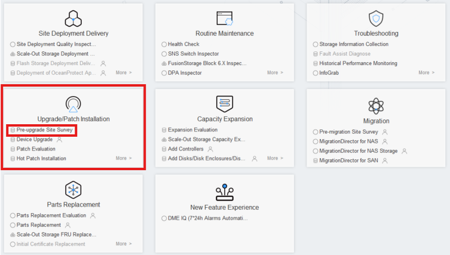
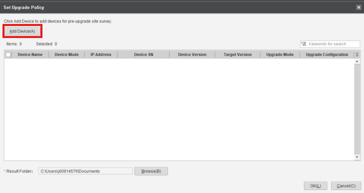
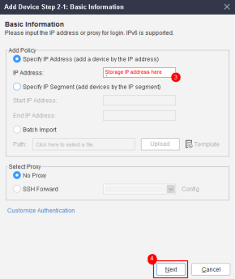
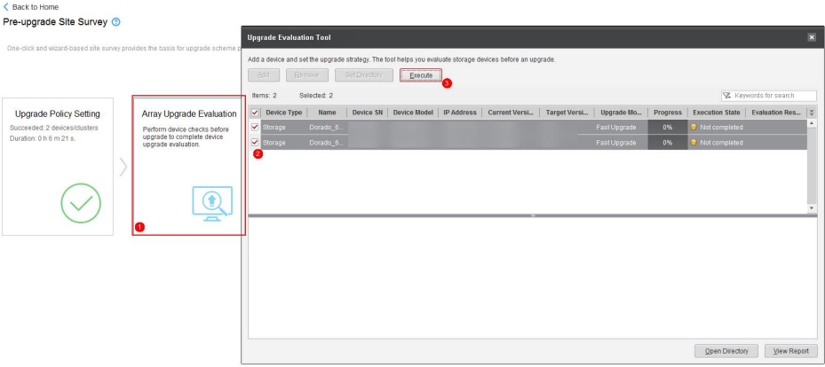
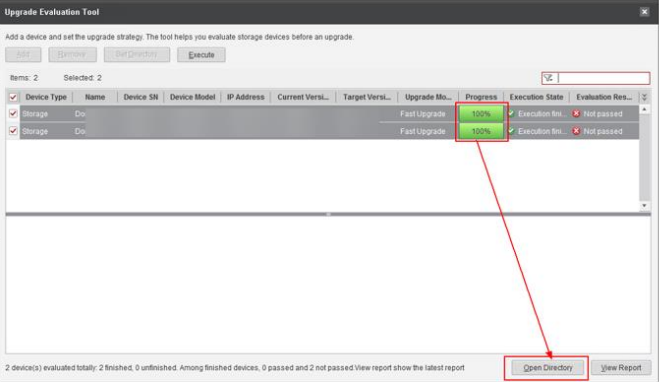
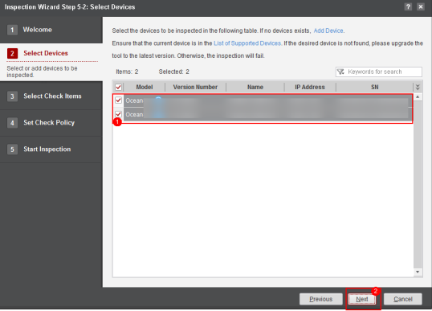
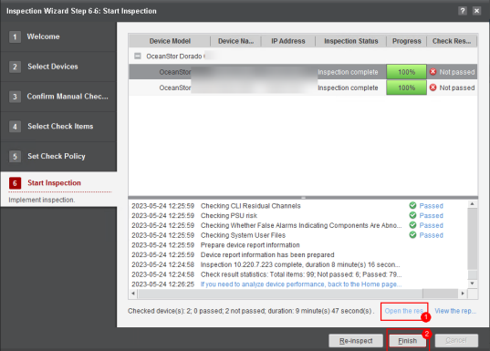

### **Main Version Update**

#### Requirements
- **Target Main** version of the update (e.g. 6.1.6 for OceanStor Dorado)
- Connection to the Storage Cabinets
- SmartKit **Tool Upgrade Evaluation** Package Installed

#### Tasks

1. Enter: **Upgrade/Patch Installation** → **Pre-upgrade Site Survey**
    
    

2. Start the process by clicking **Upgrade Policy Setting**
    
    

3. Click '**Add Device**' Button
    
    

4. Click '**Add Device**' highlighted text
    
    

5. Input the **IP** and **Credentials** of the **Storage Device** 
    
    
    

6. Select the **Added Devices** in the **Set Upgrade Policy** screen
    
    

7. Click '**Next**' on the following screen

8. Input the target version (e.g. 1.6.1 for OceanStor Dorado Cabinets) and click '**Finish**'
    
    

9. Click '**OK**' on the following screen

10. After the Policy Setting is completed, click **Array Upgrade Evaluation** and **Execute** it
    
    

11. After the process is completed, click '**Open Directory**' to obtain the files
    
    

12. After saving the files, proceed with the next step: **'Array Information Collection'**
    
    

13. Select the Storage Cabinets and click '**Collect Information**'
    
    

14. After the process is finished, click **'Open Directory'**
    
    

15. Send both of the files obtained to the **File Upload** provided

16. Collect the Inspection logs through: **Routine Maintenance** > **More** > **Inspection**
    
    

17. Click '**Inspection**' and '**Next**' on the following screen
    
    

18. Select the Storage Cabinets and click '**Next**'
    
    

19. Make sure that all boxes are checked and click '**Start**'
    
    

20. After the process is complete, save the files and click '**Finish**'
    
    

21. Send the files to the **File Upload** provided
