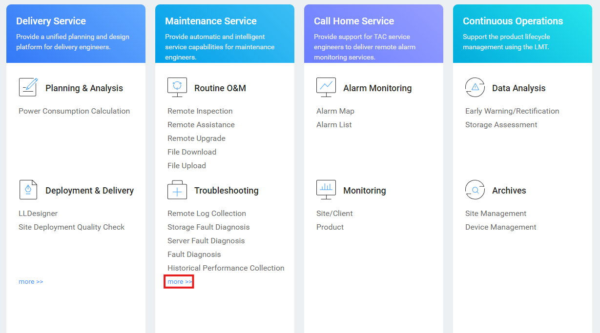
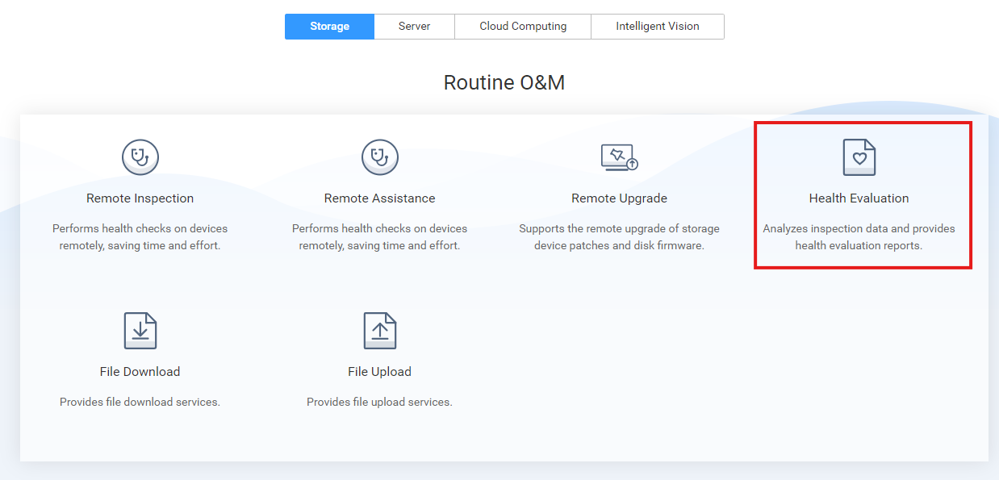
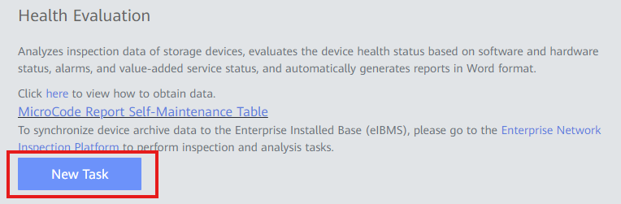
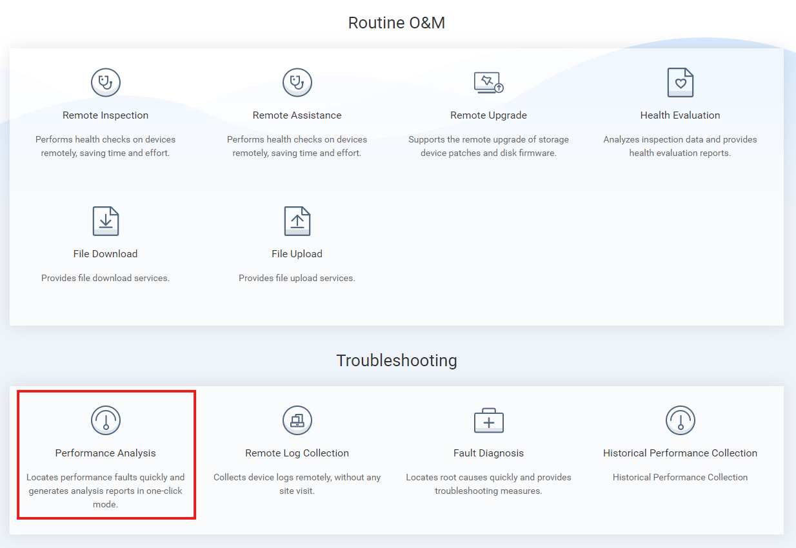
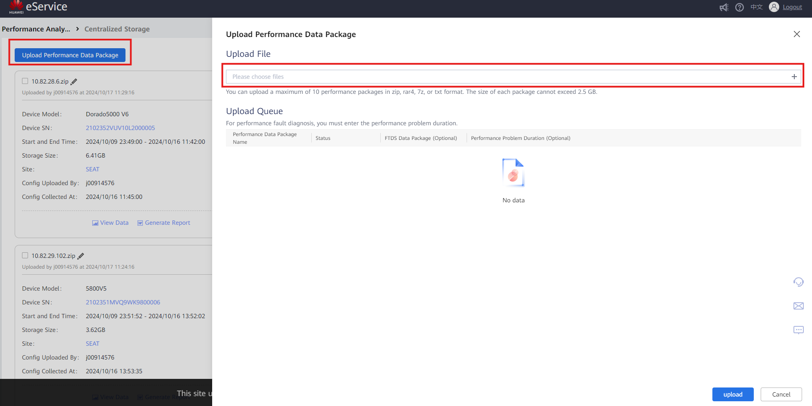

### Requirements
- Files generated from Health Check: 
  • Inspection Files 
  • Storage Information Collection Files 
  • Historical Performance Monitoring Files 

### Tasks

#### Inspection Files Uploading

1. Enter: [https://support-eu.eservice.huawei.com/](https://support-eu.eservice.huawei.com/)
   
2. Click '**Troubleshooting**' → '**More**'
    
    

3. Click '**Health Evaluation**' 
    
    

4. Click '**New Task**'
    
    

5. Fill out the information: 
   • **Task Name**: Descriptive name for the Task 
   • **Customer BG Type**: Type of customer (Carrier / Enterprise) 
   • **Site Name**: Select customer name 
   • **Region**: Select the region (normally European Region) 
   • **Office**: Select the office (normally Spain Rep Office) 

6. Click '**Import**' and add the **Inspection File** generated

7. Click '**OK**' to finish the process

---

#### Historical Performance Monitoring Files Uploading

1. Enter: [https://support-eu.eservice.huawei.com/](https://support-eu.eservice.huawei.com/)

2. Click '**Troubleshooting**' → '**More**'
    
    

3. Click '**Performance Analysis**'
    
    

4. Click '**Centralized Storage**'

5. Click '**Upload Performance Data Package**'

6. Upload Historical Performance Monitoring generated files
    
    

7. Click '**Upload**' to finish the process
