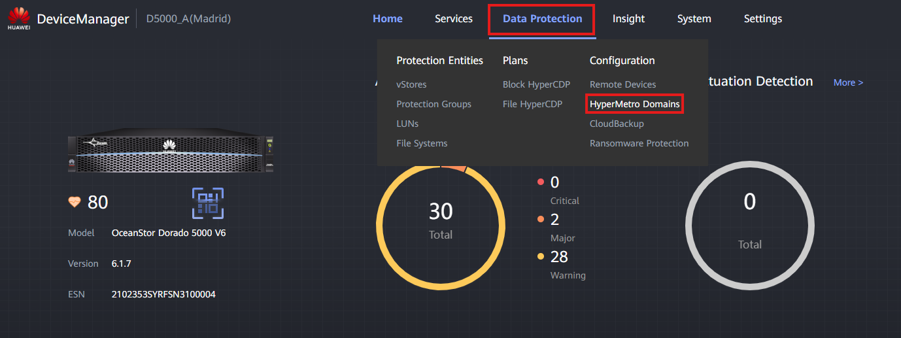
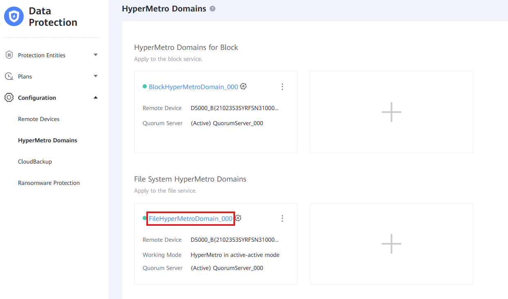
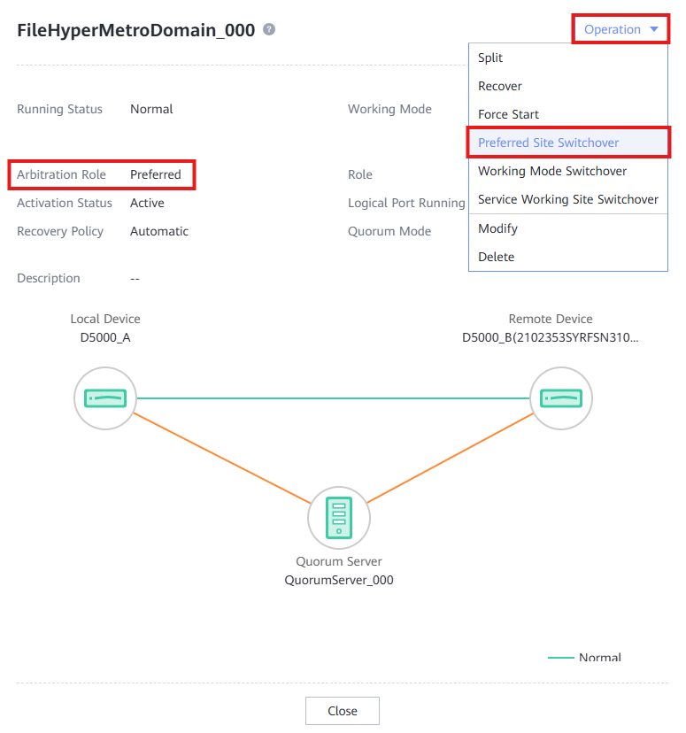
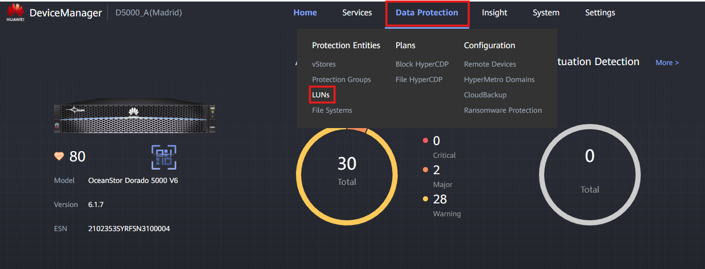
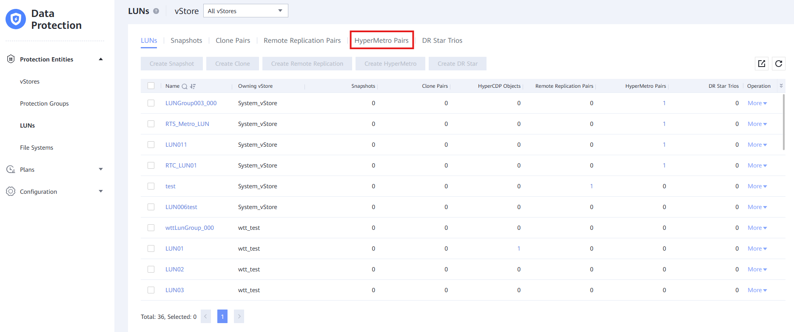
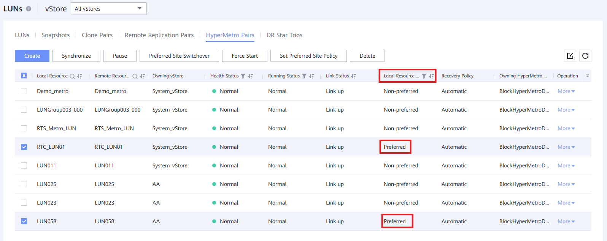
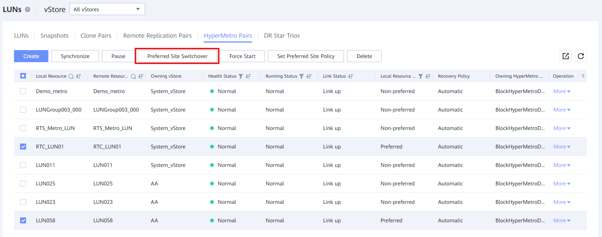

### Requirements
- Software downloaded for the Storage Devices
- Quorum Servers updated (see: [Quorum Server Update](../QuorumServerUpdate.md))

### Best Practices
When updating **HyperMetro Storage Devices** in production, we must be careful and only update **one** of the Storage Devices. After ensuring that the service is working correctly, it's needed to wait for at least **1 day** until starting the upgrade process for the other Storage Device.

We need to make sure that the cabinet we are updating is not the main in the HyperMetro.

### Tasks
1. Enter **Data Protection** > **Configuration** > **HyperMetro Domain**
    
    

2. Click the **File System HyperMetro Domain** to obtain information
    
    

3. If the **Arbitration Role** is **Preferred**, you can switchover through '**Operation**' > '**Preferred Site Switchover**'. If it is **Non Preferred**, there is no need to do anything.
    
    

4. Enter **Data Protection** > **Protection Entities** > **LUNs**
    
    

5. Click '**HyperMetro Pairs**'
    
    

6. Select all the HyperMetro Pairs whose **Local Resource Role** Column is '**Preferred**'
    
    

7. Click Preferred **Site Switchover Button** and '**OK**' on the next window
    
    

8. The cabinet is now ready to be upgraded. See [Update Machine's Software](../UpdateMachineSoftware.md) for more information on this process.
