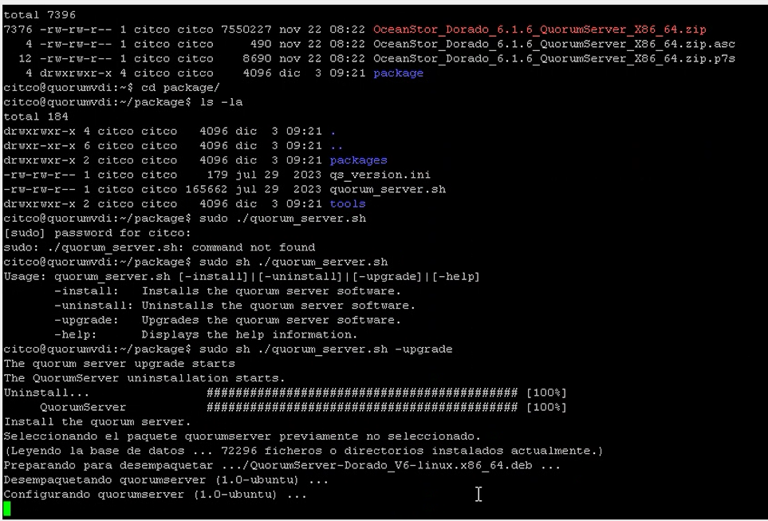
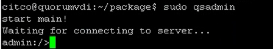
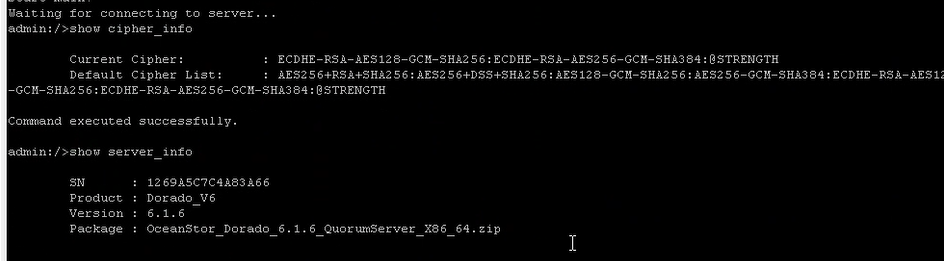
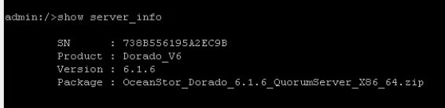
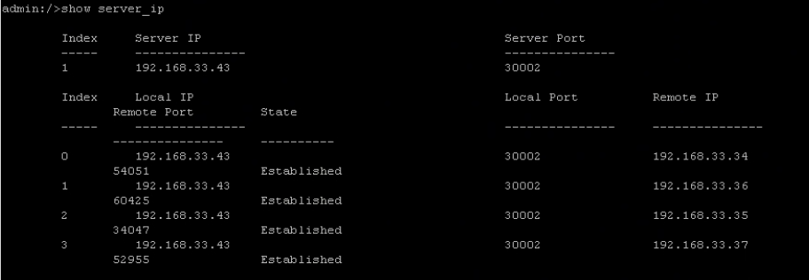

### **Software Download**

#### Requirements
- Model of the Storage Arrays (e.g. OceanStor Dorado)
- Software version of the Storage Arrays on HyperMetro
- Operating System of the Quorum Server

#### Tasks

1. Enter: [https://support.huawei.com/](https://support.huawei.com/)

2. Search the **Model** of the required Storage Solution
    
    

3. Click **Software Download**
    
    

4. Select the **Main** version the Storage Cabinets are on
    
    

5. Download the Quorum Server Software, depending on its Operating System
   - Linux: .zip
   - RedHat: .rpm
    
    

---

### **Quorum Server Update**

#### Requirements
- Software downloaded for the Quorum Server (see previous point)
- Connection to the Quorum Server

#### Tasks
1. Connect to the **Quorum Server CLI** 
   • **User:** quorumAdmin 
   • **Pass:** Huawei@SYS3

2. Upload the **Software** downloaded on the previous point to the **Quorum Server**

3. Check whether the system is in **bash** or **dash**: 
   `bash ls -l /bin/sh`
   
4. In case the result is bash, continue. In case it's dash, enter this command and select NO: 
	`sudo dpkg-reconfigure dash`

5. Enter the 'package' directory inside the Upgrade File: 
	`cd package`

6. Start the upgrade for the Quorum Server: 
	`sudo sh ./quorum_server.sh -upgrade` 
    
    

7. Enter the Quorum Server: 
	`sudo qsadmin` 
    
    

8. Display the Cipher Configuration: 
	`show cipher_info` 
    
    

9. Display information about the Quorum Server and the version to verify the update: 
	`show server_info` 
    
    

10. Display the IPs connected to Quorum Server to verify the connections: 
	`show server_ip` 
    
    

#### References
- [Quorum Server Documentation](https://support.huawei.com/enterprise/en/doc/EDOC1100112636/b2a6b05f/installing-quorum-server-software)