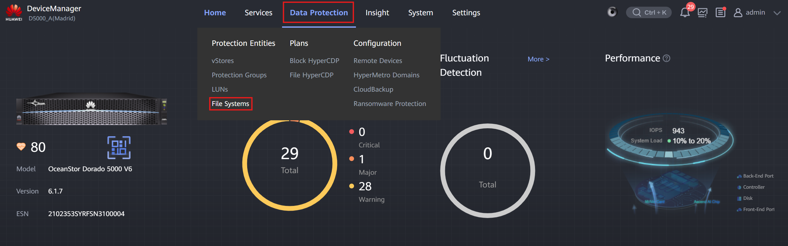
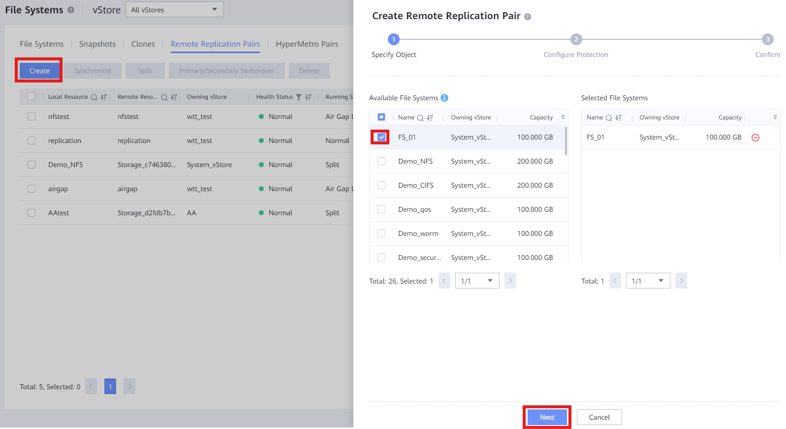

#### Requirements
- **Remote Device** connection between **Cabinet A** and **Cabinet B**

#### Tasks

1. Connect to **Cabinet A**

2. Create a **File System**: [File System Creation & Access](../Storage%20Cabinets%20Configuration/File%20System%20Creation%20&%20Access.md)

3. Enter **Data Protection** > **File Systems**
     
    

4. Click '**Remote Replication Pairs**'
     
    

5. Click '**Create**' and select the **File System** created previously
     
    

6. Click '**Next**' and fill out the information:
    - **Synchronize Configuration**: Leave normally as **Yes**
    - **Remote Replication vStore Pair**: Select the **common vStore** in both Cabinets
    - **Creation Mode**: Normally **Based on file systems**
    - **Retain Consistency Snapshot**: Enable for DR Star for NAS
    - **Pair Creation**: Leave normally as **Automatic**
    - **Remote Storage Pool**: Select the Storage Pool created for **Cabinet B**
    - **Sync Type**: Normally select 'Timed wait after sync ends', but client decides
    - **Interval**: Normally 1 minute or 30 seconds, but client decides
    - **Copy Snapshot Retention in Secondary Resource**: As clients want, snapshot syncing
    - **User Snapshot Sync**: As clients want, snapshot syncing with details

7. Click '**Next**' and finish the process
    

---
#### Requirements
- **Remote Device** connection between **Cabinet A** and **Cabinet B**

#### Tasks

1. Connect to **Cabinet A**

2. Create a **File System**: [File System Creation & Access](../Storage%20Cabinets%20Configuration/File%20System%20Creation%20&%20Access.md)

3. Enter **Data Protection** > **File Systems**
     
    

4. Click '**HyperMetro Pairs**'
