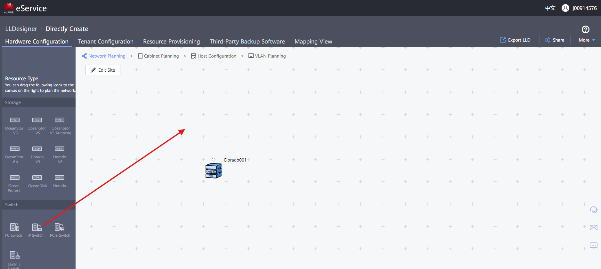
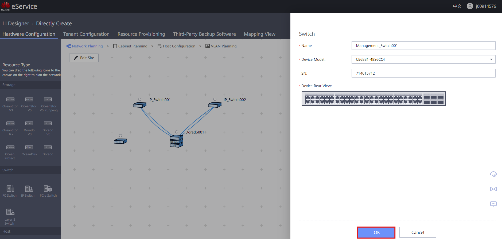
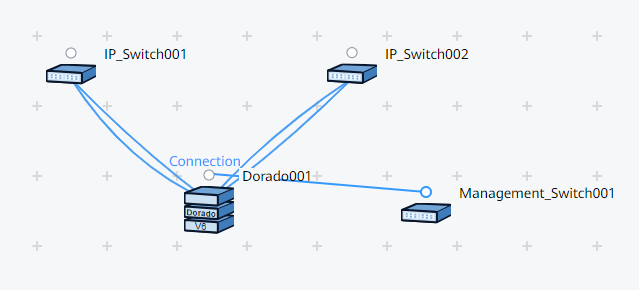
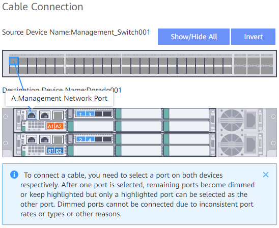
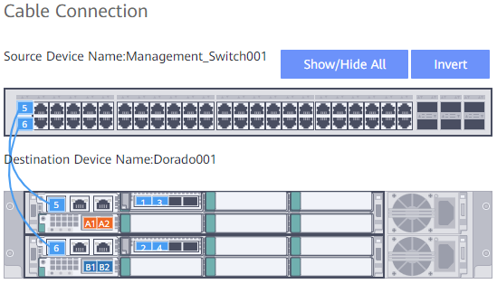
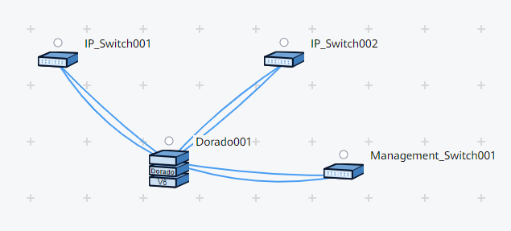

### Requirements
- Storage Cabinet created on the canvas

---
### Selecting Management Switch Model
1. Select the **IP Switch** type to represent in design
2. Drag & drop the Switch onto the canvas
    
    

3. Fill out the information:
	- **Name**: Descriptive name for the Switch
	- **Device Model**: Given by the client
	- **SN**: Optionally include ESN of the Switch
4. Click '**OK**' to create the Switch
    
    

---
### Management Connection to Storage Cabinet
1. Click on the **Dot** above the Switch and drag the connection to the Dot over the Cabinet
    
    

2. Click on the desired Port on the Switch and drag the connection to the Management Port
    
    

3. Make sure to create a **redundant** link with the Interface Modules for best practice
    
    

4. Click '**OK**' to finish the Cable Connection
5. Finished result should look like this
    
    