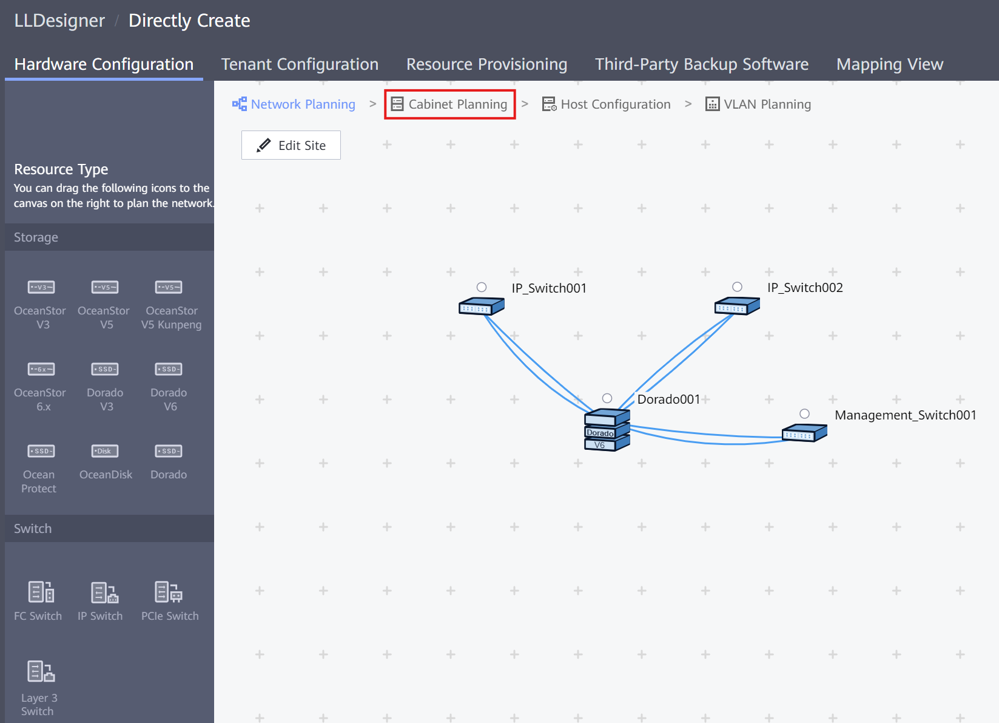

### Requirements
- LLD Architecture (topology) completed

### Cabinet Placement on Rack
1. After all the cabinets are added, go to **Cabinet Planning**
    
    

2. Make sure that all cabinets follow the correct order, from top to bottom:
	1. **Switches** (IP & Management)
	2. **Hosts** (if any)
	3. **Storage Cabinets** (OceanStor / OceanProtect)
	4. **Disk Array Enclosures** (DAEs) 

	 

This disposition ensures that heavy machines don't end up in the upper part of the rack, causing weight unbalance. Also, following this structure helps with the identification and homogeneous cabling for every rack.