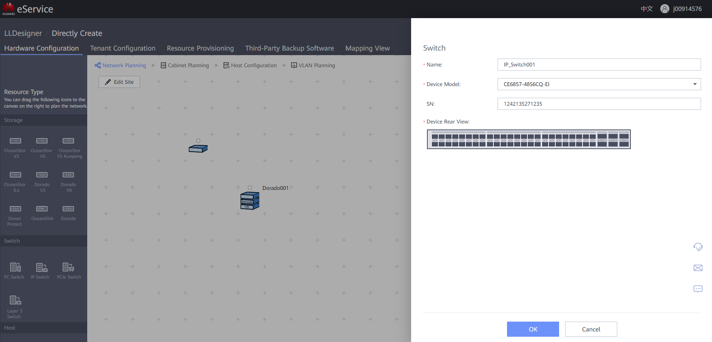
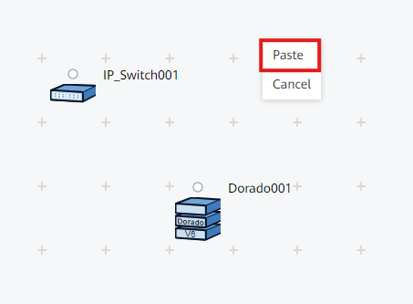
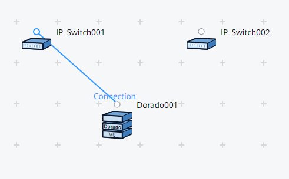
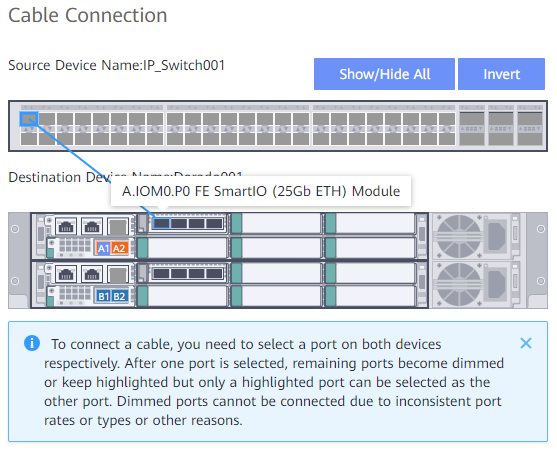
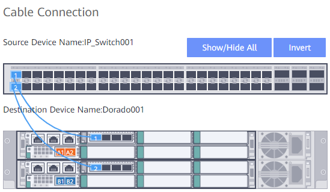
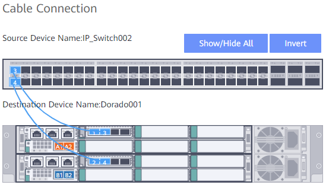
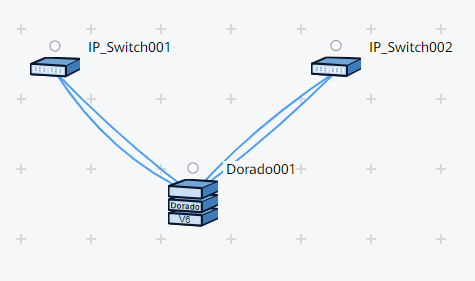

### Requirements
- Storage Cabinet with IO Modules for ETH / FC connections

---
### Selecting Switch Model
1. Select the Switch type to represent in design (FC / IP)
2. Drag & drop the Switch onto the canvas
    
    

3. Fill out the information:
	- **Name**: Descriptive name for the Switch
	- **Device Model**: Given by the client
	- **SN**: Optionally include ESN of the Switch
4. Click '**OK**' to create the Switch
    
    

5. Duplicate the Switch (redundancy) by right-clicking the Switch and copy pasting in the canvas
    
    
    

6. Rename the duplicated switch with a descriptive name (follow best practices numeration: XXXX001)

---
### Switch Connection to Storage Cabinet
1. Click on the **Dot** above the Switch and drag the connection to the Dot over the Cabinet
    
    

2. Click on the desired **Port** of the Switch and drag the connection to the **Interface Module Port**
    
    

3. Make sure to create a **redundant** link with the Interface Modules for best practice
    
    

4. Click '**OK**' to finish the Cable Connection
5. Repeat the process for the second switch for redundancy
    
    

6. Finished result should look like this:
    
    