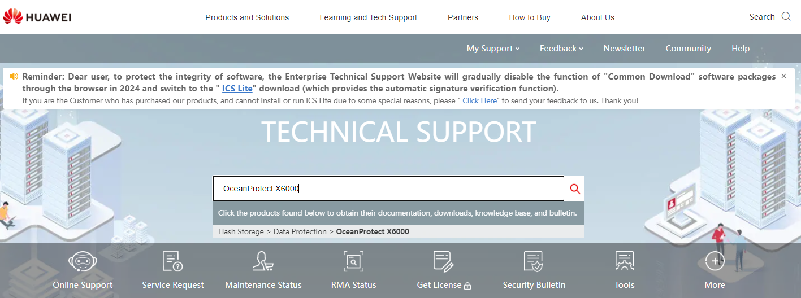
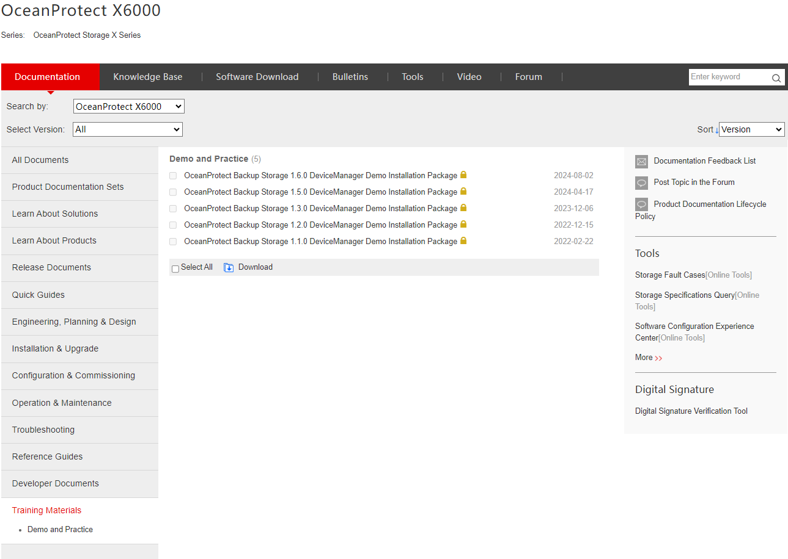
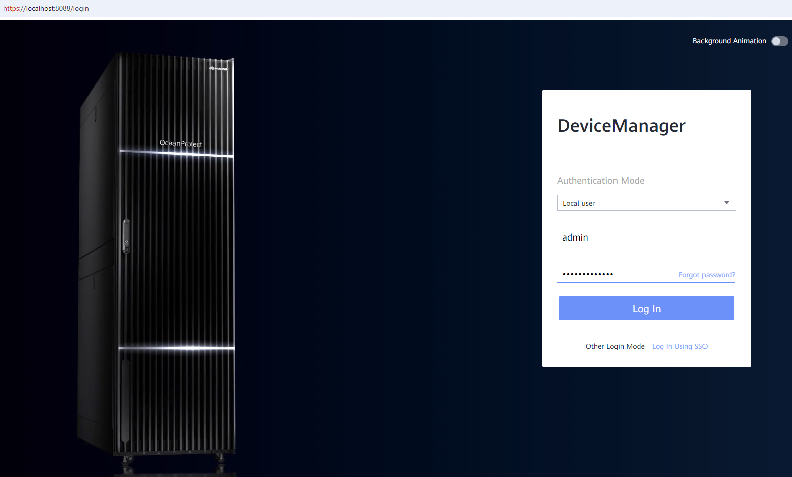

#### Requirements
- Storage Solution that the client needs
---
#### Tasks
1. Enter [Huawei Support](https://support.huawei.com/enterprise)
2. Search de **Model** of the required Storage Solution
    
    

3. Go to **Documentation** > **Training Materials**
4. Download the required **Demo** corresponding with the client version
    
    

5. Launch the **start demo** executable file
6. Enter https://localhost:8088:
	- **User**: admin
	- **Pass**: Admin@storage / Admin@Storage

    