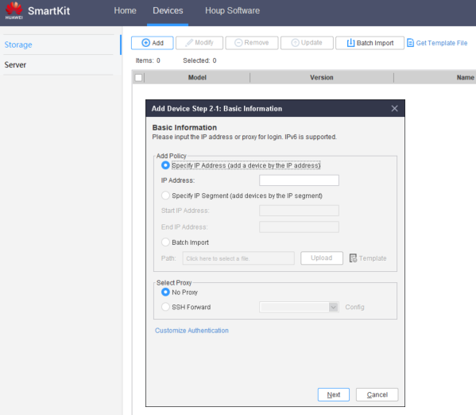
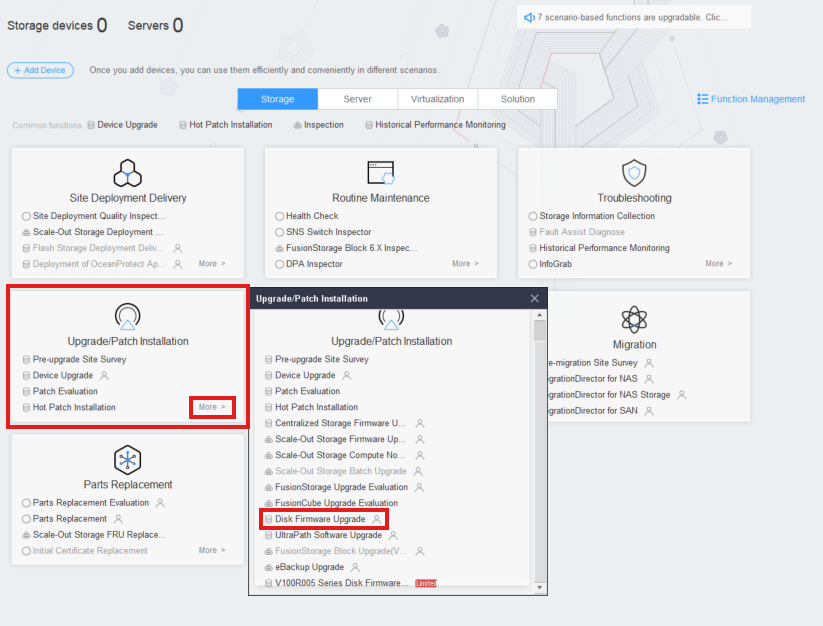
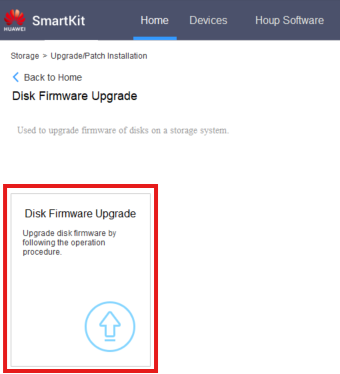
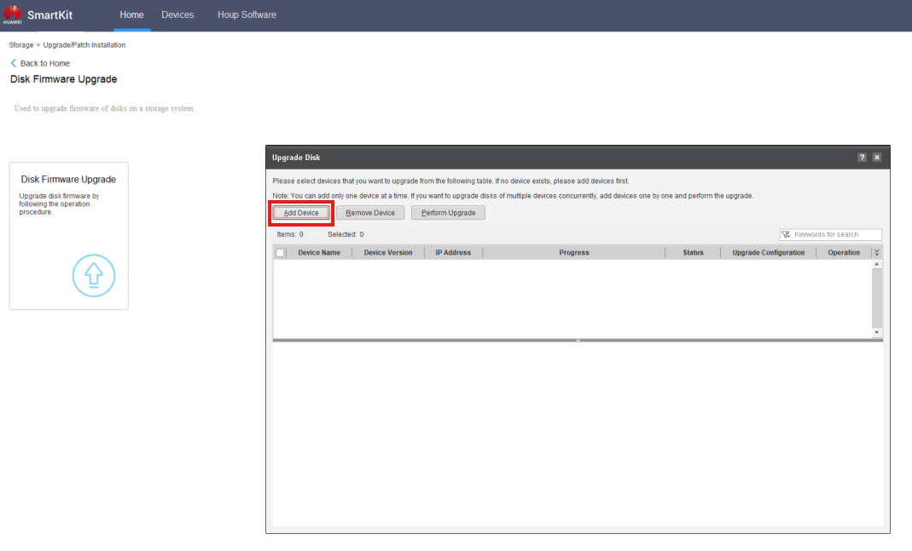

#### Requirements
- **Smart Kit** with all functions installed
- **Disk Firmware** downloaded

---
#### Tasks
1. Open the **SmartKit** Software
2. Add the device if it's not there already in **Devices** > **Add**:
	- **IP**: Use the management IP of the controller
	- **User**: admin
	- **Pass**: Admin Password (given by customer)

	 
	 

3. Go to **Upgrade/Patch Installation** > **More** > **Disk Firmware Upgrade**
	 
	 

4. Click '**Disk Firmware Upgrade**' 
	 
	 

5. Click '**Add Device**' and select the required Storage devices
	 
	 

6. Follow the upgrade process