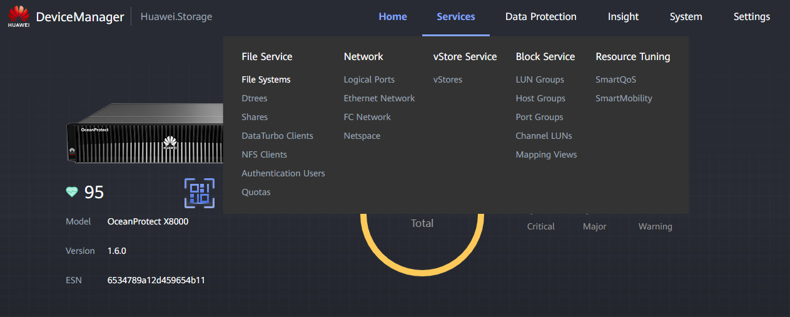
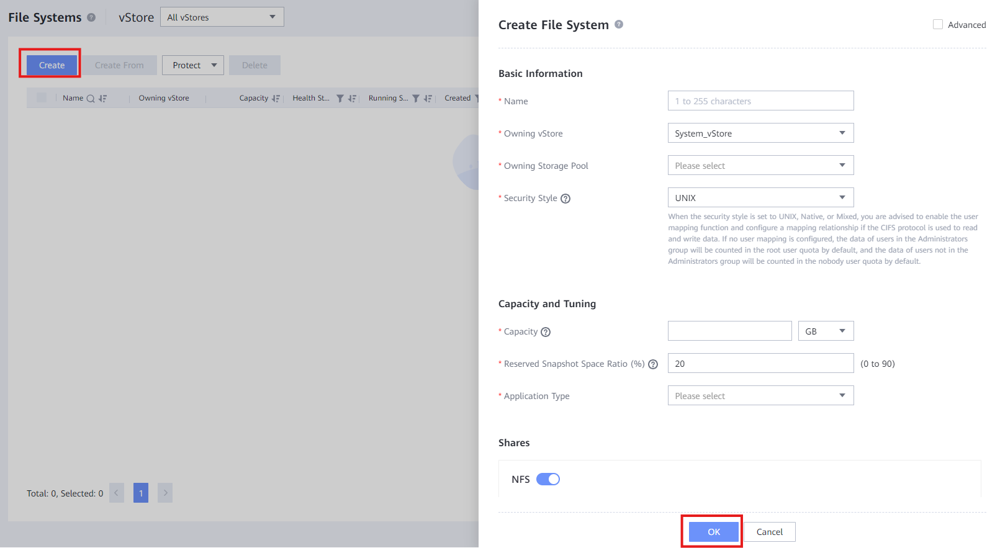

### **File System Creation**
#### Requirements
- Connection to the Storage Array
- Information on the OS of the client
#### Tasks
1. Enter the Device Manager (https://192.168.128.101 or the IP of the port)
2. Enter **Services** > **File Service** > **File Systems**
	 
	 

3. Click "**Create**" and fill the data:
	- **Name**: Descriptive name for the file system (e.g. FS_NFS_001)
	- **Owning vStore**: Select the vStore decided by the client
	- **Owning Storage Pool**: Select the Storage Pool decided by the client
	- **Security Style**: Select **UNIX** if the **OS** is **Linux** or select **NTFS** if the **OS** is **Windows**
	- **Capacity**: Designate a capacity for the File System decided by the client
	- **Reserved Snapshot Space Ratio**: Designate snapshot space percentage (client)
	- **Application Type**: Select normally **Reduction_Prioritized_Mode**
	- **Shares**: Select the **protocol(s)** for the File System
	- **Protection**: Select HyperCDP schedule if client wants data protection
4. Click "**OK**" to create the **File System**
	 
	 

---
### **File System Access**
#### Requirements
- File System created
- Correct access to the logical ports associated
#### UNIX File System
1. Install ntfs-3g (Ubuntu): 
	``sudo apt update`` 
	``sudo apt install cifs-utils`` 

2. Create the directory to mount the NTFS: 
	``sudo mkdir -p /mnt/huawei_share``

3. Mount the NTFS: 
	``sudo mount -t cifs //192.168.1.100/ShareTest /mnt/huawei_share -o username=UserName,password=PassWord``

4. Verify access to the File System: 
	``ls /mnt/huawei_share``
	
#### Windows File System
1. Open **Command Execution** (Win + R)
2. Input: <code>\\LogicalPortIP\ShareName</code>
3. Use <code>.\CreatedUser</code> and password to access with the **local user**
4. Verify correct access to the File System