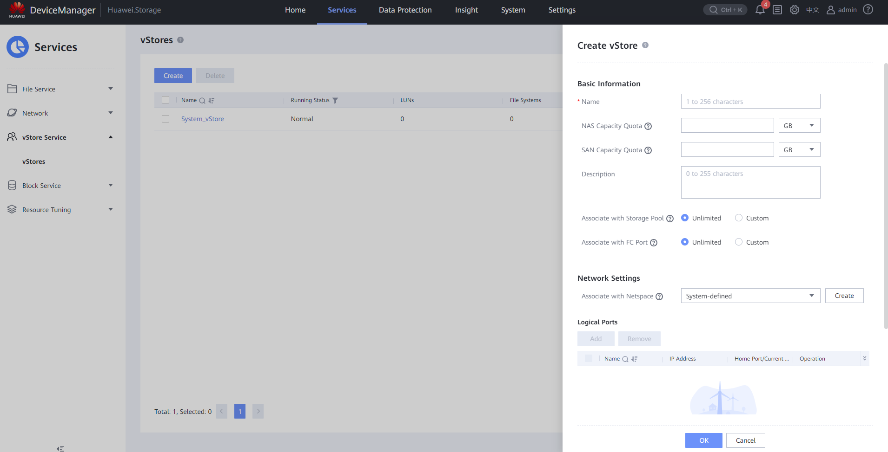

#### Use
vStores along with Logical Ports are used to isolate networks. This can be used to dedicate a network to a specific environment (development, preproduction, ...) or to divide departments inside a company.

#### Requirements
- Connection to the **Controller** through the Management Port (RJ45 cable)
- **Virtual Storage** requirements (GB / TB)
- **Logical Ports** to use from client

---
#### Tasks
1. Enter the Device Manager (https://192.168.128.101 or the IP of the port)
2. Go to **Services** > **vStore Service** > **vStores**
	 
	 

3. Click **Create** and fill the data:
	1. **Name**: Descriptive name for the **vStore** (e.g. VS_DEV)
	2. **NAS Capacity Quota**: Storage that will be **Virtualized**
	3. **SAN Capacity Quota**: Storage that will be **Virtualized**
	4. **Description**: Useful description for the **vStore** utility
	5. **Associate with Storage Pool**: 
		1. Select **Custom**
		2. Click **Selected: 0**
		3. Select the previously created **Storage Pool**
		4. Click **OK** to finish **Storage Poo**l association
	6. **Associate with FC Port (Fibre Channel)**:
		1. Select **Custom**
		2. Click **Selected: 0**
		3. Select the desired **FC Ports** (**Interface Module**)
		4. Click **OK** to finish **FC Ports** association
	7. **Logical Ports Selection**:
		- If you have already created the **Logical Ports**, select them from the menu
		- If not, click **Add** and create them through this menu, then select them
4. Click OK to create the **vStore**
	 