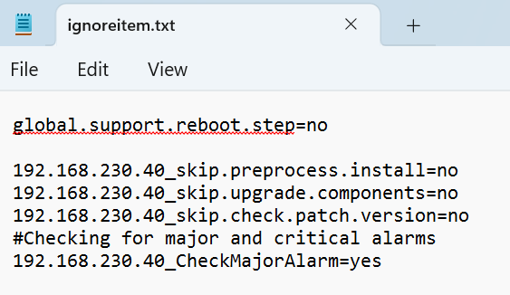

#### Requirements
- Connection to the machine
- IP of the storage array
---
#### Tasks
1. Identify the error you want to ignore
2. Go to: **C:\Program Files\Huawei SmartKit\tools\ArrayUpgrade**
3. Open **ignoreitem.txt**
4. Paste: **MachineIP_CheckMajorAlarm=yes** (Changing MachineIP for the Controller's IP)
	 
	 

5. **Save** the document and close it
6. **Retry** the **update**
7. When the error appears, click on it and press "**Ignore**"