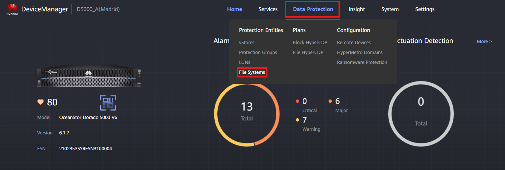

### Definition

The Snapshots are a data protection technology. They are point-in-time copies of a specific File System. They can be used to recover data, to perform a rollback on the File System, or to store a specific state of the storage device.

It is possible to create Snapshots when the Storage System has HyperMetro configured. In this case, the Snapshots are stored on both devices for high availability and the HyperMetro pair is selected.

---

### Requirements

- File System created ([[File System Creation]])
- HyperMetro Pair created (only for devices in HyperMetro)

### Tasks

1. Enter the Device Manager (https://192.168.128.101 or the management IP)
2. Go to **Data Protection** > **File Systems**
   
3. Click '**Snapshots**' on the top navigation bar
4. Click the '**Create**' button
   
5. Fill out the data:

   - **Selected FS**: Add the FS that will have a Snapshot created. In case the Devices are on HyperMetro, the Snapshot must be created from the HyperMetro Pair.
   - **Name**: Descriptive name for the Snapshot
   - **Description**: Snapshot description
   - **Tag**: Tag for the Snapshot (e.g. Daily / Weekly)
   - **Secure Snapshot**: If checked, the Snapshot won't be manipulable (nor deleted) while the protection period is active
