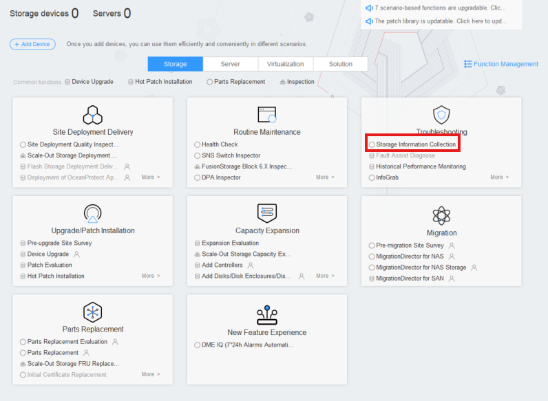
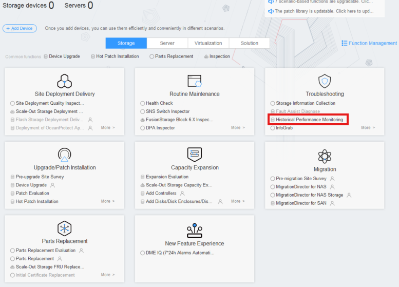

### **Requirements**

- Connection to the client machine(s) (IP addresses and ports of the Controller(s))
- SmartKit tool with **Historical Performance Monitoring** package installed

### **Tasks**

#### Add Devices

1. Click on '**Devices**'

   { width=80% display=block margin-left=auto margin-right=auto }
2. Click 'Add' and fill the details for the Machine(s)

   { width=80% display=block margin-left=auto margin-right=auto }

---

#### Inspection

1. Go to: **Routine Maintenance** → **More** → **Inspection**

   { width=80% display=block margin-left=auto margin-right=auto }
2. Click '**Inspection**' to enter the **Inspection Wizard**
3. Click '**Next**' → Select all of the added devices
4. Click '**Next**' → Leave as default all checklists
5. Wait for the process to finish

---

#### Storage Information Collection

1. Go to: **Troubleshooting** → **Storage Information Collection**

   { width=80% display=block margin-left=auto margin-right=auto }
2. Click **Information Collection**
3. Modify on all devices: **Operation** → **Setting** → **Basic Settings** → '**All Logs**'

   { width=80% display=block margin-left=auto margin-right=auto }
4. Select all the devices → Click '**Collect Information**'

   { width=80% display=block margin-left=auto margin-right=auto }
5. Wait for the process to finish

---

#### Historical Performance Monitoring

1. Go to: **Troubleshooting** → **Historical Performance Monitoring**

   { width=80% display=block margin-left=auto margin-right=auto }
2. Click 'Device Selection'
3. Modify on all devices for '**7z Compression**'

   { width=80% display=block margin-left=auto margin-right=auto }
4. Click '**OK**' → '**Historical Performance**'
