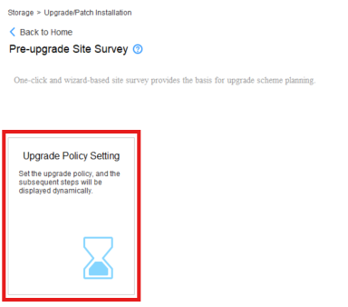
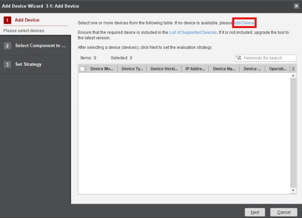
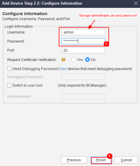
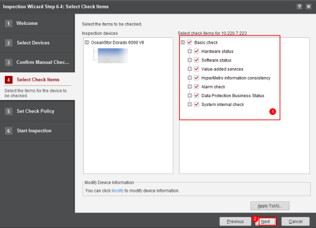

### **Main Version Update**

#### Requirements

- **Target Main** version of the update (e.g. 6.1.6 for OceanStor Dorado)
- Connection to the Storage Cabinets
- SmartKit **Tool Upgrade Evaluation** Package Installed

#### Tasks

1. Enter: **Upgrade/Patch Installation** → **Pre-upgrade Site Survey**

   

   &nbsp;
2. Start the process by clicking **Upgrade Policy Setting**

   

   &nbsp;
3. Click '**Add Device**' Button

   

   &nbsp;
4. Click '**Add Device**' highlighted text

   

   &nbsp;
5. Input the **IP** and **Credentials** of the **Storage Device**

   

   

   &nbsp;
6. Select the **Added Devices** in the **Set Upgrade Policy** screen

   

   &nbsp;
7. Click '**Next**' on the following screen
8. Input the target version (e.g. 1.6.1 for OceanStor Dorado Cabinets) and click '**Finish**'

   

   &nbsp;
9. Click '**OK**' on the following screen &nbsp;
12. After the Policy Setting is completed, click **Array Upgrade Evaluation** and **Execute** it

    

    &nbsp;
13. After the process is completed, click '**Open Directory**' to obtain the files

    

    &nbsp;
14. After saving the files, proceed with the next step: **'Array Information Collection'**

    

    &nbsp;
15. Select the Storage Cabinets and click '**Collect Information**'

    

    &nbsp;
16. After the process is finished, click **'Open Directory'**

    

    &nbsp;
17. Send both of the files obtained to the **File Upload** provided
18. Collect the Inspection logs through: **Routine Maintenance** > **More** > **Inspection**

    

    &nbsp;
19. Click '**Inspection**' and '**Next**' on the following screen

    

    &nbsp;
20. Select the Storage Cabinets and click '**Next**'

    

    &nbsp;
21. Make sure that all boxes are checked and click '**Start**'

    

    &nbsp;
22. After the process is complete, save the files and click '**Finish**'

    

    &nbsp;
23. Send the files to the **File Upload** provided
