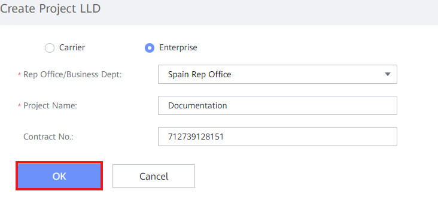

LLD Designer is a tool for designing **LLDs** (Low Level Designs). A LLD is a schematic representation of the network architecture of the client (or at least, the part of the architecture we are involved with) and it includes the storage arrays and their connection to the switches and/or hosts.

After the LLD is finished, it can be downloaded as an Excel file for easy handling on the on-site installation.

Documentation on LLD Designer can be found at: [LLDDesigner Documentation](https://lld.support.eservice.huawei.com/help/en/index.html#en-us_topic_0124134914.html)

### Index

1. [Storage Cabinet Configuration](../LLD%20Designer/Storage%20Cabinet%20Configuration.md)
2. [Switching and Networking](../LLD%20Designer/Switching%20&%20Networking.md)
3. [Management Switching Networking](../LLD%20Designer/Management%20Switching%20Networking.md)
4. [Rack Placement of Cabinets](../LLD%20Designer/Rack%20Placement%20of%20Cabinets.md)

### Create an LLD Designer File

1. Enter [LLDDesigner](https://support.eservice.huawei.com/#/Delivery/LLD_Storage;domain=storage)
2. Click '**Create LLD**'
   ` `
   ` `
3. Click '**Customize Devices to Create LLD**'
   ` `
   ` `
4. Fill out the Information:

   - **Carrier / Enterprise**: Normally Enterprise
   - **Rep Office / Business Dept**: Spain Rep Office
   - **Project Name**: Descriptive name for the project
   - **Contract No**.: Include optionally if project number is known
5. Click '**OK**' to create the LLD project
   ` `
   ` `
