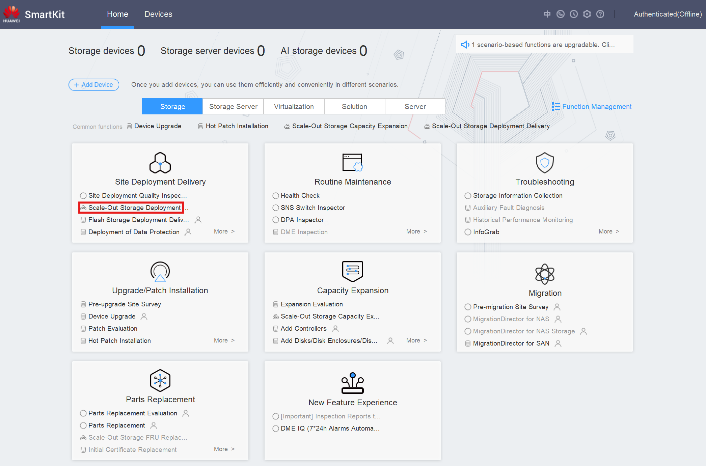
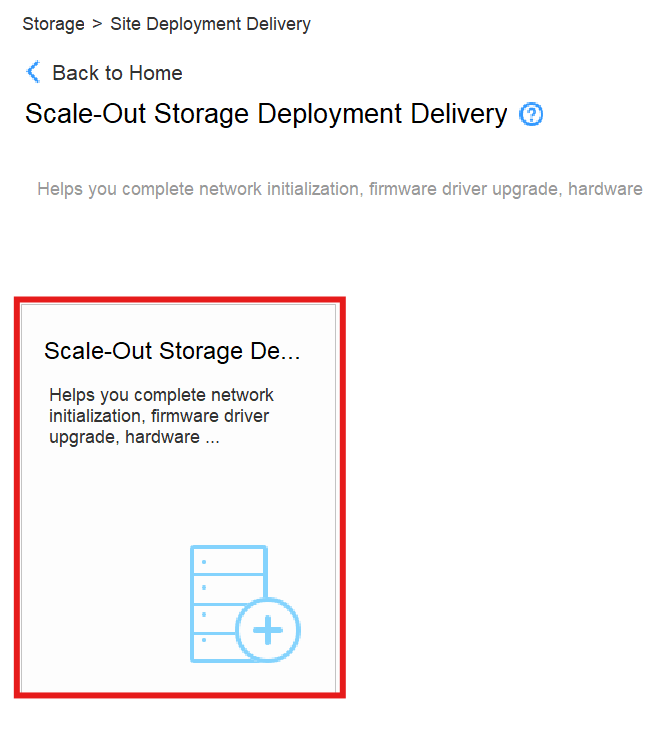
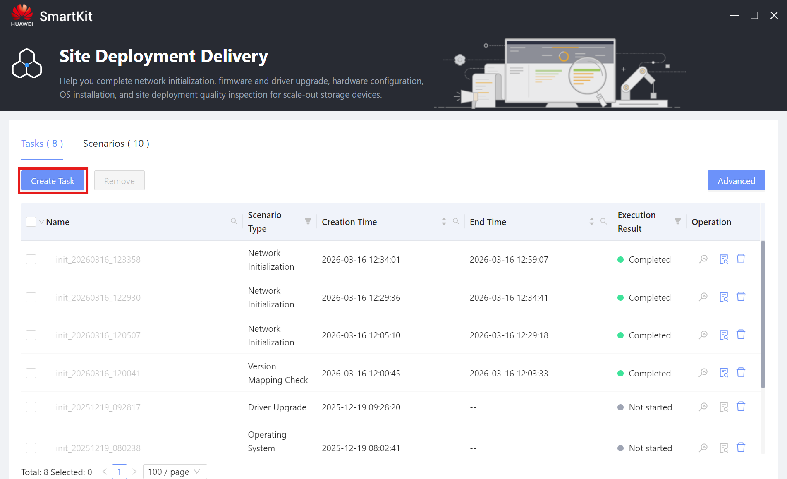
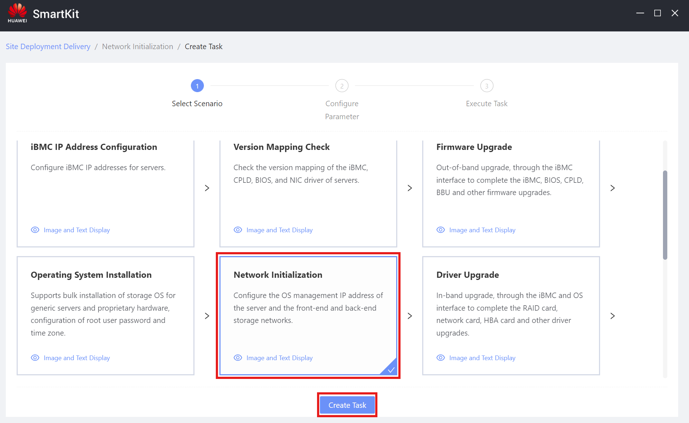
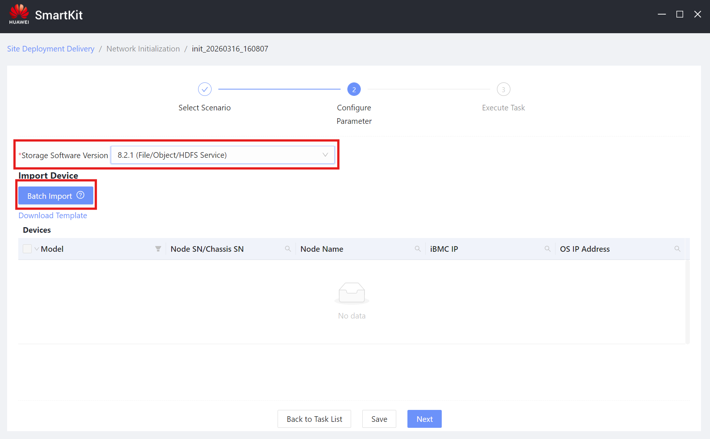
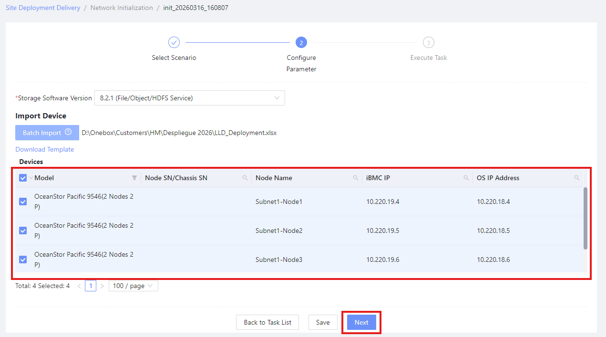
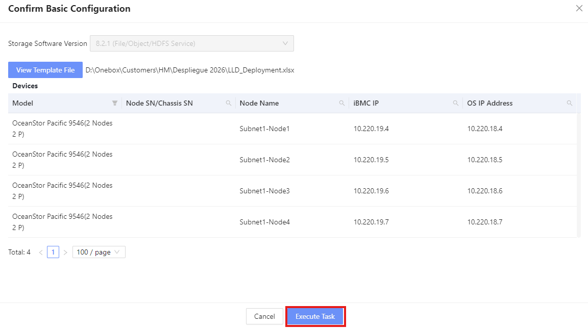
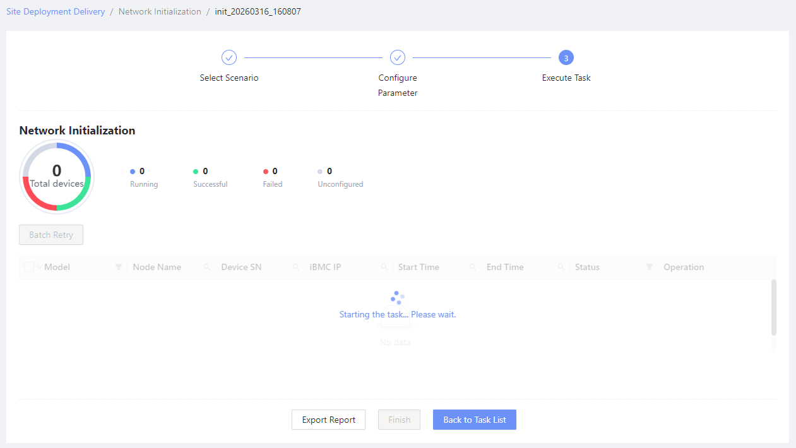
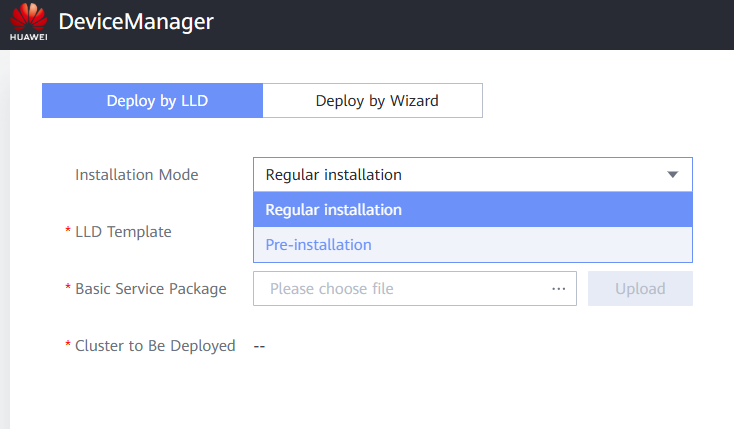
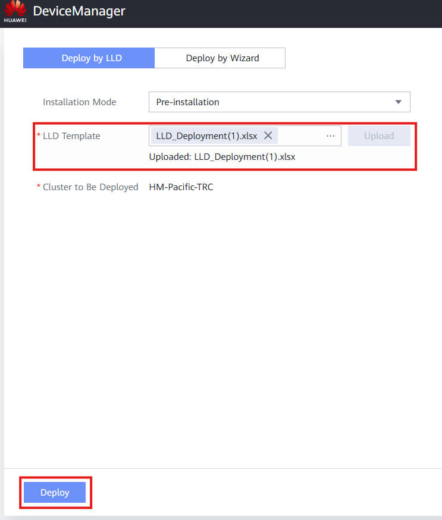

### Definition

For OceanStor Pacific devices, the deployment consists on the creation of a Storage Cluster using the Pacific nodes from the devices.

---

### Requirements

- DeviceManager client
- LLD Deployment Document (see: [Configure Scale-Out Storage Project](Configure Scale-Out Storage Project))
- SmartKit Scale Out Tools

---

### Tasks

1. Open SmartKit **Scale-Out Storage Deployment** tool:

   
2. Select **Scale-Out Storage Deployment Delivery**:

   
3. Press **Create Task** button:

   
4. Select **Network Initialization** scenario and press **Create Task**:

   
5. Select the **Storage Software Version** and import the **LLD Deployment Document**:

   
6. Select the **Devices** for the operation and press **Next**:

   
7. Confirm the operation and press **Execute Task**:

   
8. Wait for completion and close the tool:

   
9. Access the **OceanStor-Pacific_X.X.X_DeviceManagerClient** directory.
10. Execute the `run.bat` file inside of the directory.
11. Inside of the web browser, select **Pre-installation** as the **Installation Mode**:

    
12. Upload the **LLD Template** and press **Deploy**:

    
13. Wait for the deployment to finish and access the **DeviceManager** cluster IP for confirmation.
