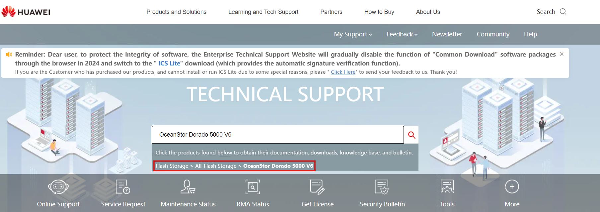
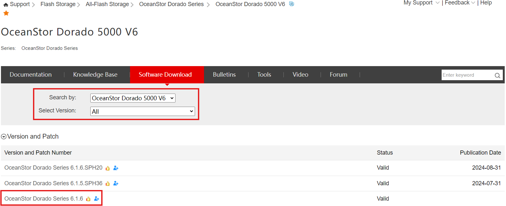
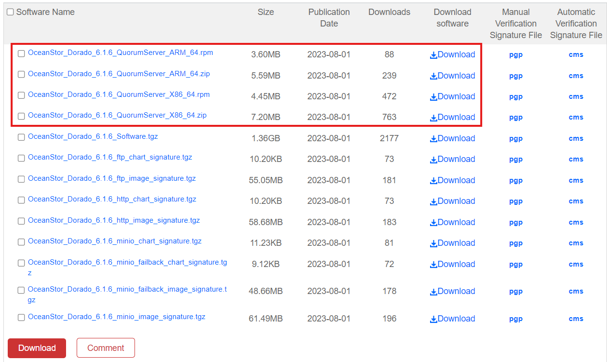

### Definition

Installing the Quorum server is the first step on setting up a HyperMetro with Quorum arbitration. The Quorum server is used to manage the tasks on the HyperMetro devices and prevent split-brain scenarios.

---

### Software Download

#### Requirements

- Model of the Storage Arrays (e.g. OceanStor Dorado)
- Software version of the Storage Arrays on HyperMetro
- Operating System of the Quorum Server
- root access into the OS

#### Tasks

1. Enter: https://support.huawei.com/
2. Search the **Model** of the required Storage Solution
   
3. Click **Software Download**
   
4. Select the **Main** version the Storage Cabinets are on
   
5. Download the Quorum Server Software, depending on its Operating System

   - **Linux**: .zip
   - **RedHat**: .rpm
     

---

### Installation

#### Requirements

- Software downloaded for the Quorum Server (see previous point)
- Connection to the Quorum Server VM

#### Tasks

1. Connect to the VM that will host the Quorum Server
2. Move the Software Package into the VM
3. Unzip the Software Package
4. Access the 'package' directory
5. Install the Quorum Server:
   ``sh ./quorum_server.sh -install``
6. Create the Quorum Server User or leave it as default
7. Input a Password for the Quorum Server User
8. Test if the installation was successful:
   ``qsadmin``
