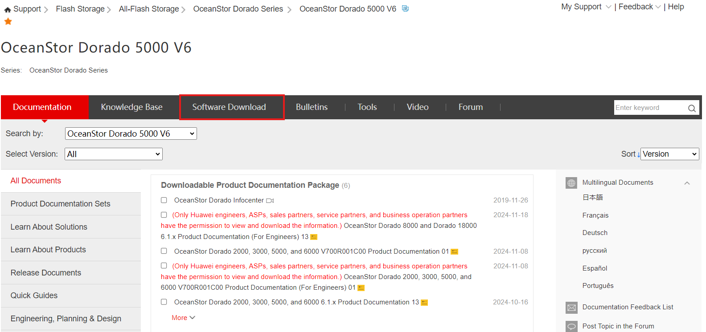

### **Software Download**

#### Requirements

- Model of the Storage Arrays (e.g. OceanStor Dorado)
- Software version of the Storage Arrays on HyperMetro
- Operating System of the Quorum Server

#### Tasks

1. Enter: [https://support.huawei.com/](https://support.huawei.com/)
2. Search the **Model** of the required Storage Solution

   

   &nbsp;
3. Click **Software Download**

   

   &nbsp;
4. Select the **Main** version the Storage Cabinets are on

   

   &nbsp;
5. Download the Quorum Server Software, depending on its Operating System

   - **Linux**: .zip
   - **RedHat**: .rpm

   

   &nbsp;

---

### **Quorum Server Update**

#### Requirements

- Software downloaded for the Quorum Server (see previous point)
- Connection to the Quorum Server

#### Tasks

1. Connect to the **Quorum Server CLI**

   - **User:** quorumAdmin
   - **Pass:** Huawei@SYS3

   &nbsp;
2. Upload the **Software** downloaded on the previous point to the **Quorum Server**

   &nbsp;
3. Check whether the system is in **bash** or **dash**:

   ```bash
   ls -l /bin/sh
   ```

   &nbsp;
4. If the result is **bash**, continue. If it's **dash**, enter this command and select **NO**:

   ```bash
   sudo dpkg-reconfigure dash
   ```

   &nbsp;
5. Enter the 'package' directory inside the Upgrade File:

   ```bash
   cd package
   ```

   &nbsp;
6. Start the upgrade for the Quorum Server:

   ```bash
   sudo sh ./quorum_server.sh -upgrade
   ```

   

   &nbsp;
7. Enter the Quorum Server:

   ```bash
   sudo qsadmin
   ```

   

   &nbsp;
8. Display the Cipher Configuration:

   ```bash
   show cipher_info
   ```

   

   &nbsp;
9. Display information about the Quorum Server and the version to verify the update:

   ```bash
   show server_info
   ```

   

   &nbsp;
10. Display the IPs connected to Quorum Server to verify the connections:

    ```bash
    show server_ip
    ```

    

    &nbsp;

#### References

- [Quorum Server Documentation](https://support.huawei.com/enterprise/en/doc/EDOC1100112636/b2a6b05f/installing-quorum-server-software)
