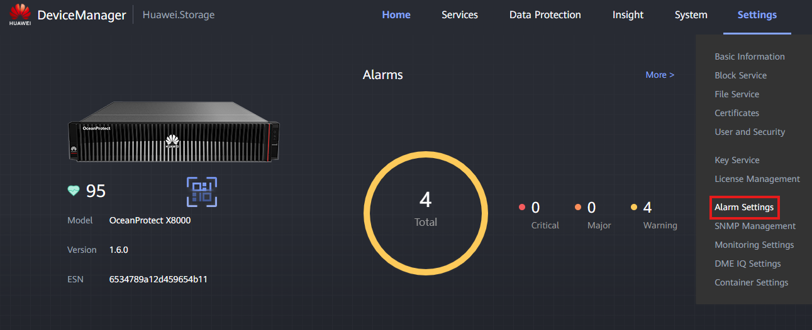
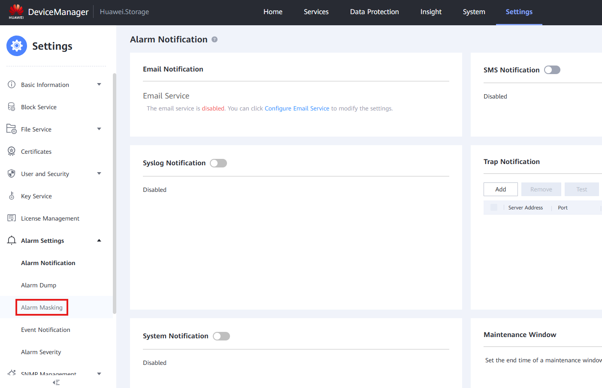
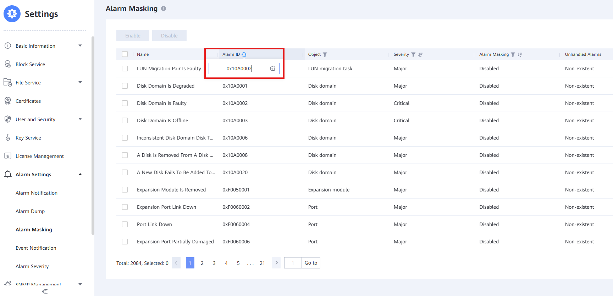
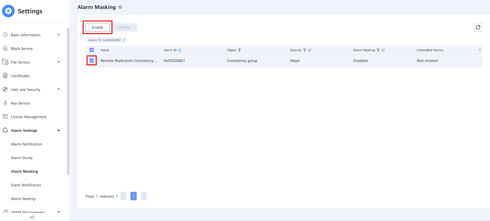

#### Requirements:

- **Alarm ID** of the alarm that needs **Masking**

---

#### Tasks

1. Go to **Settings** > **Alarm Settings**
   ` `
   ` `
2. Go to **Alarm Masking**
   ` `
   ` `
3. Filter by using the **Alarm ID** column
   ` `
   ` `
4. Select the **Alarm** and click '**Enable**'
   ` `
   ` `
5. Check the **Agreement Box** and press '**OK**' to finish this process and mask the desired alarm
