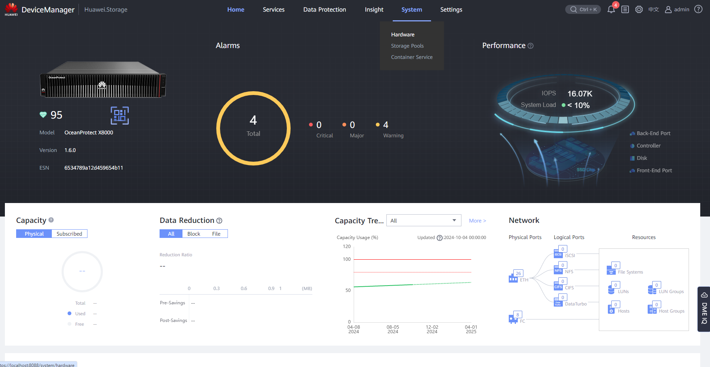
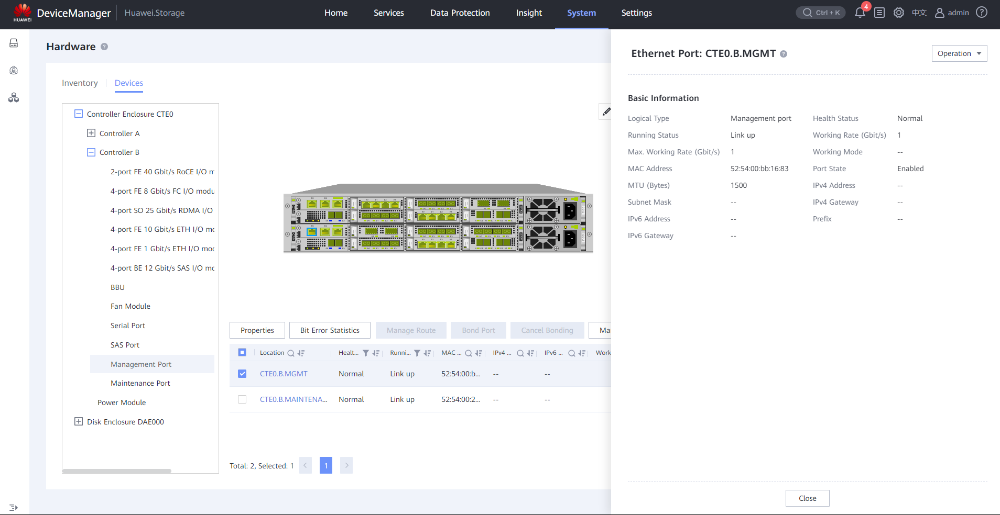
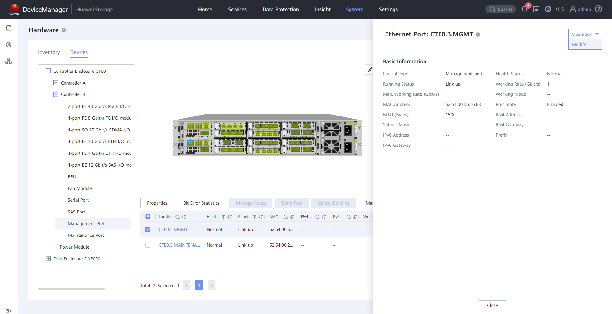

#### **Requirements:**

* **Default IPs** of the Controllers Management Ports (check **data** section)
* **Management IPs** designed for the machines (given by client)
* **Ethernet** (RJ45) Cable for connection

---

#### **Data**

* Default IPs of Management Ports of the Controller:
  * Port A: 192.168.128.101
  * Port B: 192.168.128.102
* Default IPs of Maintenance Ports of the Controller:
  * Port A: 172.31.128.101
  * Port B: 172.31.128.102
* Default IPs of Network Ports of the Controller:
  * Port A: 127.127.127.10
  * Port B: 127.127.127.11
* Default passwords: Huawei12#$ / Admin@storage / admin@Storage / Admin@Storage

---

#### **Tasks**

1. Change network adapter IP of the laptop

   1. Go to **Network Settings** > **Advanced Network Settings** > **Network Connections**
   2. Locate **Ethernet Adapter** > **Properties**
   3. Select **Internet Protocol Version 4** (TCP/IPv4) >  **Properties** :
      * IP: Different from the default ones of the controller
      * Subnet: 255.255.255.0
   4. Click ' **OK** ' to apply the changes and close the windows
2. Connect the RJ45 cable to the **Management Port** of the **Controller A** to the laptop
3. Open **Device Manager** ([https://192.168.128.101:8088](https://192.168.128.101:8088) or the port IP) > **System** > **Hardware**
   
4. Select the controller enclosure > Move to the back > Select the management port of the **Controller B**
   
5. Click **Operation** > **Modify** to change the IP of the controller:

   * IP: Set the management IP
   * Leave the rest as is

   
6. Do the same for the **Controller A**
7. Disconnect from the machine and ask the client to test the connection to the changed management IP

---

#### **Extra Information**

* To **reconnect** to the Machine after changing the  **Management Port IPs** , you should also change your **PC Ethernet Port** to match the changed IPs
