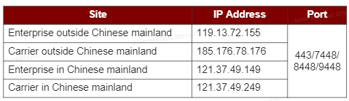
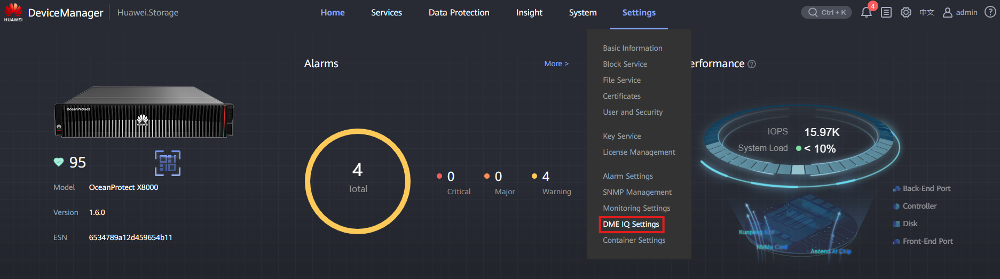
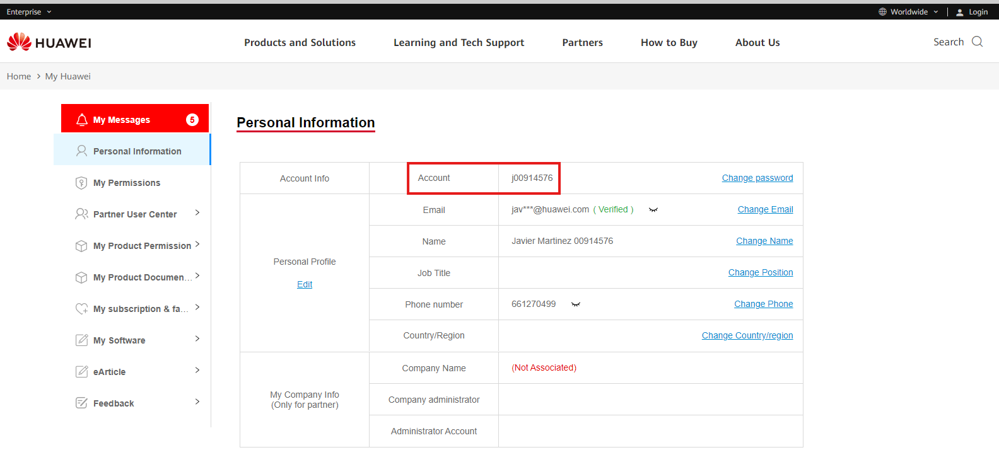

#### Requirements

- Customer has uniportal account
- Storage Cabinets are registered on customer's account
- Customer's Business type (Enterprise / Carrier)

#### Data

- User Guide: [[DME IQ Client 23.0.x User Guide.pdf]]
- Network Information on DME IQ:
  ` `
  ` `

#### Tasks

1. Enter the Device Manager (https://192.168.128.101 or the IP of the port)
2. Go to **Settings** > **DME IQ Settings**
   ` `
   ` `
3. Toggle '**Connect to DME IQ and support OTA upgrades**'
   ` `
   ` `
4. Fill out the information:

   - **DME IQ Site**: Customer's business type
   - **Customer Site Name**: Descriptive name for the customer's site
   - **Transport Protocol**: HTTPS for Internet / SMTP for Email
   - **Uniportal Account**: Customer's uniportal account
   - **Contact**: Add Huawei's employee contact information
5. Click '**Save and Authenticate**'
   ` `
   ` `
6. Fill out the information:

   - **Uniportal Account**: Customer's uniportal Account, can be found here:
     https://e.huawei.com/en/myspace/accountinformation
   - **Password**: Uniportal account password
   - **Authorization Mode**: Online authorization
   - **Customer Company Name**: Name for the customer's company
   - **Customer's Email**: Uniportal Email

   ` `
   ` `
7. Click '**OK**' to try the authentication
   ` `
   ` `
8. If all worked correctly, it should appear Authenticated:
   ` `
   ` `
9. Login to your DME IQ account and wait for the Storage Cabinets to appear
10. Open a TAC ticket to validate the Cabinets for the customer: [Eusupport@huawei.com](mailto:Eusupport@huawei.com)
