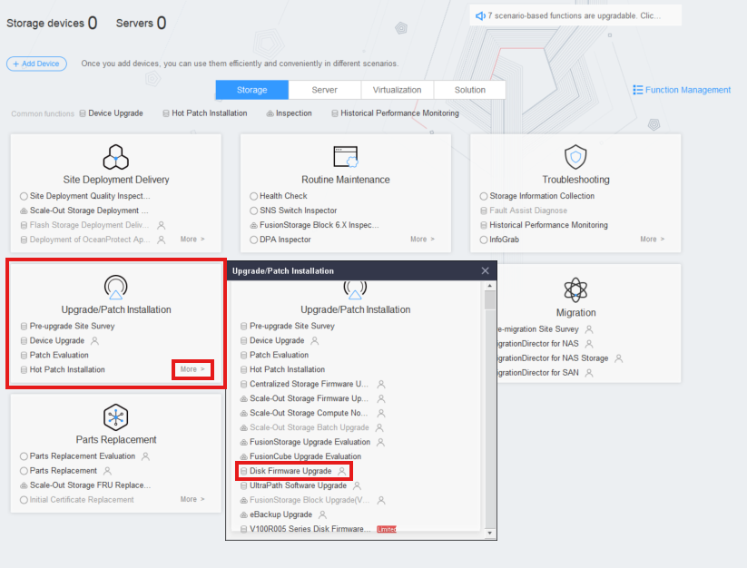

### **Requirements**

* **Smart Kit** with all functions installed
* **Disk Firmware** downloaded

---

### **Tasks**

1. Open the **SmartKit** Software
2. Add the device if it's not there already in **Devices** >  **Add** :

   * **IP** : Use the management IP of the controller
   * **User** : admin
   * **Pass** : Admin Password (given by customer)

   
3. Go to **Upgrade/Patch Installation** > **More** > **Disk Firmware Upgrade**
   
4. Click ' **Disk Firmware Upgrade** '
   
5. Click ' **Add Device** ' and select the required Storage devices
   
6. Follow the upgrade process
