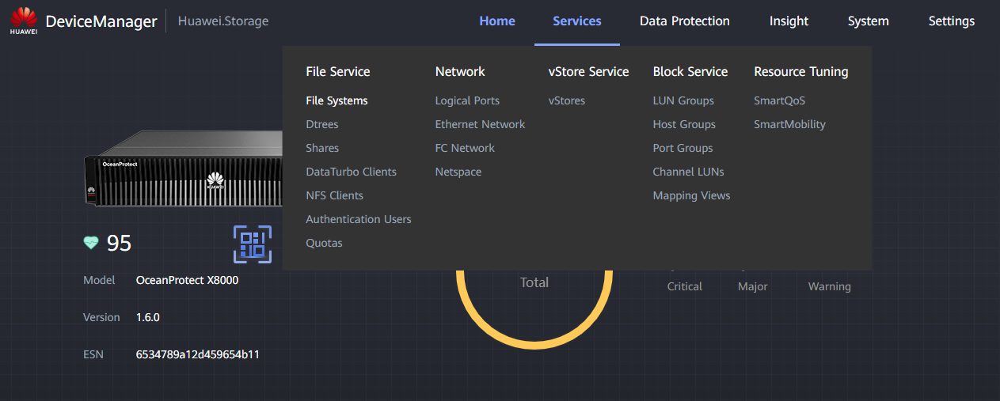

### **File System Creation**

#### Requirements

* Connection to the Storage Array
* Information on the OS of the client

---

### **Tasks**

1. Enter the Device Manager ([https://192.168.128.101](https://192.168.128.101) or the IP of the port)
2. Enter **Services** > **File Service** > **File Systems**
   
3. Click " **Create** " and fill the data:

   * **Name** : Descriptive name for the file system (e.g. FS_NFS_001)
   * **Owning vStore** : Select the vStore decided by the client
   * **Owning Storage Pool** : Select the Storage Pool decided by the client
   * **Security Style** : Select **UNIX** if the **OS** is **Linux** or select **NTFS** if the **OS** is **Windows**
   * **Capacity** : Designate a capacity for the File System decided by the client
   * **Reserved Snapshot Space Ratio** : Designate snapshot space percentage (client)
   * **Application Type** : Select normally **Reduction_Prioritized_Mode**
   * **Shares** : Select the **protocol(s)** for the File System
   * **Protection** : Select HyperCDP schedule if client wants data protection
4. Click " **OK** " to create the **File System**
   

---

### **File System Access**

#### Requirements

* File System created
* Correct access to the logical ports associated

---

#### UNIX File System

1. Install ntfs-3g (Ubuntu):

   <pre class="!overflow-visible">

bash

<button class="flex gap-1 items-center select-none px-4 py-1" aria-label="Copy"><svg width="24" height="24" viewBox="0 0 24 24" fill="none" xmlns="http://www.w3.org/2000/svg" class="icon-xs"><path fill-rule="evenodd" clip-rule="evenodd" d="M7 5C7 3.34315 8.34315 2 10 2H19C20.6569 2 22 3.34315 22 5V14C22 15.6569 20.6569 17 19 17H17V19C17 20.6569 15.6569 22 14 22H5C3.34315 22 2 20.6569 2 19V10C2 8.34315 3.34315 7 5 7H7V5ZM9 7H14C15.6569 7 17 8.34315 17 10V15H19C19.5523 15 20 14.5523 20 14V5C20 4.44772 19.5523 4 19 4H10C9.44772 4 9 4.44772 9 5V7ZM5 9C4.44772 9 4 9.44772 4 10V19C4 19.5523 4.44772 20 5 20H14C14.5523 20 15 19.5523 15 19V10C15 9.44772 14.5523 9 14 9H5Z" fill="currentColor"></path></svg>Copy</button><button class="flex select-none items-center gap-1"><svg width="24" height="24" viewBox="0 0 24 24" fill="none" xmlns="http://www.w3.org/2000/svg" class="icon-xs"><path d="M2.5 5.5C4.3 5.2 5.2 4 5.5 2.5C5.8 4 6.7 5.2 8.5 5.5C6.7 5.8 5.8 7 5.5 8.5C5.2 7 4.3 5.8 2.5 5.5Z" fill="currentColor" stroke="currentColor" stroke-linecap="round" stroke-linejoin="round"></path><path d="M5.66282 16.5231L5.18413 19.3952C5.12203 19.7678 5.09098 19.9541 5.14876 20.0888C5.19933 20.2067 5.29328 20.3007 5.41118 20.3512C5.54589 20.409 5.73218 20.378 6.10476 20.3159L8.97693 19.8372C9.72813 19.712 10.1037 19.6494 10.4542 19.521C10.7652 19.407 11.0608 19.2549 11.3343 19.068C11.6425 18.8575 11.9118 18.5882 12.4503 18.0497L20 10.5C21.3807 9.11929 21.3807 6.88071 20 5.5C18.6193 4.11929 16.3807 4.11929 15 5.5L7.45026 13.0497C6.91175 13.5882 6.6425 13.8575 6.43197 14.1657C6.24513 14.4392 6.09299 14.7348 5.97903 15.0458C5.85062 15.3963 5.78802 15.7719 5.66282 16.5231Z" stroke="currentColor" stroke-width="2" stroke-linecap="round" stroke-linejoin="round"></path><path d="M14.5 7L18.5 11" stroke="currentColor" stroke-width="2" stroke-linecap="round" stroke-linejoin="round"></path></svg>Edit</button>

<code class="!whitespace-pre language-bash">sudo apt update
   sudo apt install cifs-utils
   </code>

</pre>
2. Create the directory to mount the NTFS:

   <pre class="!overflow-visible">

bash

<button class="flex gap-1 items-center select-none px-4 py-1" aria-label="Copy"><svg width="24" height="24" viewBox="0 0 24 24" fill="none" xmlns="http://www.w3.org/2000/svg" class="icon-xs"><path fill-rule="evenodd" clip-rule="evenodd" d="M7 5C7 3.34315 8.34315 2 10 2H19C20.6569 2 22 3.34315 22 5V14C22 15.6569 20.6569 17 19 17H17V19C17 20.6569 15.6569 22 14 22H5C3.34315 22 2 20.6569 2 19V10C2 8.34315 3.34315 7 5 7H7V5ZM9 7H14C15.6569 7 17 8.34315 17 10V15H19C19.5523 15 20 14.5523 20 14V5C20 4.44772 19.5523 4 19 4H10C9.44772 4 9 4.44772 9 5V7ZM5 9C4.44772 9 4 9.44772 4 10V19C4 19.5523 4.44772 20 5 20H14C14.5523 20 15 19.5523 15 19V10C15 9.44772 14.5523 9 14 9H5Z" fill="currentColor"></path></svg>Copy</button><button class="flex select-none items-center gap-1"><svg width="24" height="24" viewBox="0 0 24 24" fill="none" xmlns="http://www.w3.org/2000/svg" class="icon-xs"><path d="M2.5 5.5C4.3 5.2 5.2 4 5.5 2.5C5.8 4 6.7 5.2 8.5 5.5C6.7 5.8 5.8 7 5.5 8.5C5.2 7 4.3 5.8 2.5 5.5Z" fill="currentColor" stroke="currentColor" stroke-linecap="round" stroke-linejoin="round"></path><path d="M5.66282 16.5231L5.18413 19.3952C5.12203 19.7678 5.09098 19.9541 5.14876 20.0888C5.19933 20.2067 5.29328 20.3007 5.41118 20.3512C5.54589 20.409 5.73218 20.378 6.10476 20.3159L8.97693 19.8372C9.72813 19.712 10.1037 19.6494 10.4542 19.521C10.7652 19.407 11.0608 19.2549 11.3343 19.068C11.6425 18.8575 11.9118 18.5882 12.4503 18.0497L20 10.5C21.3807 9.11929 21.3807 6.88071 20 5.5C18.6193 4.11929 16.3807 4.11929 15 5.5L7.45026 13.0497C6.91175 13.5882 6.6425 13.8575 6.43197 14.1657C6.24513 14.4392 6.09299 14.7348 5.97903 15.0458C5.85062 15.3963 5.78802 15.7719 5.66282 16.5231Z" stroke="currentColor" stroke-width="2" stroke-linecap="round" stroke-linejoin="round"></path><path d="M14.5 7L18.5 11" stroke="currentColor" stroke-width="2" stroke-linecap="round" stroke-linejoin="round"></path></svg>Edit</button>

<code class="!whitespace-pre language-bash">sudo mkdir -p /mnt/huawei_share
   </code>

</pre>
3. Mount the NTFS:

   <pre class="!overflow-visible">

bash

<button class="flex gap-1 items-center select-none px-4 py-1" aria-label="Copy"><svg width="24" height="24" viewBox="0 0 24 24" fill="none" xmlns="http://www.w3.org/2000/svg" class="icon-xs"><path fill-rule="evenodd" clip-rule="evenodd" d="M7 5C7 3.34315 8.34315 2 10 2H19C20.6569 2 22 3.34315 22 5V14C22 15.6569 20.6569 17 19 17H17V19C17 20.6569 15.6569 22 14 22H5C3.34315 22 2 20.6569 2 19V10C2 8.34315 3.34315 7 5 7H7V5ZM9 7H14C15.6569 7 17 8.34315 17 10V15H19C19.5523 15 20 14.5523 20 14V5C20 4.44772 19.5523 4 19 4H10C9.44772 4 9 4.44772 9 5V7ZM5 9C4.44772 9 4 9.44772 4 10V19C4 19.5523 4.44772 20 5 20H14C14.5523 20 15 19.5523 15 19V10C15 9.44772 14.5523 9 14 9H5Z" fill="currentColor"></path></svg>Copy</button><button class="flex select-none items-center gap-1"><svg width="24" height="24" viewBox="0 0 24 24" fill="none" xmlns="http://www.w3.org/2000/svg" class="icon-xs"><path d="M2.5 5.5C4.3 5.2 5.2 4 5.5 2.5C5.8 4 6.7 5.2 8.5 5.5C6.7 5.8 5.8 7 5.5 8.5C5.2 7 4.3 5.8 2.5 5.5Z" fill="currentColor" stroke="currentColor" stroke-linecap="round" stroke-linejoin="round"></path><path d="M5.66282 16.5231L5.18413 19.3952C5.12203 19.7678 5.09098 19.9541 5.14876 20.0888C5.19933 20.2067 5.29328 20.3007 5.41118 20.3512C5.54589 20.409 5.73218 20.378 6.10476 20.3159L8.97693 19.8372C9.72813 19.712 10.1037 19.6494 10.4542 19.521C10.7652 19.407 11.0608 19.2549 11.3343 19.068C11.6425 18.8575 11.9118 18.5882 12.4503 18.0497L20 10.5C21.3807 9.11929 21.3807 6.88071 20 5.5C18.6193 4.11929 16.3807 4.11929 15 5.5L7.45026 13.0497C6.91175 13.5882 6.6425 13.8575 6.43197 14.1657C6.24513 14.4392 6.09299 14.7348 5.97903 15.0458C5.85062 15.3963 5.78802 15.7719 5.66282 16.5231Z" stroke="currentColor" stroke-width="2" stroke-linecap="round" stroke-linejoin="round"></path><path d="M14.5 7L18.5 11" stroke="currentColor" stroke-width="2" stroke-linecap="round" stroke-linejoin="round"></path></svg>Edit</button>

<code class="!whitespace-pre language-bash">sudo mount -t cifs //192.168.1.100/ShareTest /mnt/huawei_share -o username=UserName,password=PassWord
   </code>

</pre>
4. Verify access to the File System:

   <pre class="!overflow-visible">

bash

<button class="flex gap-1 items-center select-none px-4 py-1" aria-label="Copy"><svg width="24" height="24" viewBox="0 0 24 24" fill="none" xmlns="http://www.w3.org/2000/svg" class="icon-xs"><path fill-rule="evenodd" clip-rule="evenodd" d="M7 5C7 3.34315 8.34315 2 10 2H19C20.6569 2 22 3.34315 22 5V14C22 15.6569 20.6569 17 19 17H17V19C17 20.6569 15.6569 22 14 22H5C3.34315 22 2 20.6569 2 19V10C2 8.34315 3.34315 7 5 7H7V5ZM9 7H14C15.6569 7 17 8.34315 17 10V15H19C19.5523 15 20 14.5523 20 14V5C20 4.44772 19.5523 4 19 4H10C9.44772 4 9 4.44772 9 5V7ZM5 9C4.44772 9 4 9.44772 4 10V19C4 19.5523 4.44772 20 5 20H14C14.5523 20 15 19.5523 15 19V10C15 9.44772 14.5523 9 14 9H5Z" fill="currentColor"></path></svg>Copy</button><button class="flex select-none items-center gap-1"><svg width="24" height="24" viewBox="0 0 24 24" fill="none" xmlns="http://www.w3.org/2000/svg" class="icon-xs"><path d="M2.5 5.5C4.3 5.2 5.2 4 5.5 2.5C5.8 4 6.7 5.2 8.5 5.5C6.7 5.8 5.8 7 5.5 8.5C5.2 7 4.3 5.8 2.5 5.5Z" fill="currentColor" stroke="currentColor" stroke-linecap="round" stroke-linejoin="round"></path><path d="M5.66282 16.5231L5.18413 19.3952C5.12203 19.7678 5.09098 19.9541 5.14876 20.0888C5.19933 20.2067 5.29328 20.3007 5.41118 20.3512C5.54589 20.409 5.73218 20.378 6.10476 20.3159L8.97693 19.8372C9.72813 19.712 10.1037 19.6494 10.4542 19.521C10.7652 19.407 11.0608 19.2549 11.3343 19.068C11.6425 18.8575 11.9118 18.5882 12.4503 18.0497L20 10.5C21.3807 9.11929 21.3807 6.88071 20 5.5C18.6193 4.11929 16.3807 4.11929 15 5.5L7.45026 13.0497C6.91175 13.5882 6.6425 13.8575 6.43197 14.1657C6.24513 14.4392 6.09299 14.7348 5.97903 15.0458C5.85062 15.3963 5.78802 15.7719 5.66282 16.5231Z" stroke="currentColor" stroke-width="2" stroke-linecap="round" stroke-linejoin="round"></path><path d="M14.5 7L18.5 11" stroke="currentColor" stroke-width="2" stroke-linecap="round" stroke-linejoin="round"></path></svg>Edit</button>

<code class="!whitespace-pre language-bash">ls /mnt/huawei_share
   </code>

</pre>

#### Windows File System

1. Open **Command Execution** (Win + R)
2. Input:

   <pre class="!overflow-visible">

code

<button class="flex gap-1 items-center select-none px-4 py-1" aria-label="Copy"><svg width="24" height="24" viewBox="0 0 24 24" fill="none" xmlns="http://www.w3.org/2000/svg" class="icon-xs"><path fill-rule="evenodd" clip-rule="evenodd" d="M7 5C7 3.34315 8.34315 2 10 2H19C20.6569 2 22 3.34315 22 5V14C22 15.6569 20.6569 17 19 17H17V19C17 20.6569 15.6569 22 14 22H5C3.34315 22 2 20.6569 2 19V10C2 8.34315 3.34315 7 5 7H7V5ZM9 7H14C15.6569 7 17 8.34315 17 10V15H19C19.5523 15 20 14.5523 20 14V5C20 4.44772 19.5523 4 19 4H10C9.44772 4 9 4.44772 9 5V7ZM5 9C4.44772 9 4 9.44772 4 10V19C4 19.5523 4.44772 20 5 20H14C14.5523 20 15 19.5523 15 19V10C15 9.44772 14.5523 9 14 9H5Z" fill="currentColor"></path></svg>Copy</button><button class="flex select-none items-center gap-1"><svg width="24" height="24" viewBox="0 0 24 24" fill="none" xmlns="http://www.w3.org/2000/svg" class="icon-xs"><path d="M2.5 5.5C4.3 5.2 5.2 4 5.5 2.5C5.8 4 6.7 5.2 8.5 5.5C6.7 5.8 5.8 7 5.5 8.5C5.2 7 4.3 5.8 2.5 5.5Z" fill="currentColor" stroke="currentColor" stroke-linecap="round" stroke-linejoin="round"></path><path d="M5.66282 16.5231L5.18413 19.3952C5.12203 19.7678 5.09098 19.9541 5.14876 20.0888C5.19933 20.2067 5.29328 20.3007 5.41118 20.3512C5.54589 20.409 5.73218 20.378 6.10476 20.3159L8.97693 19.8372C9.72813 19.712 10.1037 19.6494 10.4542 19.521C10.7652 19.407 11.0608 19.2549 11.3343 19.068C11.6425 18.8575 11.9118 18.5882 12.4503 18.0497L20 10.5C21.3807 9.11929 21.3807 6.88071 20 5.5C18.6193 4.11929 16.3807 4.11929 15 5.5L7.45026 13.0497C6.91175 13.5882 6.6425 13.8575 6.43197 14.1657C6.24513 14.4392 6.09299 14.7348 5.97903 15.0458C5.85062 15.3963 5.78802 15.7719 5.66282 16.5231Z" stroke="currentColor" stroke-width="2" stroke-linecap="round" stroke-linejoin="round"></path><path d="M14.5 7L18.5 11" stroke="currentColor" stroke-width="2" stroke-linecap="round" stroke-linejoin="round"></path></svg>Edit</button>

<code class="!whitespace-pre language-code">\\LogicalPortIP\ShareName
   </code>

</pre>
3. Use

   <pre class="!overflow-visible">

code

<button class="flex gap-1 items-center select-none px-4 py-1" aria-label="Copy"><svg width="24" height="24" viewBox="0 0 24 24" fill="none" xmlns="http://www.w3.org/2000/svg" class="icon-xs"><path fill-rule="evenodd" clip-rule="evenodd" d="M7 5C7 3.34315 8.34315 2 10 2H19C20.6569 2 22 3.34315 22 5V14C22 15.6569 20.6569 17 19 17H17V19C17 20.6569 15.6569 22 14 22H5C3.34315 22 2 20.6569 2 19V10C2 8.34315 3.34315 7 5 7H7V5ZM9 7H14C15.6569 7 17 8.34315 17 10V15H19C19.5523 15 20 14.5523 20 14V5C20 4.44772 19.5523 4 19 4H10C9.44772 4 9 4.44772 9 5V7ZM5 9C4.44772 9 4 9.44772 4 10V19C4 19.5523 4.44772 20 5 20H14C14.5523 20 15 19.5523 15 19V10C15 9.44772 14.5523 9 14 9H5Z" fill="currentColor"></path></svg>Copy</button><button class="flex select-none items-center gap-1"><svg width="24" height="24" viewBox="0 0 24 24" fill="none" xmlns="http://www.w3.org/2000/svg" class="icon-xs"><path d="M2.5 5.5C4.3 5.2 5.2 4 5.5 2.5C5.8 4 6.7 5.2 8.5 5.5C6.7 5.8 5.8 7 5.5 8.5C5.2 7 4.3 5.8 2.5 5.5Z" fill="currentColor" stroke="currentColor" stroke-linecap="round" stroke-linejoin="round"></path><path d="M5.66282 16.5231L5.18413 19.3952C5.12203 19.7678 5.09098 19.9541 5.14876 20.0888C5.19933 20.2067 5.29328 20.3007 5.41118 20.3512C5.54589 20.409 5.73218 20.378 6.10476 20.3159L8.97693 19.8372C9.72813 19.712 10.1037 19.6494 10.4542 19.521C10.7652 19.407 11.0608 19.2549 11.3343 19.068C11.6425 18.8575 11.9118 18.5882 12.4503 18.0497L20 10.5C21.3807 9.11929 21.3807 6.88071 20 5.5C18.6193 4.11929 16.3807 4.11929 15 5.5L7.45026 13.0497C6.91175 13.5882 6.6425 13.8575 6.43197 14.1657C6.24513 14.4392 6.09299 14.7348 5.97903 15.0458C5.85062 15.3963 5.78802 15.7719 5.66282 16.5231Z" stroke="currentColor" stroke-width="2" stroke-linecap="round" stroke-linejoin="round"></path><path d="M14.5 7L18.5 11" stroke="currentColor" stroke-width="2" stroke-linecap="round" stroke-linejoin="round"></path></svg>Edit</button>

<code class="!whitespace-pre language-code">.\CreatedUser
   </code>

</pre>

   and password to access with the **local user**
4. Verify correct access to the File System
