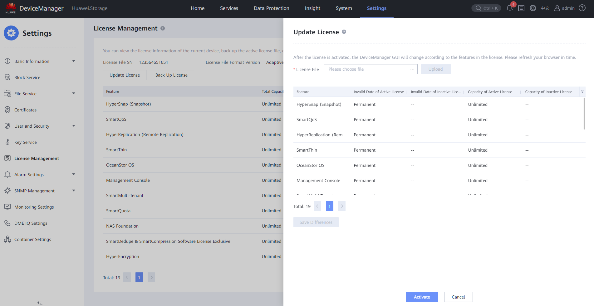

#### Requirements

- Connection to the **Controller** through the Management Port (RJ45 cable)
- **Management Port IP**
- License file (.dat) for the client specifications

---

#### Tasks

1. Enter the Device Manager (https://192.168.128.101 or the IP of the port)
2. Enter **Settings** > **License Management**
   ` `
   ` `
3. Click **Update License**
4. Choose the **License File(s)** (.dat) and click **Upload**
   ` `
   ` `
5. Click **Activate** to finish the process
