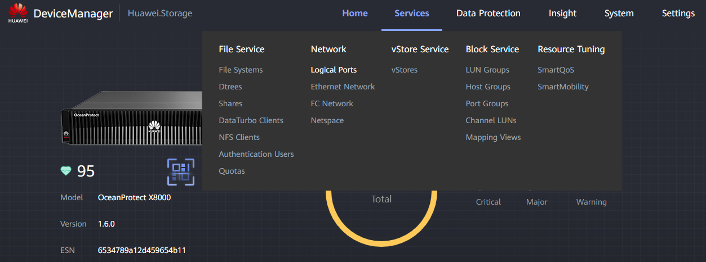
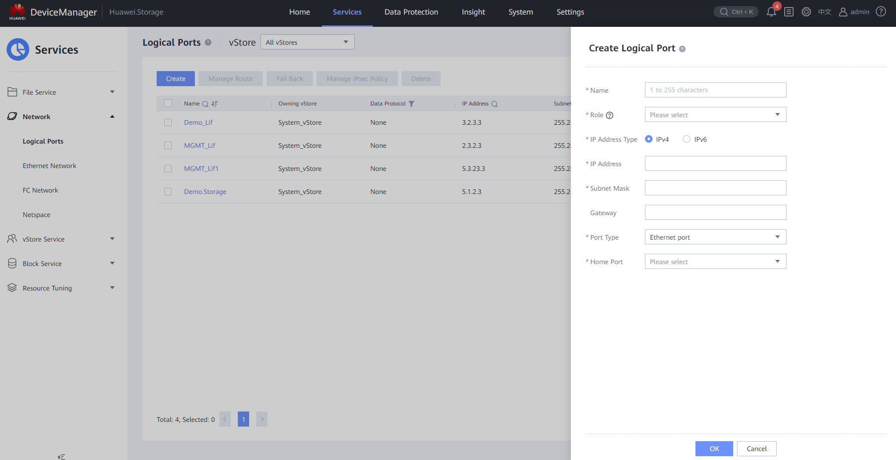
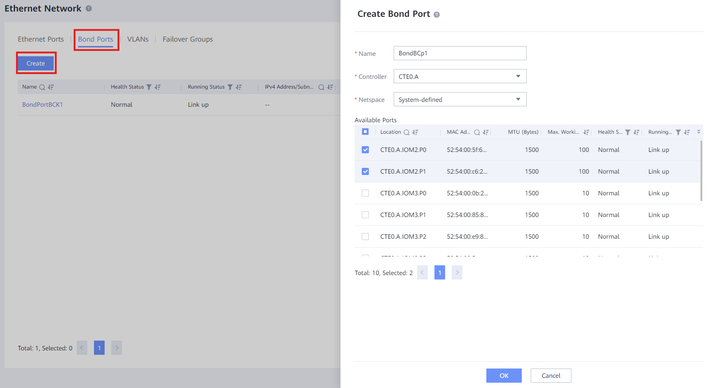
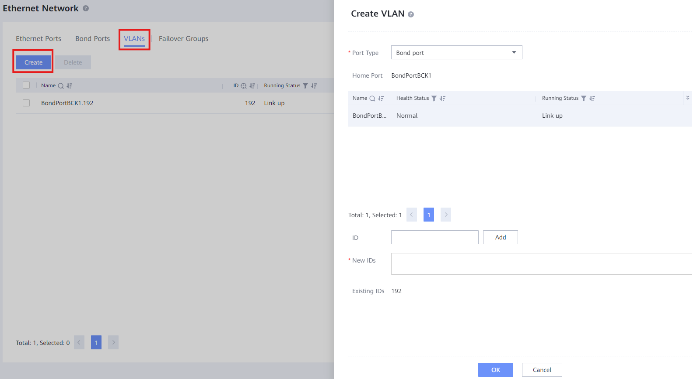
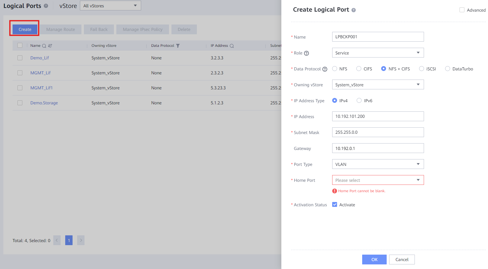

### **Requirements**

* Connection to the **Controller** through the Management Port (RJ45 cable)
* **IP Address** for the **Logical Port**
* **Subnet Mask** for the **Logical Port**
* **Role** for the port given by client (Management / Service / Replication / ...)
* **Data Protocol** for the port given by the client (NFS / CIFS / iSCSI / ...)
* **Port type** for the port given by the client
* **Home Port** for the port given by the client (Interface Module Ports)
* **(Optional) Gateway** for the port given by the client

---

### **Switch Access Through Ethernet**

#### Tasks

1. Enter the Device Manager ([https://192.168.128.101](https://192.168.128.101) or the IP of the port)
2. Go to **Services** > **Network** > **Logical Ports**
   
3. Click **Create** and fill the data:

   * **Name** : Descriptive name for the port (e.g. LP_DEV001)
   * **Role** : Given by the client (commonly  **Service** )
   * **Data Protocol** : Given by the client (commonly  **NFS** )
   * **Owning vStore** : Select the **vStore** created previously for the client
   * **IP Address Type** : Either **IPv4** or **IPv6** (commonly  **IPv4** )
   * **IP Address** : Given by the client (IP needed for service)
   * **Subnet Mask** : Given by the client (commonly 255.255.255.0)
   * **Gateway** : Given by the client
   * **Port Type** : Given by the client: **Ethernet port**
   * **Home Port** : **Interface Module** Port given by client
   * **Activation Status** : Commonly left as **Activated**
4. Click **OK** to create the **Logical Port**
   

---

### **Switch Access Through VLAN**

1. Enter the Device Manager ([https://192.168.128.101](https://192.168.128.101) or the IP of the port)
2. Go to **Services** > **Network** > **Ethernet Network**
3. Make sure that the ports you want to use show as " **Link up** "
4. Click " **Bond Ports** " and " **Create** " to fill the information:

   * **Name** : Descriptive name for the Bond Port
   * **Controller** : Select the Controller that has the physical ports
   * **Netspace** : Leave as is
   * **Available Ports** : Select the Physical Ports that will form the bond port

   
5. Click " **OK** " to create the **Bond Port**
6. Click " **VLANs** " and " **Create** " to fill the information:

   * **Port Type** : Select **Bond port**
   * **Home Port** : Select the bond port created previously
   * **ID** : Write ID of the VLAN and press " **Add** "

   
7. Click " **OK** " to create the **VLAN** with the **Bond Port**
8. Go to **Network** > **Logical Ports**
9. Click " **Create** " and fill out the information:

   * **Name** : Descriptive name for the port (e.g. LP_DEV001)
   * **Role** : Given by the client (commonly  **Service** )
   * **Data Protocol** : Given by the client (commonly  **NFS + CIFS** )
   * **Owning vStore** : Select the **vStore** created previously for the client
   * **IP Address Type** : Either **IPv4** or **IPv6** (commonly  **IPv4** )
   * **IP Address** : Given by the client (IP needed for service)
   * **Subnet Mask** : Given by the client (commonly 255.255.255.0)
   * **Gateway** : Given by the client
   * **Port Type** : **VLAN**
   * **Home Port** : Select the Home Port created previously
   * **Activation Status** : Commonly left as **Activated**

   
10. Click " **OK** " to create the Logical Port
11. Test the connection to the Logical Port through:

`ping LogicalPort_IP`
