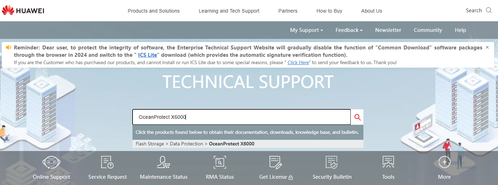

### **Software Download**

#### Requirements

* **Storage Solution** that the client needs
* Software version required

---

#### Tasks

1. Enter [https://support.huawei.com/enterprise/en/index.html](https://support.huawei.com/enterprise/en/index.html)
2. Search for the **Model** of the required Storage Solution
   
3. Go to **Software Download** and find the software:

   * Main: Doesn't have the .SPHXX extension
   * Patch: Highest number on SPHXX for the required main patch
4. Press on **Download** and fill out the required details (if needed)
   
5. Wait for the approval (if locked) and download the software
