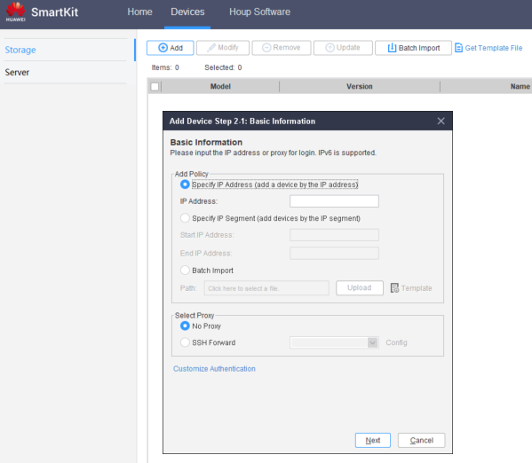

### **Smart Kit**

#### Requirements

- **Smart Kit** with all functions installed: [SmartKit Download](https://support.huawei.com/enterprise/en/distributed-storage/smartkit-pid-8576706/software/261548176?idAbsPath=fixnode01%7C7919749%7C251366268%7C250389224%7C251366263%7C8576706)
- **Main Software** and **Patch** downloaded: [Main and Patch Software Download](../Storage%20Cabinets%20Configuration/Main%20and%20Patch%20Software%20Download.md)
- **Management IPs** of the **Controllers** (given from client)
- **Ethernet** (RJ45) Cable for connection

#### Tasks

1. Connect to the **Controller** through the RJ45 cable
2. Open the **SmartKit** Software
3. Add the device if it's not there already in **Devices** > **Add**:

   - **IP**: Use the management IP of the controller
   - **User**: admin
   - **Pass**: Admin Password (given by customer)
     ` `
     ` `
4. Go to **Upgrade/Patch Installation** > **Device Upgrade** > **Upgrade Policy Setting**
5. Select the **Device** to update
   ` `
   ` `
6. Select **Upgrade Storage Device**
7. Browse for the **Main Update** file and press **Finish**
8. Click **Modify** to select the **Patch Update** after the **Main Update** finishes
9. Click **OK** to start the **Device Upgrade**

---

### **Device Manager**

#### Requirements

- **Main Software** and **Patch** downloaded of required Storage Solution
- **Management IPs** of the **Controllers** (given from client)
- **License File** for the required **Storage Solution**
- **Ethernet** (RJ45) Cable for connection

#### Tasks

1. Connect to the **Controller** through the RJ45 cable
2. Open **Device Manager** (https://192.168.128.101 or the IP of the port) > **Settings** > **Basic Information** > **Upgrade**
3. Click on **Manual Upgrade** button to start the process
4. For **Patch Update**:
   1. Click **Hot Patch**
   2. Check that **Current Version** is correct
   3. Unmark **Update Check Item Component Package**
   4. Patch Package: Browse for the **Update File** and click **Upload**
   5. Click **Upgrade**
5. For **Main Update**:
   1. Click **System Upgrade**
   2. Check that **Current Version** is different from the one to update
   3. Unmark **Update Check Item Component Package** and click **Evaluate**
   4. After the process is done, upload the **License File** and click **Next**
