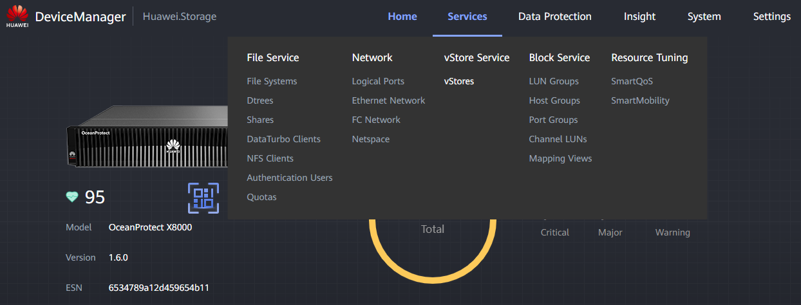

#### Use

vStores along with Logical Ports are used to isolate networks. This can be used to dedicate a network to a specific environment (development, preproduction, ...) or to divide departments inside a company.

#### Requirements

* Connection to the **Controller** through the Management Port (RJ45 cable)
* **Virtual Storage** requirements (GB / TB)
* **Logical Ports** to use from client

---

#### Tasks

1. Enter the Device Manager ([https://192.168.128.101](https://192.168.128.101) or the IP of the port)
2. Go to **Services** > **vStore Service** > **vStores**
   
3. Click **Create** and fill the data:

   1. **Name** : Descriptive name for the **vStore** (e.g. VS_DEV)
   2. **NAS Capacity Quota** : Storage that will be **Virtualized**
   3. **SAN Capacity Quota** : Storage that will be **Virtualized**
   4. **Description** : Useful description for the **vStore** utility
   5. **Associate with Storage Pool** :
   6. Select **Custom**
   7. Click **Selected: 0**
   8. Select the previously created **Storage Pool**
   9. Click **OK** to finish **Storage Pool** association
   10. **Associate with FC Port (Fibre Channel)** :
   11. Select **Custom**
   12. Click **Selected: 0**
   13. Select the desired **FC Ports** ( **Interface Module** )
   14. Click **OK** to finish **FC Ports** association
   15. **Logical Ports Selection** :

   * If you have already created the  **Logical Ports** , select them from the menu
   * If not, click **Add** and create them through this menu, then select them
4. Click OK to create the **vStore**
