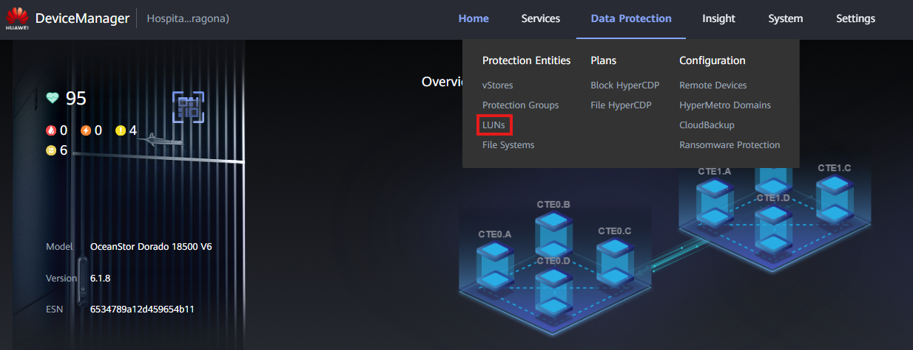

### Definición

Los Snapshots son una tecnología de protección de datos. Son copias en un punto en el tiempo de un LUN específico. Pueden utilizarse para recuperar datos, realizar una reversión en el LUN o almacenar un estado específico del dispositivo de almacenamiento.

Es posible crear Snapshots cuando el Sistema de Almacenamiento tiene HyperMetro configurado. En este caso, los Snapshots se almacenan en ambos dispositivos para alta disponibilidad y se selecciona el par HyperMetro.

---

### Requisitos

- LUN creado ([[LUN Creation]])
- Par HyperMetro creado (solo para dispositivos en HyperMetro)

### Tareas

1. Accede al Device Manager (https://192.168.128.101 o la IP de gestión)
2. Ve a **Data Protection** > **LUNs**
   
3. Haz clic en '**Snapshots**' en la barra de navegación superior
4. Haz clic en el botón '**Create**'
   
5. Completa los datos:

   - **Selected LUN**: Agrega el LUN que tendrá un Snapshot creado. En caso de que los Dispositivos estén en HyperMetro, el Snapshot debe crearse desde el Par HyperMetro.
   - **Creation Mode**:
     - **New Snapshot**: Crea un nuevo snapshot (LUN) para este LUN original.
     - **Select a target LUN**: Utiliza un LUN existente para convertirlo en un snapshot para este LUN.
   - **Name**: Nombre descriptivo para el Snapshot
   - **Description**: Descripción del Snapshot
     
