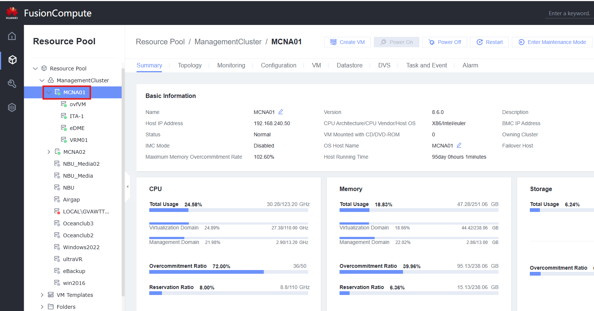

# Activar Modo de Mantenimiento en Hosts

## Definición

El modo de mantenimiento se utiliza para aislar el host del sistema completo. De esta manera, se pueden realizar operaciones de mantenimiento, como reemplazo de componentes, apagado o reinicio del host sin afectar a los servicios del sistema.

Se recomienda migrar todas las VMs del host **antes** de entrar en modo de mantenimiento. No se pueden crear, iniciar o migrar VMs en un host que está en modo de mantenimiento.

## Tareas

1. Acceder a **Resource Pool**
2. Seleccionar el host para entrar en **Maintenance Mode**
   
3. Hacer clic en **Enter Maintenance Mode**
   
4. Seleccionar **Migrate all VMs on the host** y hacer clic en **OK**
   
5. Esperar a que se complete la migración y comenzar las operaciones en el host. El modo de mantenimiento se puede desactivar haciendo clic en **Exit Maintenance Mode**
