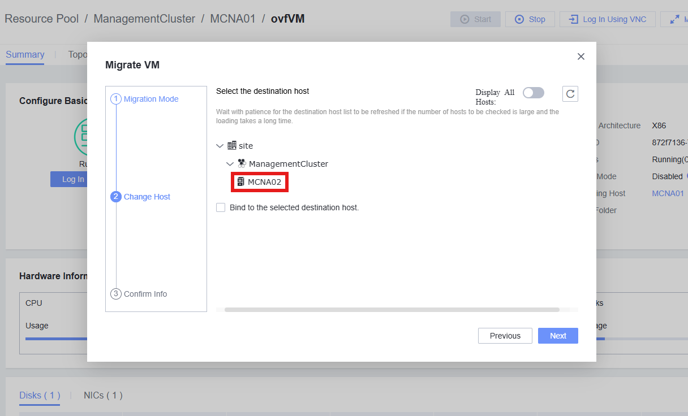

# Mover VMs entre Hosts

## Definición

Las Máquinas Virtuales (o VMs) residen en un Host y utilizan sus recursos para realizar sus servicios. Usando FusionCompute, es posible migrar de forma simple y **sin riesgos o tiempo de inactividad** una VM entre hosts.

## Tareas

1. Acceder a **Resource Pool**
   
2. Seleccionar la VM deseada para mover
   
3. Hacer clic en el botón **Migrate**
   
4. Seleccionar parámetros:

   - **Select Migration Mode**: Seleccionar **Change Host**
   - **Migration Policy**: Normalmente se selecciona **Prioritize Services** para evitar tiempo de inactividad
   - **Timeout Duration**: Tiempo para considerar la migración como fallida
   - **Migration Channel**: Encripta el proceso de migración
   - **Select Destination Host**: Seleccionar el Host que recibirá la VM
   - **Bind to the Host**: Evita que la VM sea migrada automáticamente a otros Hosts para balanceo de carga
     
5. Presionar OK para iniciar la **Migración**. El proceso puede visualizarse en la pestaña **Recent Tasks**
