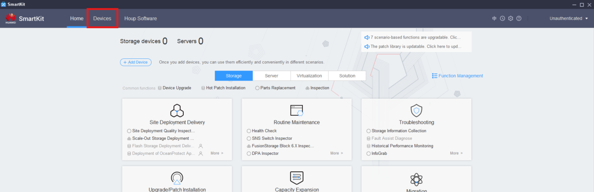
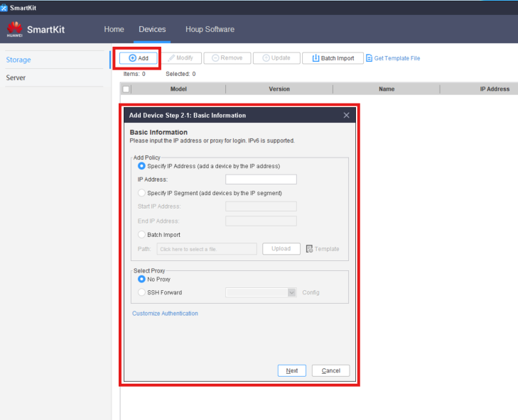
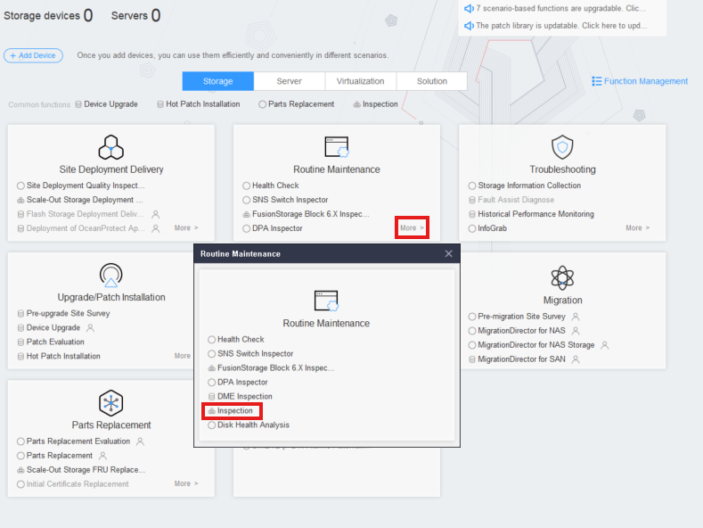
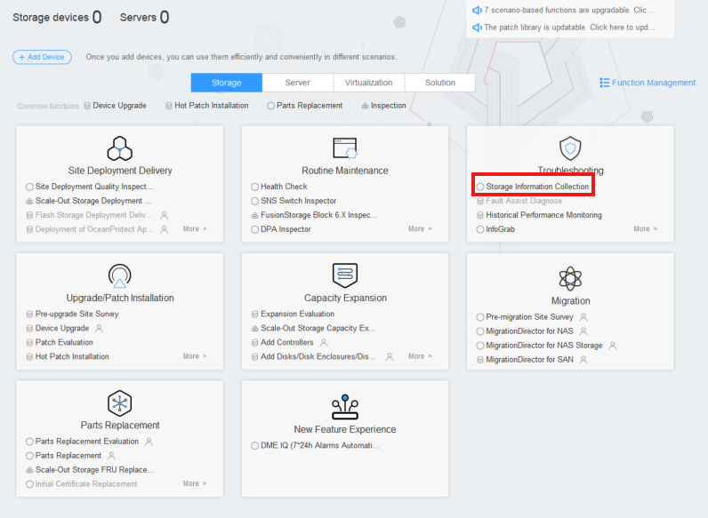
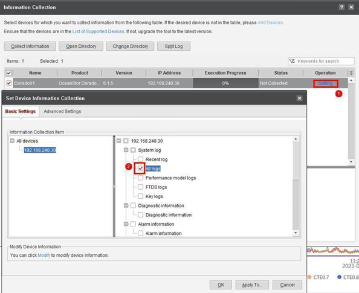
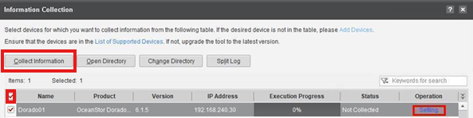
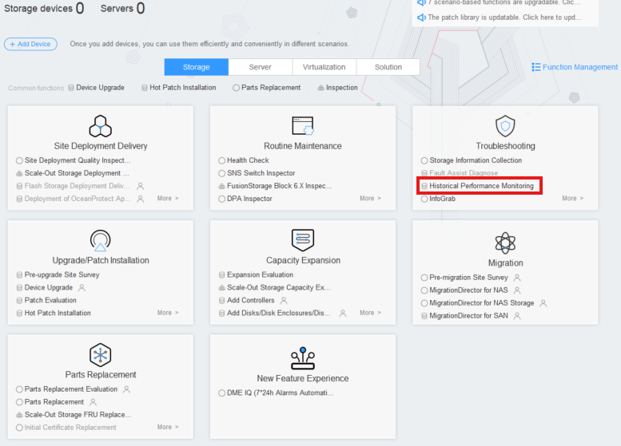
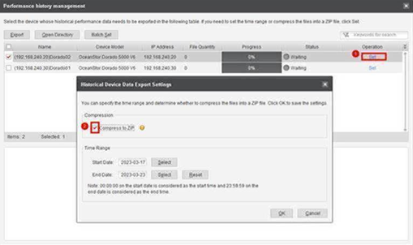

### **Requisitos**

- Conexión con la(s) máquina(s) cliente(s) (direcciones IP y puertos del/los Controlador(es))
- Herramienta SmartKit con el paquete **Historical Performance Monitoring** instalado

---

### **Tareas**

#### Agregar Dispositivos

1. Haz clic en '**Dispositivos**' ` `
2. Haz clic en '**Agregar**' y completa los detalles de la(s) máquina(s)
   

---

#### Inspección

1. Ve a: **Mantenimiento Rutinario** → **Más** → **Inspección** ` `
2. Haz clic en '**Inspección**' para entrar en el **Asistente de Inspección**
3. Haz clic en '**Siguiente**' → Selecciona todos los dispositivos añadidos
4. Haz clic en '**Siguiente**' → Deja todas las listas de verificación con los valores predeterminados
5. Espera a que el proceso finalice

---

#### Recopilación de Información del Almacenamiento

1. Ve a: **Solución de Problemas** → **Recopilación de Información del Almacenamiento** ` `
2. Haz clic en **Recopilar Información**
3. Modifica en todos los dispositivos: **Operación** → **Configuración** → **Configuración Básica** → '**Todos los Registros**' ` `
4. Selecciona todos los dispositivos → Haz clic en '**Recopilar Información**' ` `
5. Espera a que el proceso finalice

---

#### Monitoreo del Rendimiento Histórico

1. Ve a: **Solución de Problemas** → **Monitoreo del Rendimiento Histórico** ` `
2. Haz clic en '**Selección de Dispositivos'**
3. Modifica en todos los dispositivos la opción '**Compresión 7z**' ` `
4. Haz clic en '**Aceptar**' → '**Rendimiento Histórico**
