### **Actualización de la Versión Principal**

#### Requisitos

- Versión **Principal Objetivo** de la actualización (ej. 6.1.6 para OceanStor Dorado)
- Conexión a los Gabinetes de Almacenamiento
- Paquete **Evaluación de la Actualización de Herramientas** de SmartKit instalado

#### Tareas

1. Ingresar a: **Instalación de Actualización/Parche** → **Encuesta del Sitio Pre-actualización**

   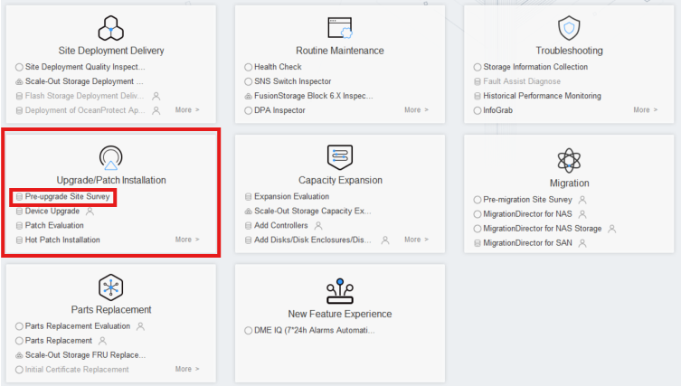

   &nbsp;
2. Iniciar el proceso haciendo clic en **Configuración de Política de Actualización**

   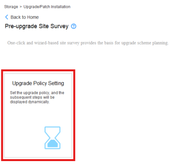

   &nbsp;
3. Hacer clic en el botón '**Agregar Dispositivo**'

   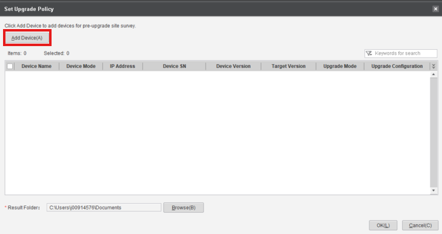

   &nbsp;
4. Hacer clic en el texto resaltado '**Agregar Dispositivo**'

   

   &nbsp;
5. Ingresar la **IP** y las **Credenciales** del **Dispositivo de Almacenamiento**

   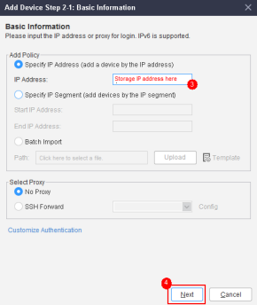

   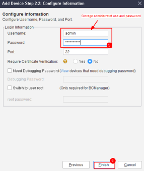

   &nbsp;
6. Seleccionar los **Dispositivos Agregados** en la pantalla **Configurar Política de Actualización**

   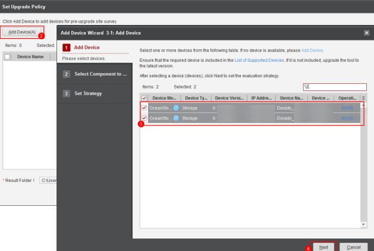

   &nbsp;
7. Hacer clic en '**Siguiente**' en la siguiente pantalla
8. Ingresar la versión objetivo (ej. 1.6.1 para OceanStor Dorado Cabinets) y hacer clic en '**Finalizar**'

   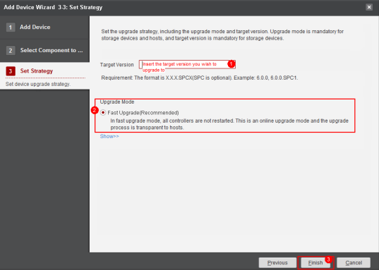

   &nbsp;
9. Hacer clic en '**OK**' en la siguiente pantalla

   &nbsp;
10. Una vez completada la Configuración de Política, hacer clic en **Evaluación de Actualización de Arreglo** y **Ejecutarla**

    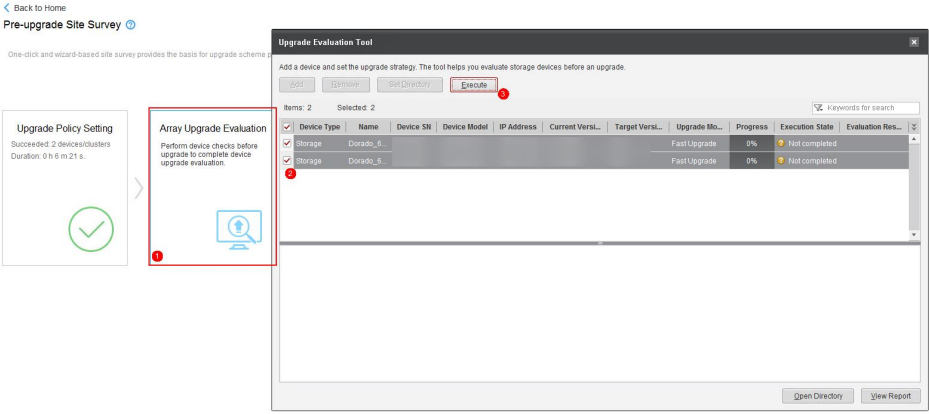

    &nbsp;
11. Una vez completado el proceso, hacer clic en '**Abrir Directorio**' para obtener los archivos

    

    &nbsp;
12. Después de guardar los archivos, proceder al siguiente paso: **'Recopilación de Información de Arreglo'**

    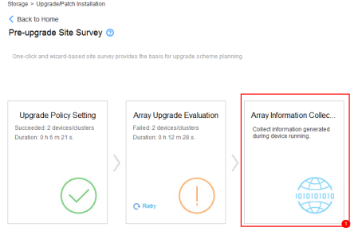

    &nbsp;
13. Seleccionar los Gabinetes de Almacenamiento y hacer clic en '**Recopilar Información**'

    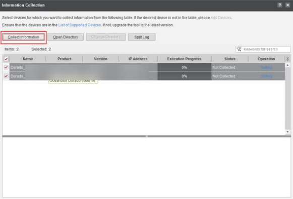

    &nbsp;
14. Una vez finalizado el proceso, hacer clic en '**Abrir Directorio**'

    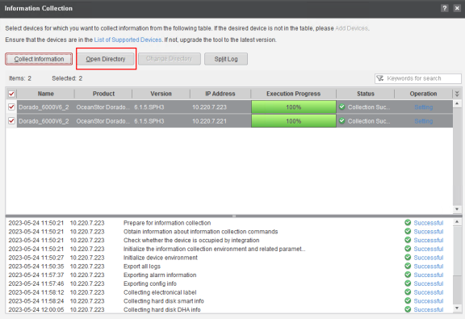

    &nbsp;
15. Enviar ambos archivos obtenidos a la **Carga de Archivos** proporcionada
16. Recopilar los registros de Inspección a través de: **Mantenimiento de Rutina** > **Más** > **Inspección**

    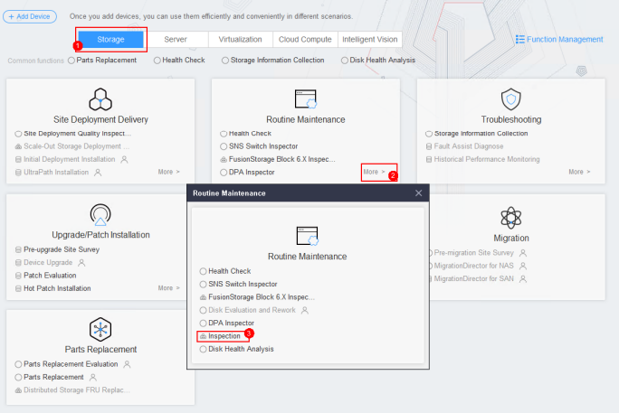

    &nbsp;
17. Hacer clic en '**Inspección**' y '**Siguiente**' en la siguiente pantalla

    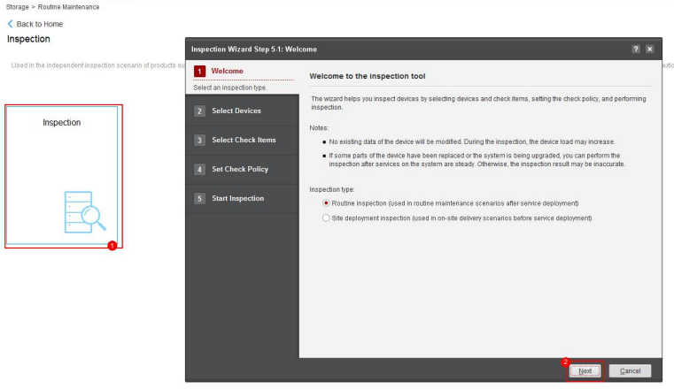

    &nbsp;
18. Seleccionar los Gabinetes de Almacenamiento y hacer clic en '**Siguiente**'

    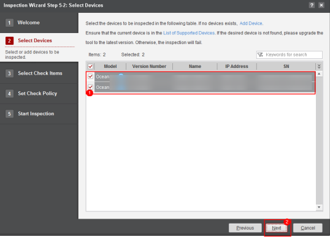

    &nbsp;
19. Asegurarse de que todas las casillas estén marcadas y hacer clic en '**Iniciar**'

    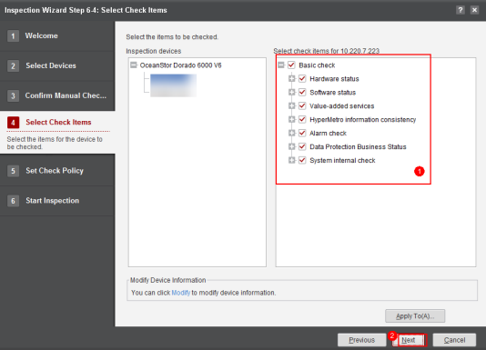

    &nbsp;
20. Una vez finalizado el proceso, guardar los archivos y hacer clic en '**Finalizar**'

    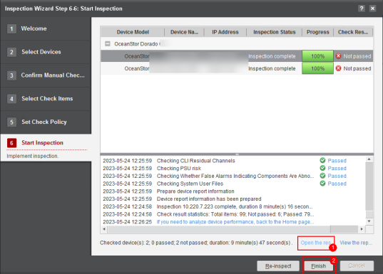

    &nbsp;
21. Enviar los archivos a la **Carga de Archivos** proporcionada
