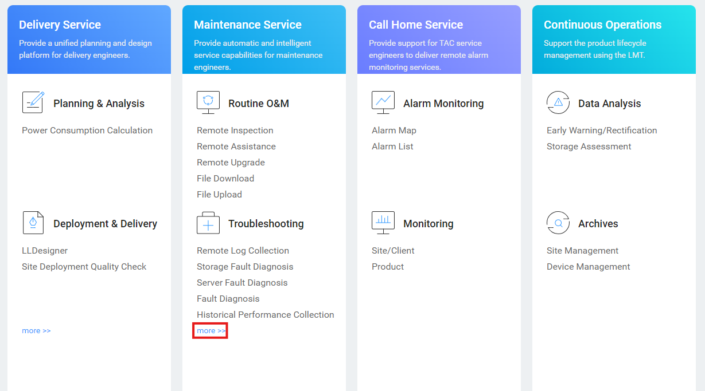

### Requisitos

- Archivos generados a partir de la Verificación de Salud:
  • Archivos de Inspección
  • Archivos de Recopilación de Información de Almacenamiento
  • Archivos de Monitoreo de Rendimiento Histórico

### Tareas

#### Carga de Archivos de Inspección

1. Ingresar a: [https://support-eu.eservice.huawei.com/](https://support-eu.eservice.huawei.com/)
2. Hacer clic en '**Solución de Problemas**' → '**Más**'

   

   &nbsp;
3. Hacer clic en '**Evaluación de Salud**'

   

   &nbsp;
4. Hacer clic en '**Nueva Tarea**'

   

   &nbsp;
5. Completar la información:• **Nombre de la Tarea**: Nombre descriptivo de la tarea• **Tipo de Cliente BG**: Tipo de cliente (Carrier / Enterprise)• **Nombre del Sitio**: Seleccionar el nombre del cliente• **Región**: Seleccionar la región (normalmente Región Europea)• **Oficina**: Seleccionar la oficina (normalmente Oficina Representativa de España)

   &nbsp;
6. Hacer clic en '**Importar**' y agregar el **Archivo de Inspección** generado
7. Hacer clic en '**OK**' para finalizar el proceso

   &nbsp;

---

#### Carga de Archivos de Monitoreo de Rendimiento Histórico

1. Ingresar a: [https://support-eu.eservice.huawei.com/](https://support-eu.eservice.huawei.com/)
2. Hacer clic en '**Solución de Problemas**' → '**Más**'

   

   &nbsp;
3. Hacer clic en '**Análisis de Rendimiento**'

   

   &nbsp;
4. Hacer clic en '**Almacenamiento Centralizado**'
5. Hacer clic en '**Cargar Paquete de Datos de Rendimiento**'
6. Subir los archivos generados del Monitoreo de Rendimiento Histórico

   

   &nbsp;
7. Hacer clic en '**Cargar**' para finalizar el proceso
