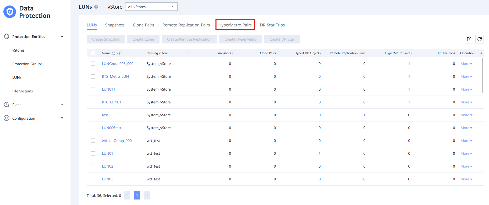
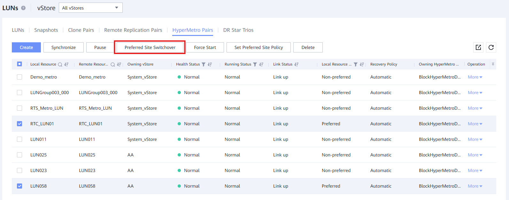

### Requisitos

- Software descargado para los Dispositivos de Almacenamiento
- Servidores de Quorum actualizados (ver: [Actualización del Servidor Quorum](Quorum Server Update.md))

### Mejores Prácticas

Al actualizar **Dispositivos de Almacenamiento HyperMetro** en producción, debemos ser cuidadosos y actualizar solo **uno** de los Dispositivos de Almacenamiento.
Después de asegurarnos de que el servicio funciona correctamente, es necesario esperar al menos **1 día** antes de comenzar el proceso de actualización del otro Dispositivo de Almacenamiento.

Debemos asegurarnos de que el gabinete que estamos actualizando no sea el principal en el HyperMetro.

### Tareas

1. Ingresar a **Protección de Datos** > **Configuración** > **Dominio HyperMetro**

   

   &nbsp;
2. Hacer clic en el **Dominio HyperMetro del Sistema de Archivos** para obtener información

   

   &nbsp;
3. Si el **Rol de Arbitraje** es **Preferido**, puedes hacer el cambio a través de '**Operación**' > '**Cambio de Sitio Preferido**'.Si es **No Preferido**, no es necesario hacer nada.

   

   &nbsp;
4. Ingresar a **Protección de Datos** > **Entidades de Protección** > **LUNs**

   

   &nbsp;
5. Hacer clic en '**Pares HyperMetro**'

   

   &nbsp;
6. Seleccionar todos los Pares HyperMetro cuya columna **Rol de Recurso Local** sea '**Preferido**'

   

   &nbsp;
7. Hacer clic en el **Botón de Cambio de Sitio Preferido** y en '**OK**' en la siguiente ventana

   

   &nbsp;
8. El gabinete ya está listo para ser actualizado. Consulta [Actualización del Software de la Máquina](../Storage Cabinets Configuration/Update Machine's Software.md) para más información sobre este proceso.
