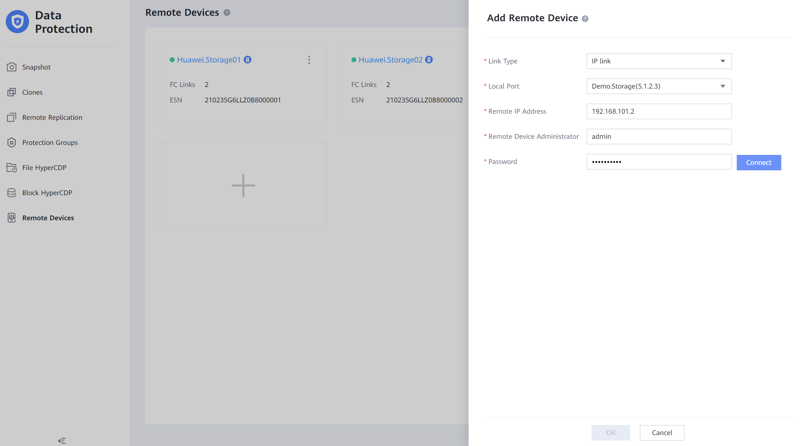
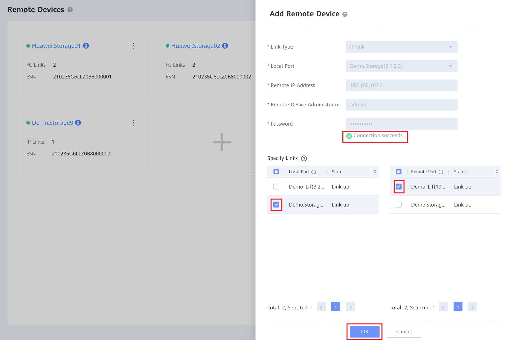
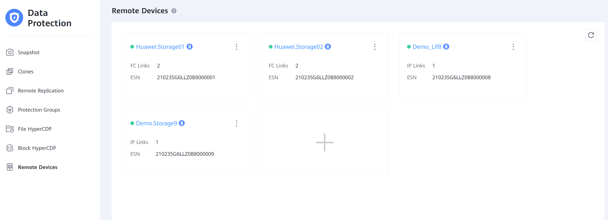
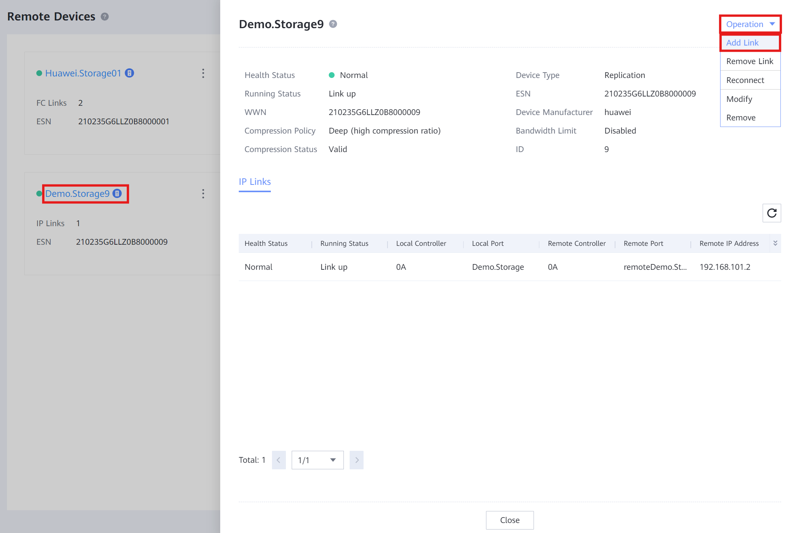
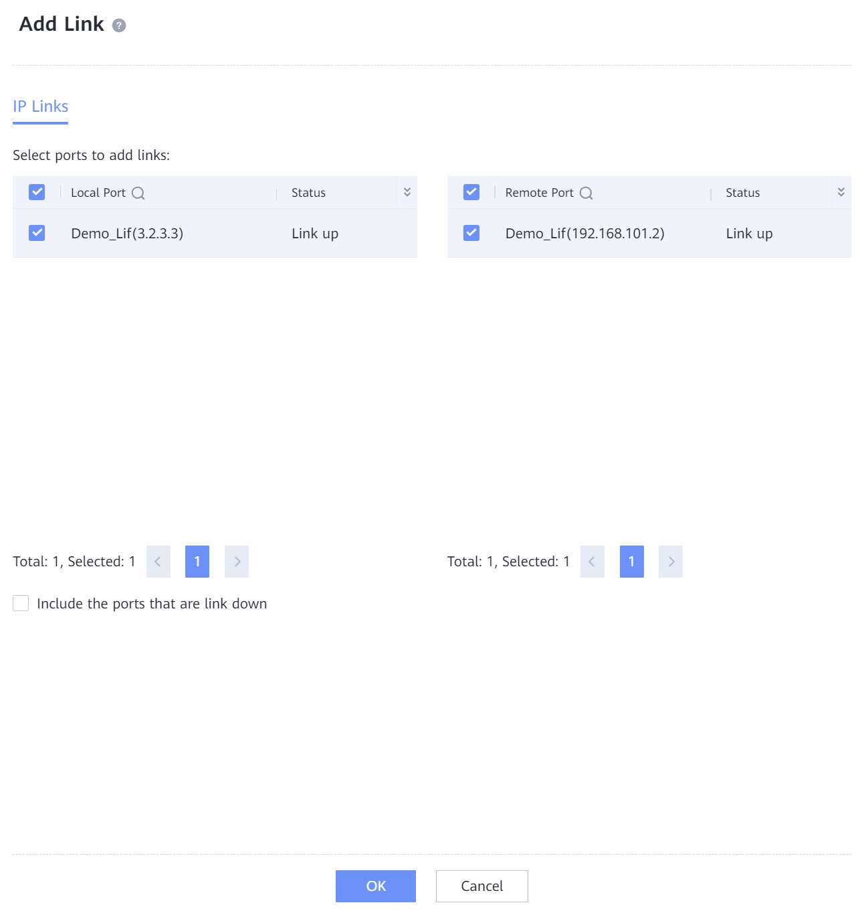

#### Requirements

- Connection to both cabinets
- IPs for logical ports
- Credentials for both cabinets

#### Tasks

1. Connect to **Cabinet A**
2. Create a **Storage Pool** and a **vStore**: [vStore Creation](../Storage%20Cabinets%20Configuration/vStore%20Creation.md)
3. Create a Logical Port: [Logical Ports Creation](../Storage%20Cabinets%20Configuration/Logical%20Ports%20Creation.md.md)
4. Connect to **Cabinet B**
5. Create a **Storage Pool** and a **vStore**: [vStore Creation](../Storage%20Cabinets%20Configuration/vStore%20Creation.md) → Use same names as **Cabinet A**
6. Create a **Logical Port**: [Logical Ports Creation](../Storage%20Cabinets%20Configuration/Logical%20Ports%20Creation.md.md) → Same port types as **Cabinet A**
7. Connect to **Cabinet A**
8. Enter **Data Protection** > **Remote Devices**
9. Click '**+**' and fill out with information:` `
   • **Link Type**: Choose either IP link or FC link` `
   • **Local Port**: Select the **Logical Port** of the **Cabinet A**` `
   • **Remote IP Address**: IP of the address on the **Logical Port** of **Cabinet B**` `
   • **Remote Device Administrator**: **Admin** user of **Cabinet B**` `
   • **Password**: **Admin** password of **Cabinet B**` `
10. Press '**Connect**' to connect the devices
    ` `
    ` `
11. Select the **links** and click '**OK**' to link the devices
    ` `
    ` `

---

#### Requirements

- Remote Device added between **Cabinet A** & **Cabinet B**

#### Tasks

1. Connect to **Cabinet A**
2. Enter **Data Protection** > **Remote Devices**
   ` `
   ` `
3. Click on the **Remote Device** > '**Operation**' > '**Add Link**'
   ` `
   ` `
4. Select other connected ports to establish new **Links** and click '**OK**'
   ` `
   ` `
