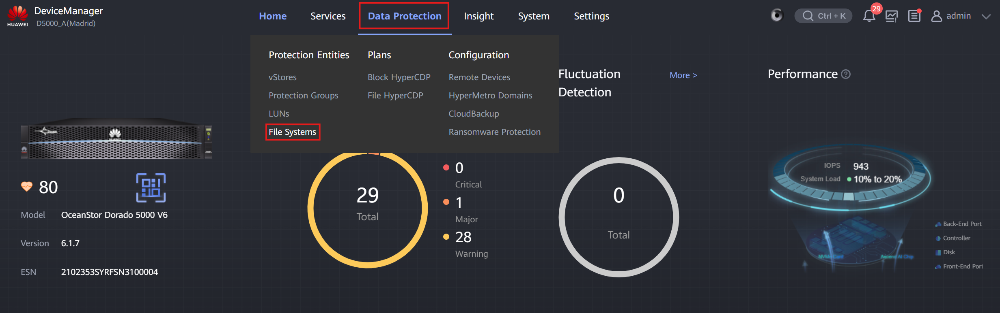
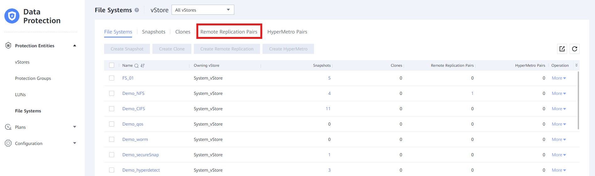
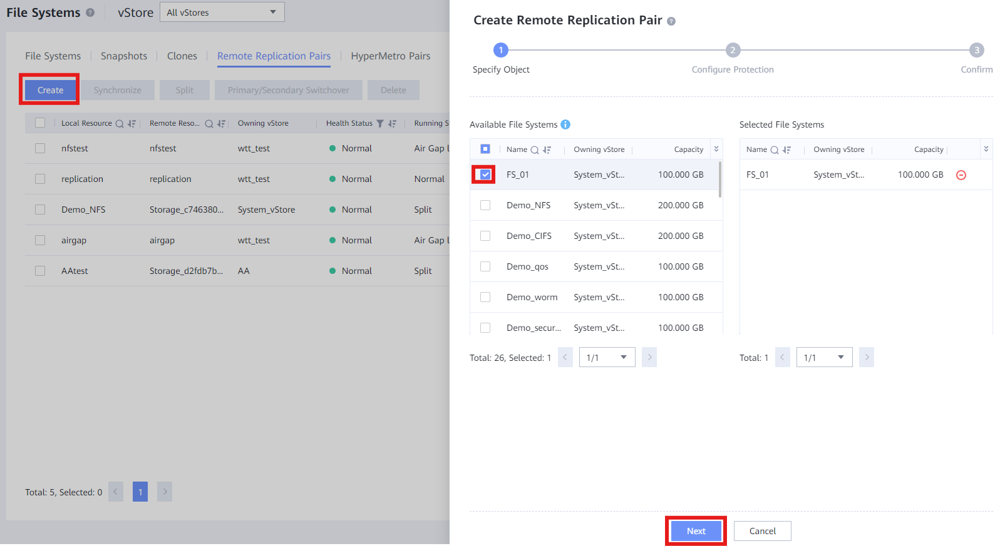
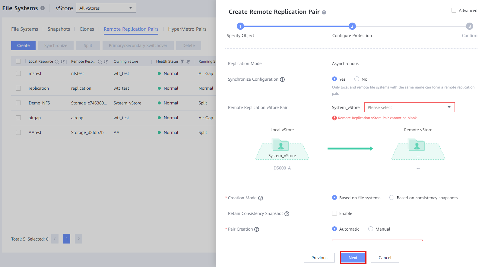

## **Requisitos**

* Conexión de **Dispositivo Remoto** entre **Gabinete A** y **Gabinete B**

## **Tareas**

1. Conéctate al **Gabinete A**
2. Crea un  **File System** : [Creación de File System &amp; Acceso](../Storage%20Cabinets%20Configuration/File%20System%20Creation%20&%20Access.md)
3. Entra en **Protección de Datos** > **File Systems**
   
4. Haz clic en ' **Remote Replication Pairs** '
   
5. Haz clic en ' **Crear** ' y selecciona el **File System** creado previamente
   
6. Haz clic en ' **Siguiente** ' y completa la información:

   * **Configuración de sincronización** : Deja normalmente como **Sí**
   * **Par de vStore de replicación remota** : Selecciona el **vStore común** en ambos gabinetes
   * **Modo de Creación** : Normalmente **Basado en file systems**
   * **Retener Snapshot de Consistencia** : Habilitar para DR Star en NAS
   * **Creación de par** : Deja normalmente como **Automático**
   * **Remote Storage Pool** : Selecciona el Storage Pool creado para **Gabinete B**
   * **Tipo de sincronización** : Normalmente selecciona 'Espera sincronizada después de que termine la sincronización', pero el cliente decide
   * **Intervalo** : Normalmente 1 minuto o 30 segundos, pero el cliente decide
   * **Retención de Snapshot de copia en el recurso secundario** : Según lo que desee el cliente, sincronización de snapshots
   * **Sincronización de Snapshot de Usuario** : Según lo que desee el cliente, sincronización de snapshots con detalles
7. Haz clic en ' **Siguiente** ' y finaliza el proceso
   

---

## **Requisitos**

* Conexión de **Dispositivo Remoto** entre **Gabinete A** y **Gabinete B**

## **Tareas**

1. Conéctate al **Gabinete A**
2. Crea un  **File System** : [Creación de File System &amp; Acceso](../Storage%20Cabinets%20Configuration/File%20System%20Creation%20&%20Access.md)
3. Entra en **Protección de Datos** > **File Systems**
   
4. Haz clic en ' **HyperMetro Pairs** '
