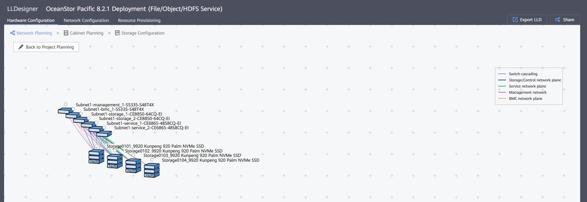
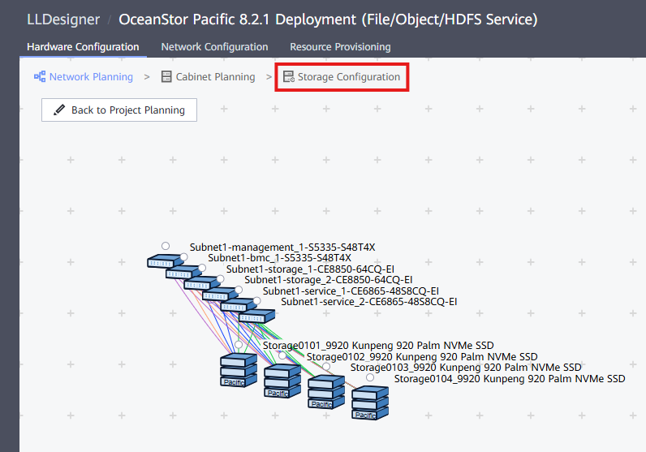
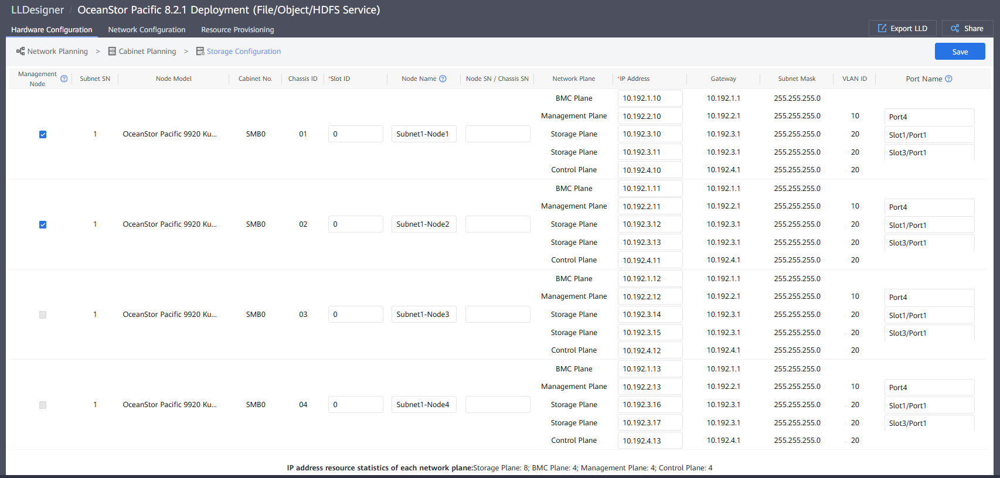
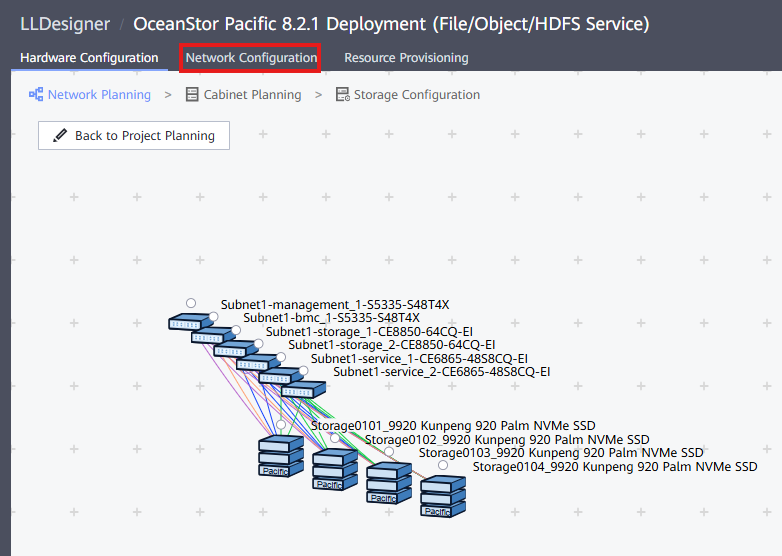
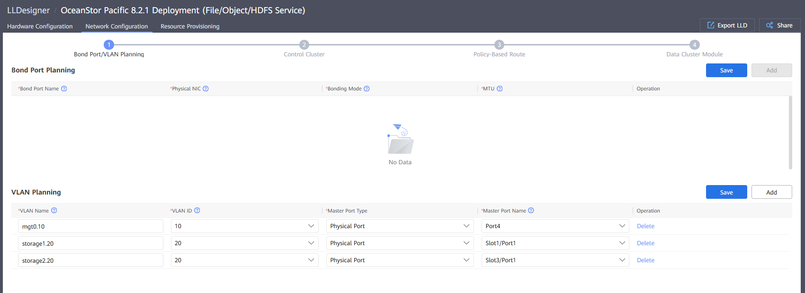
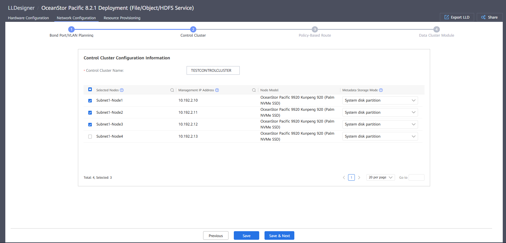
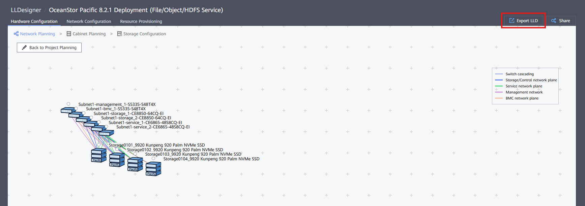
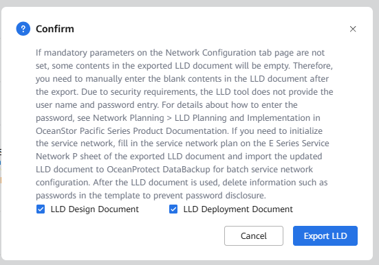

## Definición

Después de crear un proyecto de Scale-Out Storage (ver)[[Create Scale-Out Storage Project]]), es necesario configurarlo correctamente a través de LLDesigner para preparar el despliegue.

## Tareas

1. Selecciona '**Storage Configuration**' para acceder a la configuración de dispositivos de almacenamiento:
   
2. En esta página, es posible configurar los puertos de almacenamiento para los diferentes planos de red (solo en caso de que la configuración sea diferente a la predeterminada):
   
3. Presiona **Save** para actualizar los cambios (si los hay)
4. Selecciona '**Network Configuration**' para configurar correctamente las IPs para los planos de red:
   
5. Bond Port/Vlan Planning:

   - **Bond Port Planning**: En caso de usar bonds, se pueden completar aquí
   - **VLAN Planning**: Para cada uno de los planos de red y respecto a la información ingresada en el LLD, este punto se completa.
     
6. Control Cluster:

   - Control Cluster Name: Nombre del Control Cluster
   - Node selection: Nodos que pueden usarse para crear un control cluster. El número de nodos en un control cluster debe cumplir las siguientes reglas:
     - Si el clúster contiene 3 a 4 nodos, configura 3 nodos.
     - Si el clúster contiene 5 a 6 nodos, configura 5 nodos.
     - Si el clúster contiene 7 nodos o más, configura 7 nodos.
     - Si el clúster contiene 9 nodos o más, o el número de fragmentos de paridad EC es +4 (no +4:1) en un esquema EC, configura 9 nodos.
       
7. Policy-Based Route: En este punto, se requiere configurar una IP para cada uno de los puertos en el plano de red de almacenamiento:
   
8. Presiona el botón '**Complete**' en la siguiente página para completar la **Network Configuration**.
9. Presiona el botón 'Export LLD' para obtener el documento requerido para el despliegue del clúster:
   

   
