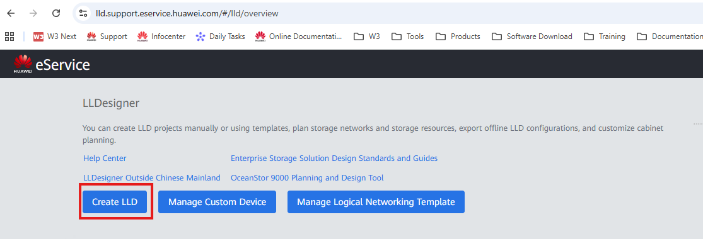
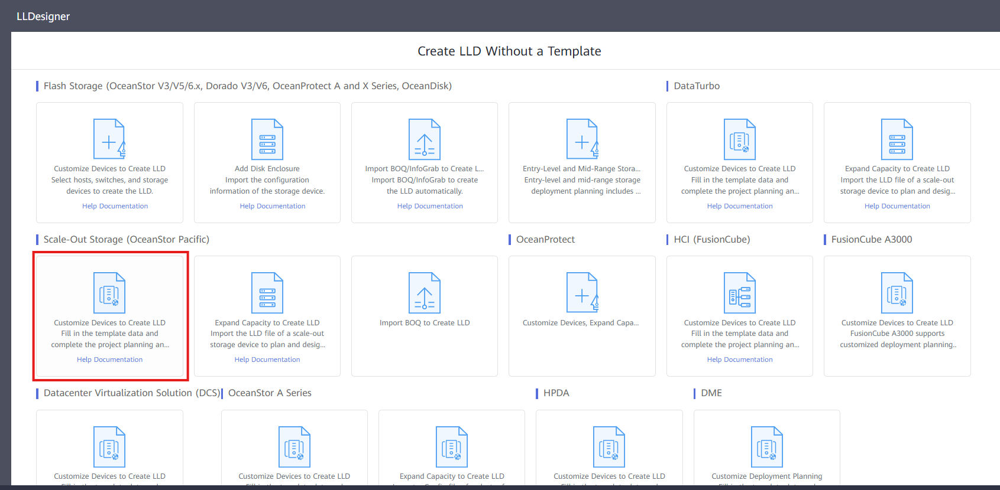
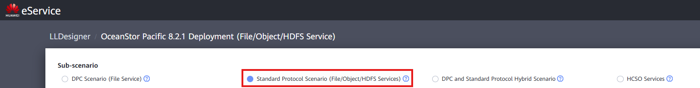
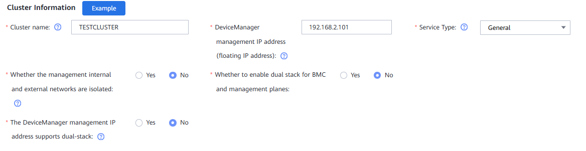
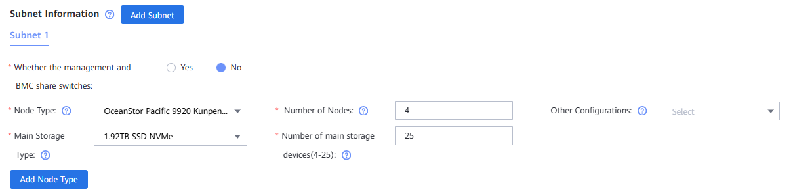
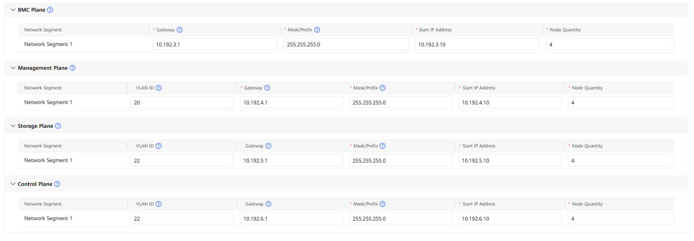

## Definition

Los proyectos de Scale-Out Storage utilizan los dispositivos OceanStor Pacific para crear un clúster de almacenamiento distribuido, formado por varios nodos OceanStor Pacific.

## Tasks

1. Accede a **LLDesigner** y crea un nuevo proyecto: [Link](https://lld.support.eservice.huawei.com/)
   
2. Selecciona la opción '**Customize Devices to Create LLD**' :

   
3. Completa la pantalla '**Create Project LLD**':

   - **Project type**: Carrier / Enterprise
   - **Product version (service)**: Selecciona la versión de firmware OceanStor Pacific
   - **Rep Office / Business Dept**: Selecciona región / Rep Office
   - **Project Name**: Nombre del proyecto
   - **Contract No**: Agrega el número de contrato como referencia
     
4. Completa el **Sub-Scenario**:

   - **DPC Scenario (File Service)**: Los escenarios HPC usan esta opción. DPC debe desplegarse en el clúster Pacific, así como el cliente DPC en los hosts que acceden al clúster de almacenamiento. Esta aplicación habilita acceso directo inter-nodos al almacenamiento distribuido, mejorando enormemente los tiempos de lectura.
   - **Standard Protocol Scenario (File/Object/HDFS Services)**: Despliegue más común para entregas OceanStor Pacific. Soporta casos de uso general de almacenamiento distribuido mediante multi-protocolo.
   - **DPC and Standard Protocol Hybrid Scenario**: Híbrido entre las dos primeras opciones. Habilita DPC cuando algunos SO de nodos de cómputo no lo soportan.
   - **HCSO Services**: Aplica a escenarios donde SFS está integrado
     
5. Completa '**Cluster Information**':

   - **Cluster name**: Nombre del clúster OceanStor Pacific
   - **DeviceManager management IP address**: IP flotante en subred IP de gestión para despliegue de aplicación DeviceManager O&M.
   - **Service Type**: Selecciona tipo de servicio (se recomienda General)
   - **Whether the management internal and external networks are isolated**: Plano de red de gestión puede dividirse en interno y externo. Externo se refiere al accedido por red del cliente para O&M, interno para interconexiones nodos. En escenarios normales, se marca '**No**'.
   - **Whether to enable dual stack for BMC and management planes**: Habilita operación simultánea IPv4 e IPv6 para planos gestión e iBMC. En escenarios normales, se marca '**No**'.
   - **The DeviceManager management IP address supports dual-stack**: Si IP DeviceManager soporta operación simultánea IPv4 e IPv6.Completa '**Subnet Information**':
6. - **Whether the management and BMC share switches**: Si switches diferentes para Gestión e iBMC, selecciona '**Yes**' (recomendado). Si mismos switches, selecciona '**No**'.
   - **Node Type**: Modelo dispositivos OceanStor Pacific.
   - **Number of Nodes**: Número total nodos en el Clúster.
   - **Other Configurations**: Si se usa NFSoRDMA o NFSoRDMA + servicio, se seleccionan.
   - **Main Storage Type**: Tipo disco y capacidad
   - **Number of main storage devices**: Número discos por nodo en el Clúster.
     
7. Completa '**Networking Information**':

   - **Whether the front and back ends share the same plane**: Si plano Almacenamiento (FE + BE) comparte misma red, se marca '**Yes**'. En mayoría escenarios, así es.
   - **Number of replication IP addresses**: Si replicación Clúster contra otro, selecciona número IPs.
   - **Storage Networking Model**: Tipo enlaces usados en plano red Almacenamiento (FE + BE).
   - **Storage Switch Model**: Modelo switch para conexiones plano red Almacenamiento.
   - **Storage network traffic classification**: Si RoCE en 'Storage Networking Model', selecciona bits DSCP o PCP para header (comúnmente DSCP).
   - **Multiple IP Addresses for Storage Network**: Número IP para Red Almacenamiento.
   - **Service Networking Type**: Tipo enlaces para plano red Servicio.
   - **Service Switch Model**: Modelo switch para conexiones plano red Servicio.
     
8. Completa '**Network Configuration**':

   - **BMC Plane**: Ingresa Gateway, Mask, Start IP Address y Node Quantity.
   - **Management Plane**: Ingresa VLAN ID, Gateway, Mask, Start IP Address y Node Quantity.
   - **Storage Plane**: Ingresa VLAN ID, Gateway, Mask, Start IP Address y Node Quantity.
   - **Control Plane**: Ingresa VLAN ID, Gateway, Mask, Start IP Address y Node Quantity.
     
9. Presiona botón '**OK**' para finalizar proceso creación LLD.
