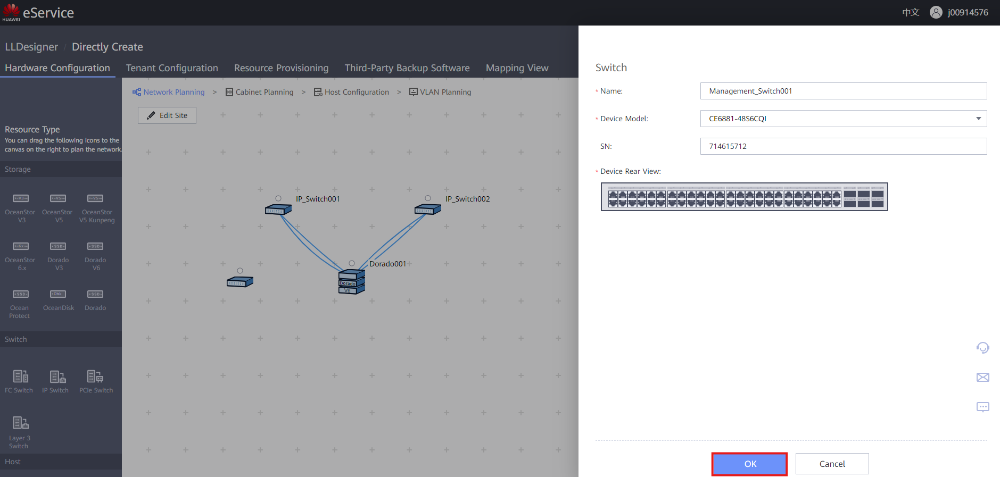
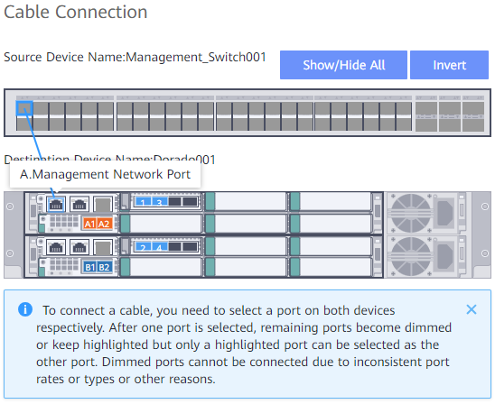

## **Requisitos**

* Gabinete de almacenamiento creado en el lienzo

---

### **Selección del Modelo de Switch de Gestión**

1. Selecciona el tipo de **Switch IP** que se va a representar en el diseño
2. Arrastra y suelta el Switch sobre el lienzo
   
3. Completa la información:

   * **Nombre** : Nombre descriptivo para el Switch
   * **Modelo del dispositivo** : Proporcionado por el cliente
   * **SN** : Incluir opcionalmente el ESN del Switch
4. Haz clic en ' **OK** ' para crear el Switch
   

---

### **Conexión de Gestión al Gabinete de Almacenamiento**

1. Haz clic en el **Punto** sobre el Switch y arrastra la conexión hacia el Punto sobre el Gabinete
   
2. Haz clic en el Puerto deseado del Switch y arrastra la conexión al Puerto de Gestión
   
3. Asegúrate de crear un enlace **redundante** con los Módulos de Interfaz para mejores prácticas
   
4. Haz clic en ' **OK** ' para terminar la conexión del cable
5. El resultado final debería verse de esta manera
