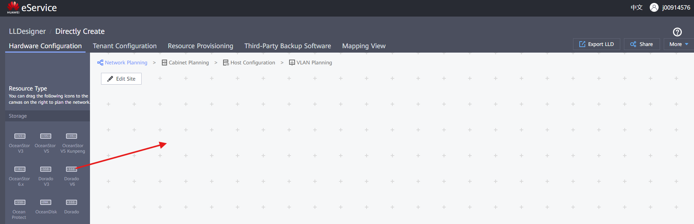
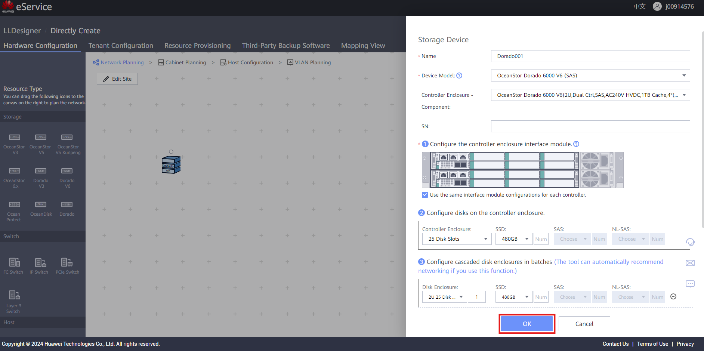
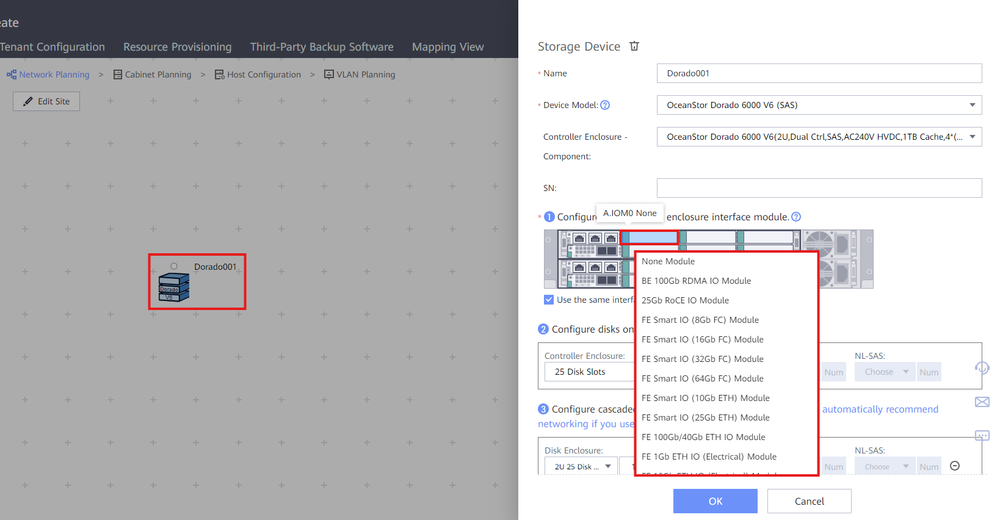
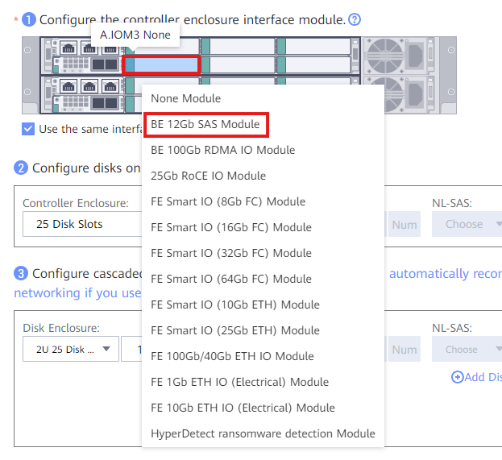
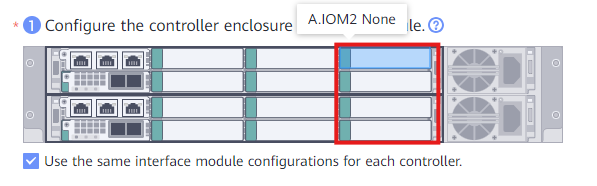
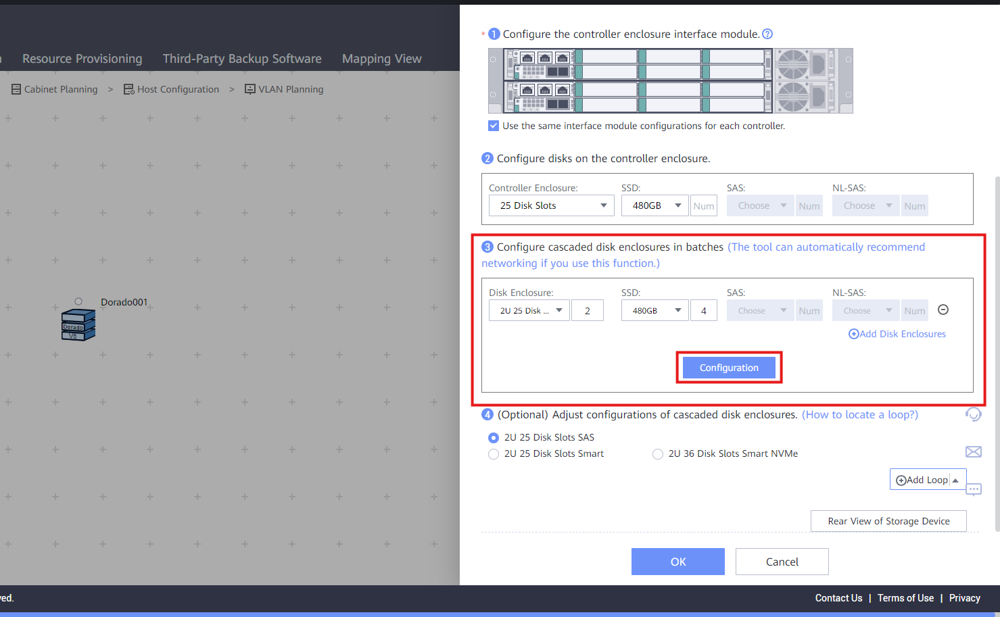
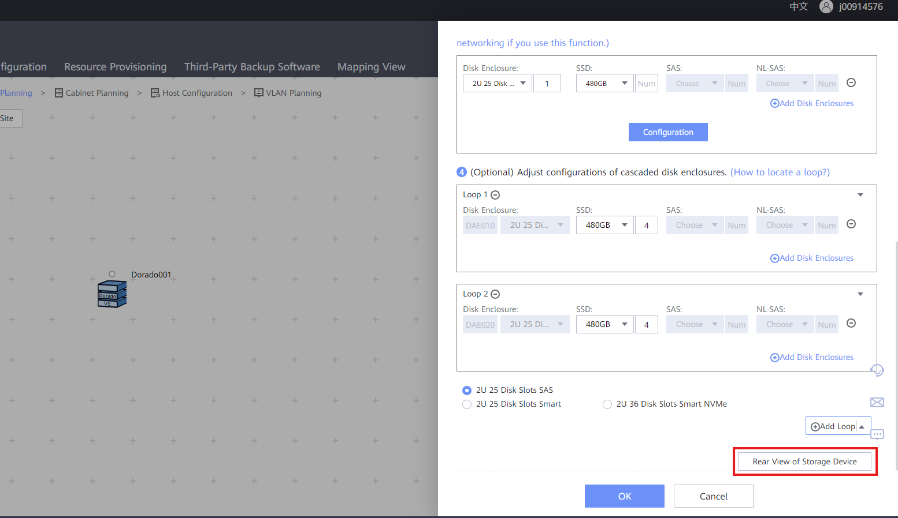
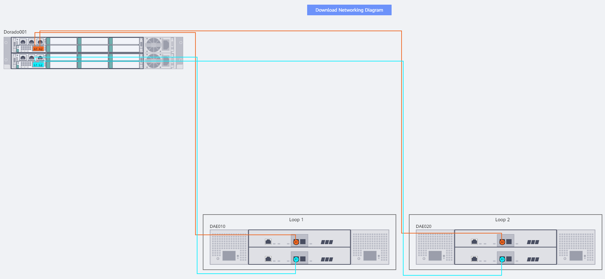

### Selecting Cabinet Model

1. Select the cabinet to represent on the design (given from client)
2. Drag & drop the cabinet onto the canvas
   ` `
   ` `
3. Fill out the information:

   - **Name**: Descriptive name for the cabinet
   - **Device Model**: Select the Model (given by client)
   - **Controller Enclosure**: Normally leave as it is
   - **SN**: Input (if known) the ESN of the cabinet
4. Click '**OK**' to create the **Storage Device**
   ` `
   ` `

---

### IO Interface Modules Configuration

1. Click the **Storage Device** that needs configuration
2. Right click on any **slot** to add an **Interface Module**, see **Best Practices** below
   ` `
   ` `
3. Following the document from presale, fill out the ports decided by the client
4. When all ports are assigned, click '**OK**' to finish the process

#### Best Practices

- SAS Module normally goes right next to the SAS ports of the cabin (for DAE expansion)
  ` `
  ` `
- Following the priority of the ports, the right-most slots are normally left empty for scale-out
  ` `

---

### Adding DAEs (Disk Array Enclosures)

1. Click the **Storage Device** that has DAE(s)
2. If the SAS ports available on the controller are not enough for the number of DAEs, a SAS interface module must be added into the controller
3. Move to **Point 3** and select the information:

   - **Disk Enclosure**: Select the **Disk Enclosure type** (given by client) and the number of them
   - **SSD / SAS**: Add the **Disks** that will be included in the DAE
4. Click '**Configuration**' to add the **DAE(s)** automatically to the Storage Device
   ` `
   ` `
5. For checking the connections, click '**Rear View of Storage Device**'
   ` `
   ` `
