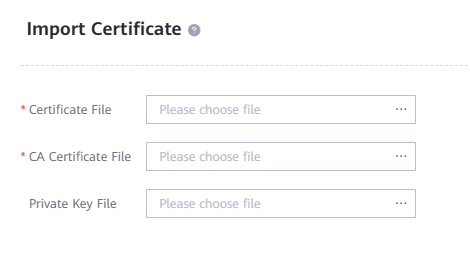

### Definición

La configuración del Servidor Quorum incluye agregar las IPs del Servidor Quorum para la conexión a los dispositivos, firmar los certificados de los dispositivos de almacenamiento para garantizar una conexión segura y añadir los dispositivos de almacenamiento a la lista blanca en el Quorum.

---

### Agregar IP

1. Accede al Servidor Quorum:
   ``qsadmin``
2. Agrega la(s) IP(s) del Servidor Quorum:
   ``add server ip XX.XX.XX.XX``
3. Verifica las IPs dentro del Servidor Quorum:
   ``show server_ip``

---

### Firma de Certificados

1. Accede al/los Dispositivo(s) de Almacenamiento que se conectarán al Servidor Quorum a través de DeviceManager
2. Accede a **Settings > Certificates** en DeviceManager
   
3. Selecciona '**HyperMetro arbitration certificate**' y **Export Request File**
   
4. Mueve el archivo .csr generado a la VM del Servidor Quorum: **/opt/quorum_server/export_import**
5. Otorga permisos al archivo para el Servidor Quorum:
   ``chown quorumsvr:quorumsvr FILENAME.csr``
6. Firma el archivo .csr y genera el archivo CA .crt:
   ``generate tls_cert csr=FILENAME.csr cert_name=FILENAME.crt``
7. Obtén el archivo CA (cps_ca.crt) y el certificado de arbitraje HyperMetro firmado (FILENAME.crt) del directorio **/opt/quorum_server/export_import**
8. Accede a **Settings > Certificates** en DeviceManager para el Dispositivo de Almacenamiento
9. Selecciona '**HyperMetro arbitration certificate**' y **Import Certificate**
   
10. Carga '**Certificate File**' como el certificado de arbitraje HyperMetro firmado (FILENAME.crt)
11. Carga '**CA Certificate File'** como la firma de entidad de confianza (cps_ca.crt)
    
12. Presiona **OK** y finaliza el proceso de firma de certificados

---

### Lista Blanca de Dispositivos

1. Accede al Servidor Quorum:
   ``qsadmin``
2. Consulta el ID del certificado y registra el valor '**Cert id**':
   ``show tls_cert``
   
3. Agrega el/los Dispositivo(s) de Almacenamiento a la lista blanca:
   ``add white_list sn=xxxxxxxxxxxxx cert_id=0``
