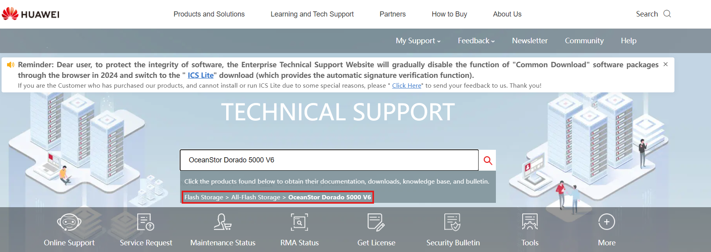
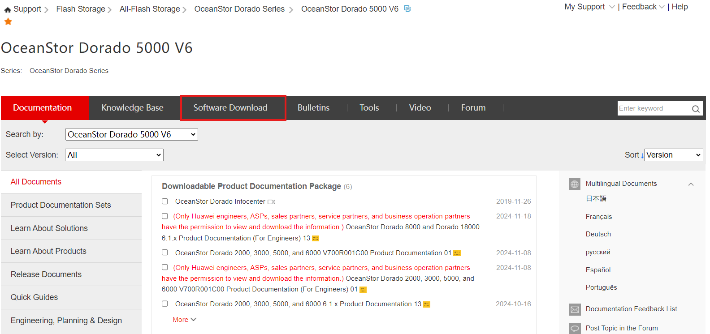
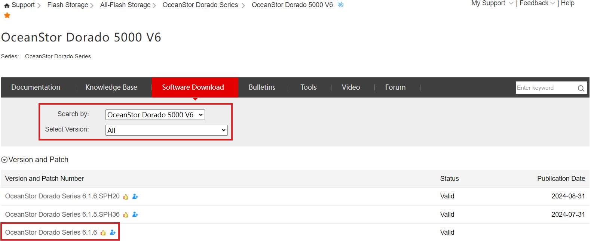
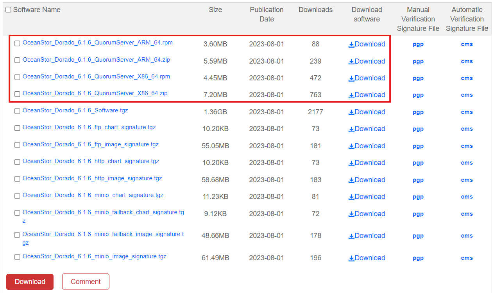

### Definición

La instalación del servidor Quorum es el primer paso para configurar un HyperMetro con arbitraje Quorum. El servidor Quorum se utiliza para gestionar las tareas en los dispositivos HyperMetro y prevenir escenarios de split-brain.

---

### Descarga de Software

#### Requisitos

- Modelo de las Cabinas de Almacenamiento (ej. OceanStor Dorado)
- Versión de software de las Cabinas de Almacenamiento en HyperMetro
- Sistema Operativo del Servidor Quorum
- Acceso root al SO

#### Tareas

1. Accede a: [https://support.huawei.com/](https://support.huawei.com/)
2. Busca el **Modelo** de la Solución de Almacenamiento requerida
   
3. Haz clic en **Software Download**
   
4. Selecciona la versión **Principal** en la que se encuentran las Cabinas de Almacenamiento
   
5. Descarga el Software del Servidor Quorum, dependiendo de su Sistema Operativo

   - **Linux**: .zip
   - **RedHat**: .rpm
     

---

### Instalación

#### Requisitos

- Software descargado para el Servidor Quorum (ver punto anterior)
- Conexión a la VM del Servidor Quorum

#### Tareas

1. Conéctate a la VM que alojará el Servidor Quorum
2. Mueve el Paquete de Software a la VM
3. Descomprime el Paquete de Software
4. Accede al directorio 'package'
5. Instala el Servidor Quorum:
   ``sh ./quorum_server.sh -install``
6. Crea el Usuario del Servidor Quorum o déjalo por defecto
7. Introduce una Contraseña para el Usuario del Servidor Quorum
8. Prueba si la instalación fue exitosa:
   ``qsadmin``
