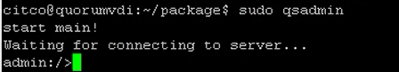

### **Descarga del Software**

#### Requisitos

- Modelo de los Arrays de Almacenamiento (por ejemplo, OceanStor Dorado)
- Versión del software de los Arrays de Almacenamiento en HyperMetro
- Sistema Operativo del Servidor Quorum

#### Tareas

1. Ingresar a: [https://support.huawei.com/](https://support.huawei.com/)
2. Buscar el **Modelo** de la solución de almacenamiento requerida

   

   &nbsp;
3. Hacer clic en **Descarga de Software**

   

   &nbsp;
4. Seleccionar la versión **Principal** en la que están los Gabinetes de Almacenamiento

   

   &nbsp;
5. Descargar el Software del Servidor Quorum, según su Sistema Operativo

   - **Linux**: .zip
   - **RedHat**: .rpm

   

   &nbsp;

---

### **Actualización del Servidor Quorum**

#### Requisitos

- Software descargado para el Servidor Quorum (ver punto anterior)
- Conexión al Servidor Quorum

#### Tareas

1. Conectar al **CLI del Servidor Quorum**

   - **Usuario:** quorumAdmin
   - **Contraseña:** Huawei@SYS3

   &nbsp;
2. Subir el **Software** descargado en el punto anterior al **Servidor Quorum**

   &nbsp;
3. Verificar si el sistema está en **bash** o **dash**:

   ```bash
   ls -l /bin/sh
   ```

   &nbsp;
4. Si el resultado es **bash**, continuar. Si es **dash**, ejecutar este comando y seleccionar **NO**:

   ```bash
   sudo dpkg-reconfigure dash
   ```

   &nbsp;
5. Ingresar al directorio 'package' dentro del archivo de actualización:

   ```bash
   cd package
   ```

   &nbsp;
6. Iniciar la actualización del Servidor Quorum:

   ```bash
   sudo sh ./quorum_server.sh -upgrade
   ```

   

   &nbsp;
7. Ingresar al Servidor Quorum:

   ```bash
   sudo qsadmin
   ```

   

   &nbsp;
8. Mostrar la Configuración de Cifrado:

   ```bash
   show cipher_info
   ```

   

   &nbsp;
9. Mostrar información sobre el Servidor Quorum y la versión para verificar la actualización:

   ```bash
   show server_info
   ```

   

   &nbsp;
10. Mostrar las IPs conectadas al Servidor Quorum para verificar las conexiones:

    ```bash
    show server_ip
    ```

    

    &nbsp;

#### Referencias

- [Documentación del Servidor Quorum](https://support.huawei.com/enterprise/en/doc/EDOC1100112636/b2a6b05f/installing-quorum-server-software)
