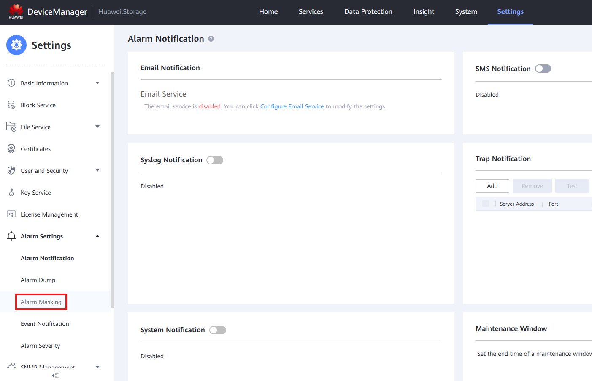
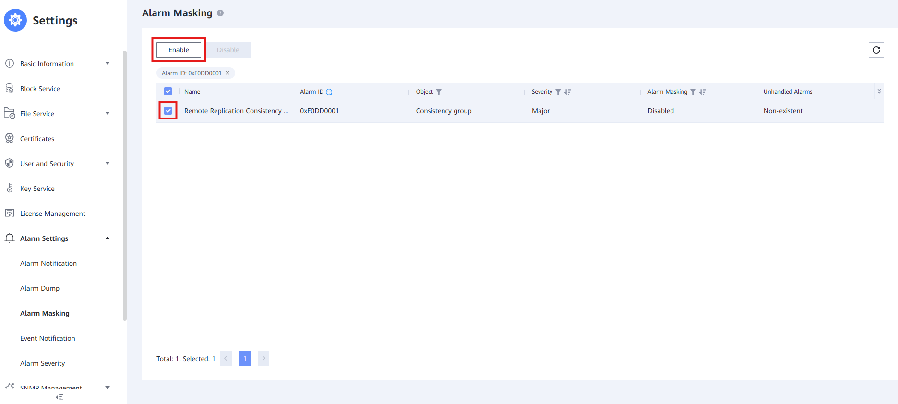

#### **Requisitos:**

* **ID de Alarma** de la alarma que necesita **Enmascarado**

---

#### **Tareas**

1. Ve a **Configuración** > **Ajustes de Alarma**
   
2. Ve a **Enmascarado de Alarmas**
   
3. Filtra utilizando la columna de **ID de Alarma**
   
4. Selecciona la **Alarma** y haz clic en ' **Habilitar** '
   
5. Marca la **Caja de Acuerdo** y presiona ' **OK** ' para finalizar este proceso y enmascarar la alarma deseada
