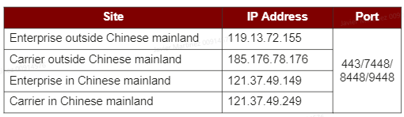
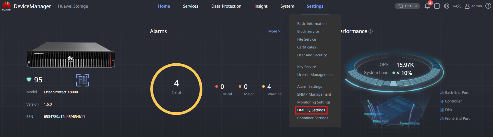
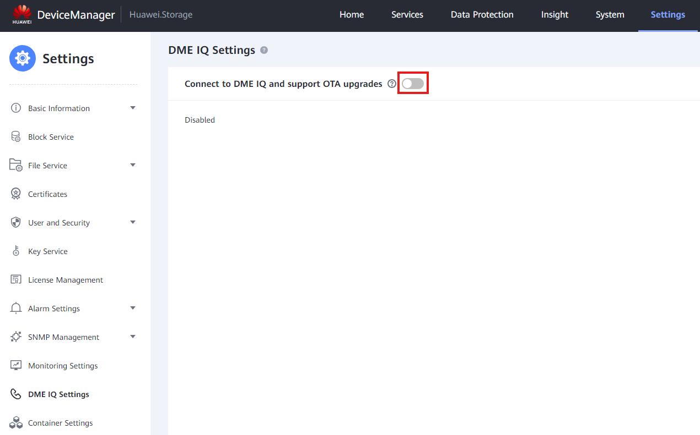
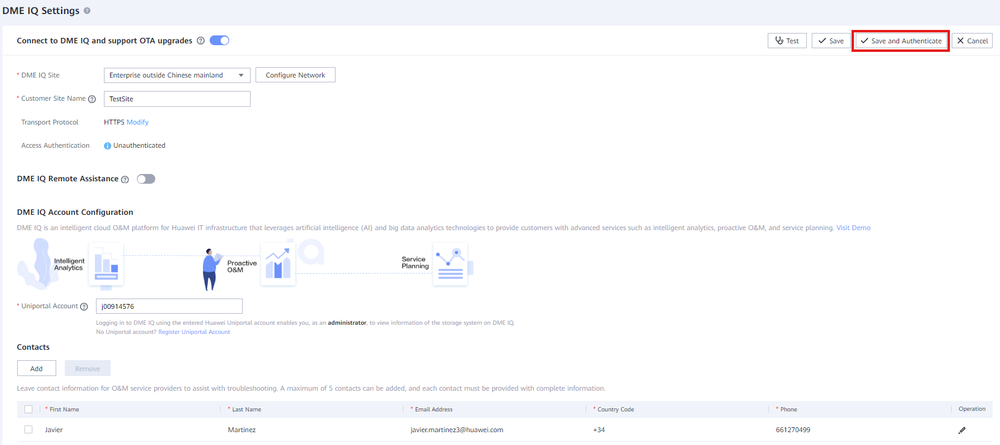
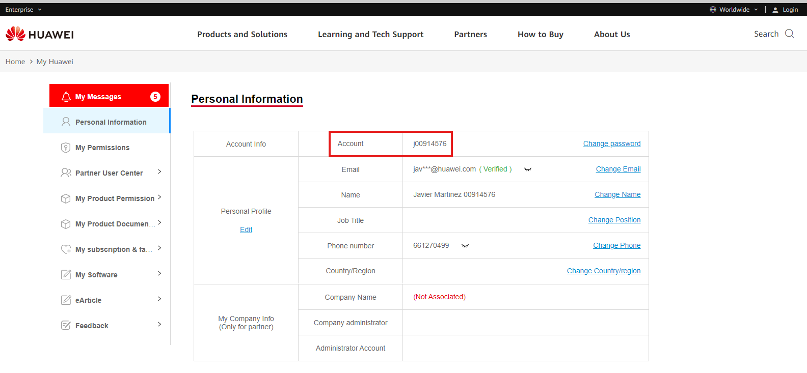
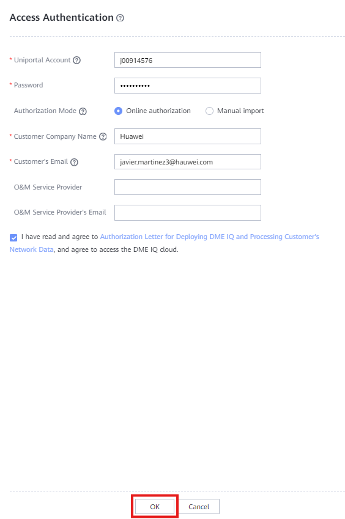
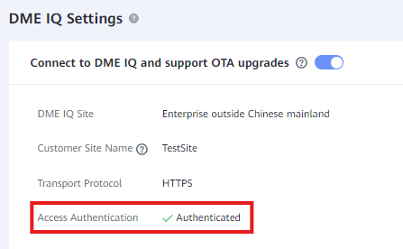

### **Requisitos**

* El cliente tiene cuenta en Uniportal
* Los gabinetes de almacenamiento están registrados en la cuenta del cliente
* Tipo de negocio del cliente (Empresa / Carrier)

---

### **Datos**

* Guía de usuario: [[Guía de usuario del cliente DME IQ 23.0.x.pdf]]
* Información de la red en DME IQ:
  

---

### **Tareas**

1. Ingrese al Administrador de dispositivos ([https://192.168.128.101](https://192.168.128.101) o la IP del puerto)
2. Vaya a **Configuración** > **Configuración de DME IQ**
   
3. Active ' **Conectar a DME IQ y soportar actualizaciones OTA** '
   
4. Complete la información:

   * **Sitio DME IQ** : Tipo de negocio del cliente
   * **Nombre del sitio del cliente** : Nombre descriptivo para el sitio del cliente
   * **Protocolo de transporte** : HTTPS para Internet / SMTP para correo electrónico
   * **Cuenta Uniportal** : Cuenta uniportal del cliente
   * **Contacto** : Agregue la información de contacto del empleado de Huawei
5. Haga clic en ' **Guardar y autenticar** '
   
6. Complete la información:

   * **Cuenta Uniportal** : Cuenta Uniportal del cliente, se puede encontrar aquí:
     [https://e.huawei.com/en/myspace/accountinformation](https://e.huawei.com/en/myspace/accountinformation)
   * **Contraseña** : Contraseña de la cuenta Uniportal
   * **Modo de autorización** : Autorización en línea
   * **Nombre de la empresa del cliente** : Nombre de la empresa del cliente
   * **Correo electrónico del cliente** : Correo electrónico de Uniportal

   
7. Haga clic en ' **OK** ' para intentar la autenticación
   
8. Si todo funcionó correctamente, debería aparecer Autenticado:
   
9. Inicie sesión en su cuenta DME IQ y espere a que los gabinetes de almacenamiento aparezcan
10. Abra un ticket TAC para validar los gabinetes para el cliente: [Eusupport@huawei.com](mailto:Eusupport@huawei.com)
