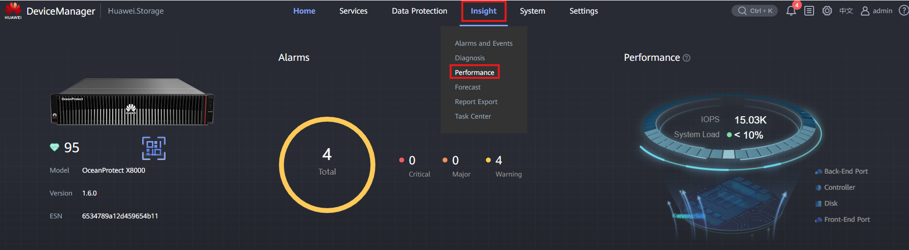
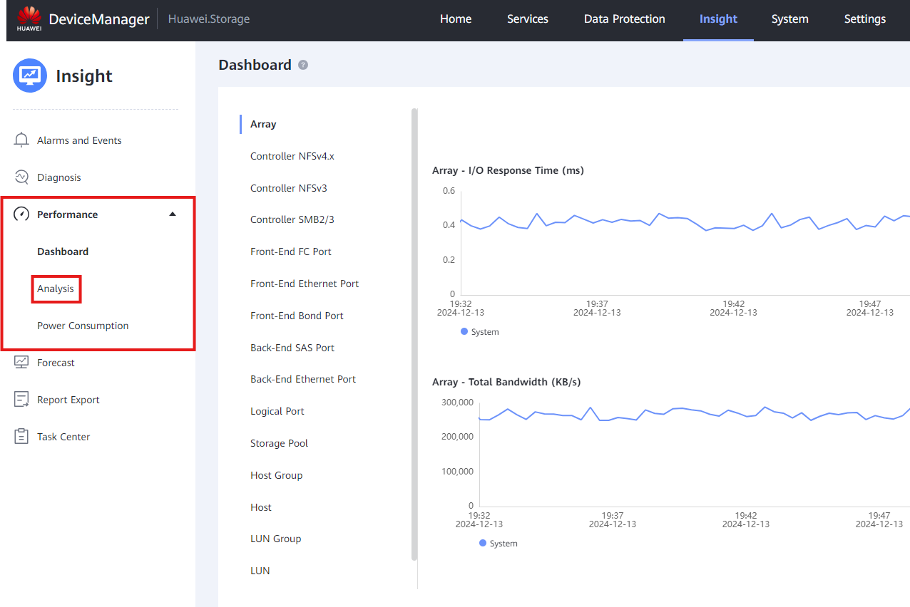
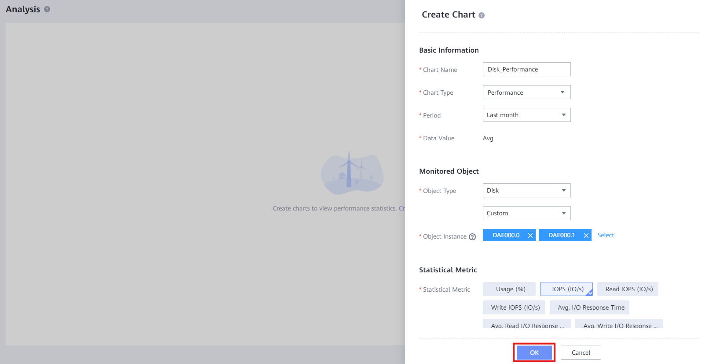

#### **Tareas**

1. Abrir **Administrador de dispositivos** ([https://192.168.128.101:8088](https://192.168.128.101:8088) o la IP del puerto) > **Insight** > **Rendimiento**
   
2. Hacer clic en ' **Análisis** '
   
3. Hacer clic en ' **Crear ahora** ' y completar los detalles:

   * **Nombre del gráfico** : Nombre descriptivo para el Dashboard
   * **Tipo de gráfico** : Seleccionar entre métricas de Rendimiento / Capacidad
   * **Período** : Seleccionar el período de tiempo para las métricas
   * **Valor de datos** : Seleccionar valores Promedio / Máximos para las métricas
   * **Tipo de objeto** : Seleccionar el dispositivo del que tomar las métricas
   * **Instancia de objeto** : Seleccionar los sub-objetos dentro del dispositivo de los cuales tomar las métricas
   * **Métrica estadística** : Seleccionar la métrica que se mostrará

   
4. Hacer clic en ' **OK** ' para crear la métrica y terminar el proceso
   
