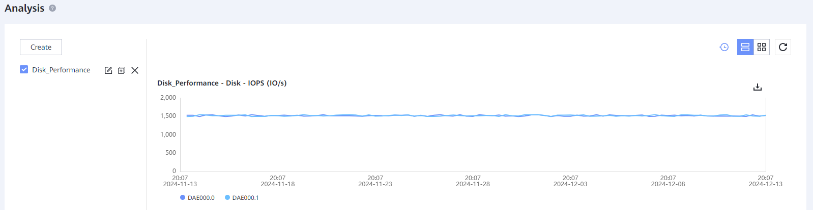

#### Tasks

1. Open **Device Manager** (https://192.168.128.101:8088 or the port IP) > **Insight** > **Performance**
    ` `
   ` `
2. Click '**Analysis**'
    ` `
   ` `
3. Click '**Create Now**' and fill in the details:

   - **Chart Name**: Descriptive name for the Dashboard
   - **Chart Type**: Select between Performance / Capacity metrics
   - **Period**: Select the time period for the metrics
   - **Data Value**: Select Average / Max values for the metrics
   - **Object Type**: Select the device to take the metrics from
   - **Object Instance**: Select the sub-objects inside the device to take metrics from
   - **Statistical Metric**: Select the metric to be displayed

    ` `
   ` `
4. Click '**OK**' to create the metric and finish the process
    ` `
    ` `
